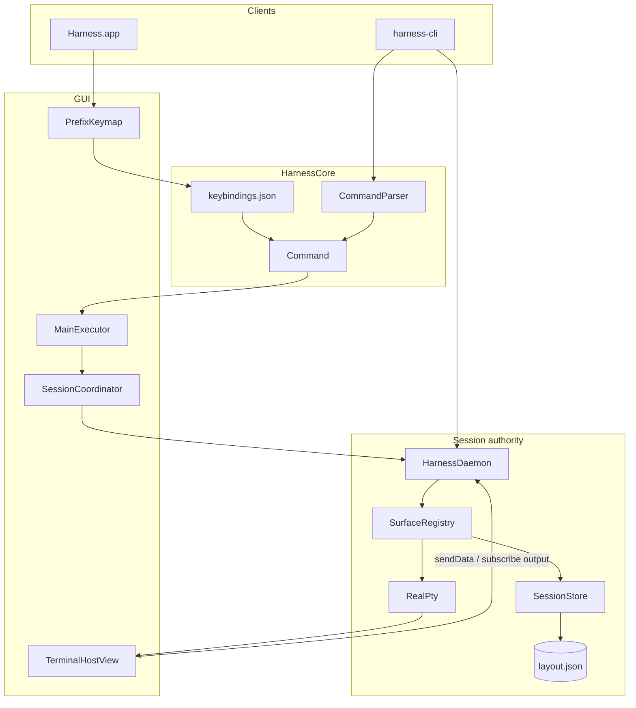

# CLAUDE.md — Harness

Agent handbook for the **Harness** repository. Read before architectural or UI changes.

`claude.md` and `agents.md` are **identical** except the title — update both together.

**Rules:** Do not edit `.cursor/plans/` unless asked. Commit only when requested. Prefer minimal, focused diffs. Fix root causes (Ghostty parity, cwd/title, tab creation) over UI bandaids.

---

## What Harness is

Native macOS terminal combining:

- **Ghostty rendering** — GPU terminals via a local **libghostty fork** (`../libghostty-spm-fork`, sibling of this repo; based on [libghostty-spm](https://github.com/Lakr233/libghostty-spm)) that adds the styled-grid read API powering the terminal compositor
- **cmux-style organization** — workspaces, sidebar sessions, tabs, splits, agent sidebar
- **Harness command system** — prefix keymap, `:` prompt, `harness-cli`, shared `Command` vocabulary (familiar multiplexer verbs, Harness-owned)
- **Agent awareness** — Codex, Claude Code, Cursor, Pi, Hermes, OpenClaw, and more

### Naming

| Name | What it is |
|------|------------|
| **Harness.app** | macOS GUI (keep this name) |
| **harness-cli** | CLI binary (`Package.swift` product) |
| **HarnessDaemon** | Background session authority |
| **HarnessCore** | Shared models, IPC, commands, persistence |
| **HarnessTerminalKit** | libghostty wrapper (`TerminalHostView`, `GridCompositor`) |

Never rename the app to `harness-cli`.

### Platform

- macOS 14.0+ (Liquid Glass: `NSGlassEffectView` on macOS 26+)
- Swift 6.0, SPM + XcodeGen (`Harness.xcodeproj` from `project.yml`)
- Bundle ID: `com.robert.harness`

---

## Quick start

```bash
cd /path/to/harness
swift package resolve
make preview          # isolated .harness-preview/ (no release artifacts)
make release          # or ./Scripts/build-release.sh
open Harness.app

xcodegen generate && open Harness.xcodeproj
xcodebuild -project Harness.xcodeproj -scheme Harness -configuration Debug \
  -destination 'platform=macOS,arch=arm64' build test

.build/release/harness-cli ping
harness-cli list-workspaces
```

**Preview:** `make preview` → `.harness-preview/HarnessPreview.app` with state under `.harness-preview/`. Stop: `make preview-stop`. Reset: `make preview-clean`. CLI: `HARNESS_HOME=.harness-preview .build/debug/harness-cli ping`.

`HARNESS_HOME` overrides app support (preview uses `HarnessPreviewHome` in Info.plist).

---

## Architecture



### Authority rules (critical)

1. **HarnessDaemon owns session truth.** All layout mutations go through IPC. Only `SurfaceRegistry` writes `layout.json`.
2. **Harness.app is a client.** `SessionCoordinator` → `DaemonSessionService` → `syncFromDaemon()`. Never write `layout.json` from the app.
3. **GUI panes are daemon-backed `RealPty`.** libghostty in-memory backend; input via `sendData`; output via `subscribeSurfaceOutput` + scrollback replay on attach.
4. **One surface ID everywhere.** `PaneLeaf.surfaceID` = daemon PTY ID = `HARNESS_SURFACE` env = `harness-cli notify --surface`.
5. **Reuse terminal views.** `TerminalPaneRegistry` keyed by `SurfaceID`. Rebuild panes only on `structureRevision` change.
6. **Metadata vs structure.** cwd/title/agent/git → `syncFromDaemon(metadataOnly: true)` + `refreshMetadata()`. Topology → `structureRevision` + pane remount.

### Processes

| Process | Started by | Lifetime |
|---------|------------|----------|
| Harness.app | User | While app runs |
| HarnessDaemon | launchd (`LaunchAgentInstaller`); fallback `DaemonLauncher` | `KeepAlive`, respawns on crash/login |
| harness-cli | User/scripts | Per command; `attach` holds TTY |

---

## Repository map

```
harness/
├── Package.swift, project.yml, Makefile, Harness.entitlements
├── Harness.xcodeproj/             # generated via xcodegen
├── claude.md / agents.md          # this handbook
├── Apps/Harness/
│   ├── Resources/Assets.xcassets, Harness.icns (generated)
│   └── Sources/HarnessApp/
│       ├── AppDelegate.swift, main.swift, Resources/Info.plist
│       ├── Services/              # SessionCoordinator, MainExecutor, KeybindingsService,
│       │                          # TerminalPaneRegistry, TerminalPaneRegistryAccess,
│       │                          # SurfaceShellTracker, CLIInstaller, DaemonLauncher
│       ├── Settings/              # SettingsViewController, KeyRecorderView, LiveTerminalPreview
│       └── UI/                    # MainSplit, sidebar, tabs, PrefixKeymap, CommandPrompt,
│                                  # CopyMode, StatusLine, notifications, CommandPalette, Chrome,
│                                  # DisplayPanesOverlay, AboutPanelController
├── Packages/
│   ├── HarnessCore/               # Models, IPC, SessionEditor, Commands, Keybindings,
│   │                              # Options, Events, Format, Layouts, Buffers, Agents,
│   │                              # Session/PaneRectSolver (compositor pane layout)
│   ├── HarnessTerminalKit/        # TerminalHostView, ThemeManager, GridCompositor,
│   │                              # TerminalColorPipeline, TerminalColorspace
│   └── HarnessDaemon/
│       ├── Sources/HarnessDaemon/ # HarnessDaemonCore: SurfaceRegistry, DaemonServer,
│       │                          # RealPty, AgentScanner
│       └── Sources/HarnessDaemonMain/main.swift
├── Tools/harness/Sources/HarnessCLI/  # HarnessCLI, AttachClient, WindowAttachClient,
│                                      # AgentHookInstaller
├── Tests/
│   ├── HarnessCoreTests/
│   ├── HarnessDaemonTests/
│   └── HarnessTerminalKitTests/
├── Scripts/                       # build-release, package-app, preview.sh, generate-app-icon.sh,
│                                  # create-dmg.sh, sign-and-notarize.sh, completions/
└── docs/
    ├── COMMANDS.md                # full command grammar
    ├── KEYBINDINGS.md             # default bindings + FormatString tokens
    ├── ARCHITECTURE.md            # short summary (may lag handbook)
    └── agent-hooks/
```

### SPM products

| Product | Target | Role |
|---------|--------|------|
| `Harness` | `HarnessApp` | GUI |
| `HarnessDaemon` | `HarnessDaemon` | Thin `main` over `HarnessDaemonCore` |
| — | `HarnessDaemonCore` | Testable daemon logic |
| `harness-cli` | `HarnessCLI` | CLI client (depends on `HarnessTerminalKit` for the compositor) |
| `HarnessCore` | `HarnessCore` | Shared library |
| `HarnessTerminalKit` | `HarnessTerminalKit` | libghostty wrapper |

Dependency: the local **libghostty fork** as `.package(path: "../libghostty-spm-fork")` — identity `libghostty-spm-fork`, products `GhosttyTerminal`, `GhosttyTheme` (matched in `project.yml`). The fork's `BinaryTarget/GhosttyKit.xcframework` is gitignored; build it with that repo's `Script/build.sh` before resolving. It carries patch `0009-read-cells` (styled-grid `ghostty_surface_read_cells` + the renderer-free `ghostty_terminal_*` headless terminal). See [[harness-multiplexer-remaining-work]] and [[harness-libghostty-fork-toolchain]] in agent memory.

---

## Core concepts

| Term | Meaning |
|------|---------|
| **Workspace** | Named group of sidebar sessions |
| **Session** | Sidebar row with its own tab bar |
| **Tab** | Terminal tab: title, cwd, git, agent, split tree |
| **Pane** | `PaneNode` leaf or branch |
| **SurfaceID** | UUID per terminal; `HARNESS_SURFACE` in shell |
| **PaneID** | UUID for pane leaf in split tree |
| **Snapshot** | `SessionSnapshot` from daemon |
| **revision** | Daemon commit counter |
| **structureRevision** | App counter for topology UI reloads |

**Tab status:** `idle` | `waiting` (agent notify) | `error`

**Agent activity:** `idle` | `working` | `awaiting` | `errored`

### Data model (essentials)

```swift
struct SessionSnapshot {
    var version: Int           // schema 2
    var revision: Int
    var workspaces: [Workspace]
    var activeWorkspaceID: WorkspaceID?
    var themeName: String
    var keepSessionsOnQuit: Bool
    var savedAt: Date
}

enum PaneNode {
    case leaf(PaneLeaf)
    case branch(direction: SplitDirection, ratio: Double, first: PaneNode, second: PaneNode)
}
// PaneLeaf: id (PaneID), surfaceID (SurfaceID)
```

**UI labels:** Prefer cwd basename over `"Shell"`. Show `tab.title` only when it differs from cwd basename and is not `"Shell"` (`TerminalTabBarView`, `SessionCardRowView`).

---

## On-disk layout

Under `~/Library/Application Support/Harness/` (or `HARNESS_HOME`):

| Path | Owner | Purpose |
|------|-------|---------|
| `harness.sock` | daemon | Unix IPC |
| `daemon.pid` | daemon | PID file |
| `sessions/layout.json` | daemon | Session snapshot |
| `settings.json` | app | `HarnessSettings` |
| `keybindings.json` | app | Key tables (merged with defaults) |
| `options.json` | daemon | `OptionStore` (status line, mouse, …) |
| `hooks.json` | daemon | `HookRegistry` |
| `buffers.json` | daemon | `PasteBufferStore` |
| `agents.json` | optional | Custom agent rules |
| `bin/harness-cli` | install | Installed CLI |
| `logs/daemon.log` | daemon | Rotates at 4 MiB → `.1` |
| `~/Library/LaunchAgents/com.robert.harness.daemon.plist` | launchd | Daemon supervisor |
| `~/.config/fish/completions/harness-cli.fish` | install | Fish completion |

**Ghostty import sources** (`GhosttyConfigImporter.candidatePaths`): `~/.config/ghostty/config`, `~/.config/ghostty/config.ghostty`, `~/Library/Application Support/com.mitchellh.ghostty/config`, and `…/config.ghostty`.

**Note:** The on-disk table lists all persisted paths; [`HarnessPaths`](Packages/HarnessCore/Sources/HarnessCore/Paths/HarnessPaths.swift) exposes only a subset (socket, snapshot, settings, logs, buffers, fish completion, launch agent). `keybindings.json`, `options.json`, `hooks.json`, `agents.json`, and `bin/harness-cli` live at the same root but are owned by their respective stores/installers.

---

## Command system

GUI actions — prefix key, `:` prompt, palette picks, menu items, daemon hooks — resolve to a **`Command`** ([`Command.swift`](Packages/HarnessCore/Sources/HarnessCore/Commands/Command.swift)), parsed by **`CommandParser`**. Marked `join-pane -h/-v` (prefix `j` after `m`/`M`) is a normal `Command`. Many **`harness-cli` subcommands bypass `Command`** and call `DaemonClient` IPC directly (`notify`, `attach`, buffers, hooks, options, `detect-agent`, explicit `join-pane --src/--dst`, layout ops with explicit `--tab`, etc.).

| Layer | Role |
|-------|------|
| `KeyTable` / `KeybindingsStore` | Defaults in `KeyTableSet.defaults`; overrides in `keybindings.json` |
| `PrefixKeymap` | Prefix → `KeySpec` → `Command` |
| `CommandPromptController` | `Cmd+;` or `prefix :` |
| `MainExecutor` | App `CommandExecutor` → `SessionCoordinator` / IPC |
| `SurfaceRegistry` | Daemon IPC for layout, PTY, options, hooks, buffers |
| `HarnessCLI` | Subcommands → `DaemonClient` or local keybinding file ops |

**References:** [docs/COMMANDS.md](docs/COMMANDS.md) (full grammar), [docs/KEYBINDINGS.md](docs/KEYBINDINGS.md) (defaults + `FormatString` tokens).

**Extend a command:** `Command` enum → `CommandParser` → `MainExecutor.dispatch` / `SurfaceRegistry.handle` → `IPCRequest` if needed → `HarnessCLI` subcommand → optional prefix/palette binding.

---

## IPC

JSON over `harness.sock` via `IPCEnvelope` / `IPCReply` (`IPCCodec`). Clients: `DaemonClient` (CLI), `DaemonSessionService` (app). Server: `DaemonServer` → `SurfaceRegistry`.

Extend in [`IPCMessage.swift`](Packages/HarnessCore/Sources/HarnessCore/IPC/IPCMessage.swift).

| Group | Requests (representative) |
|-------|---------------------------|
| **Health / query** | `ping`, `getSnapshot`, `listWorkspaces`, `listSurfaces`, `daemonStats`, `listClients` |
| **Layout** | `newWorkspace`, `newSession`, `newTab`, `newTabInWorkspace`, `newSplit`, `closeTab/Session/Workspace`, `killPane`, `swapPanes`, `resizePane`, `resizePaneRatio`, `zoomPane`, `breakPane`, `joinPane`, `rotatePanes`, `applyLayout`, `nextLayout`, `previousLayout`, `selectPaneDirectional`, `respawnPane` |
| **Selection** | `selectWorkspace`, `selectWorkspaceByName`, `selectSession`, `selectTab`, `reorderTab`, `swapTab`, `reorderSession`, renames |
| **Metadata** | `updateTabTitle/Cwd/GitBranch`, `setTheme`, `setKeepSessionsOnQuit`, `notify`, `clearNotification` |
| **PTY I/O** | `createSurface`, `ensureSurface`, `attachSurface`, `sendData`, `send`/`sendKeys`, `capturePane`, `setCopyMode`, `resizeSurface` |
| **Streaming** | `subscribeSurfaceOutput`, `cancelSubscription`, `replayScrollback`, `detachSurface`, `identifyClient`, `detachClient` |
| **Buffers** | `setBuffer`, `getBuffer`, `listBuffers`, `deleteBuffer`, `pasteBuffer` |
| **Options / hooks / UI** | `setOption`, `showOptions`, `bindHook`, `unbindHook`, `listHooks`, `displayMessage` |
| **Agents** | `detectAgent` |

**Responses:** `ok`, `pong`, typed IDs, `clientID`, `snapshot`, `text`, `data`, `agentInfo`, `clients`, `daemonStats`, `buffer`, `buffers`, `options`, `hooks`, `workspaces`, `surfaces`, `error`.

**IPC-only (no CLI subcommand):** `closeWorkspace`, `reorderTab`, `swapTab`, `reorderSession`, `resizePaneRatio`, `setTheme`, `setKeepSessionsOnQuit`, `clearNotification`, tab metadata updates (`updateTabTitle/Cwd/GitBranch`), streaming internals (`subscribeSurfaceOutput`, `ensureSurface`, etc.).

**markWaiting (invariant):** `notify` must resolve tab by **surface ID string** only — never mark all tabs waiting.

```swift
guard let match = editor.tab(forSurfaceKey: surfaceKey) else { return }
editor.setTabStatus(workspaceID: match.workspaceID, tabID: match.tabID, ...)
```

**Terminal I/O:** `ensureSurface` → `sendData` (GUI keys) → `subscribeSurfaceOutput` → scrollback replay on attach. `listWorkspaces.tabCount` = sidebar **session** count (legacy field name).

---

## harness-cli

Binary: `.build/{debug,release}/harness-cli`, `Harness.app/Contents/MacOS/harness-cli`, or `~/Library/Application Support/Harness/bin/harness-cli` after `install`.

Requires daemon running (app or launchd). Full flags: `harness-cli` (no args) or [docs/COMMANDS.md](docs/COMMANDS.md).

| Category | Examples |
|----------|----------|
| **Health** | `ping`, `daemon-stats`, `list-clients`, `detach-client --client <uuid>` |
| **Query** | `list-workspaces`, `list-surfaces`, `get-snapshot` |
| **Layout** | `new-workspace --name api`, `new-session --workspace Default --cwd ~`, `new-tab --workspace Default`, `new-split --tab <uuid> --direction horizontal`, `select-workspace/tab/session`, `rename-tab/session`, `rename-workspace --id <uuid> --name "…"`, `close-tab/session` |
| **Pane** | `send-keys --surface <uuid> --keys "C-c Enter"`, `capture-pane [-S <n> -E <n>]`, `pipe-pane --surface <uuid> "<cmd>"`, `kill-pane`, `swap-pane`, `resize-pane --dir L`, `zoom-pane`, `select-pane --pane <uuid> --dir L`, `break-pane`, `join-pane --src --dst --direction`, `respawn-pane --clear-history`, `copy-mode` |
| **Window link / control** | `link-window --tab <uuid> --target-session <uuid>`, `unlink-window --tab <uuid>`, `control-mode` / `-CC` (tmux control protocol over stdio) |
| **Layouts** | `select-layout --tab <uuid> --layout tiled`, `next-layout --tab <uuid>`, `previous-layout --tab <uuid>`, `rotate-window --tab <uuid> [--reverse]` |
| **Attach** | `attach --surface <uuid> [--detach-keys "C-a d"]` (single pane); `attach-window [--tab <id> \| --session <id\|name> \| --window <id>] [--detach-keys …]` (full split layout — the compositor) |
| **Bindings** | `bind-key` (`bind`), `unbind-key` (`unbind`), `list-keys` (local `keybindings.json`) |
| **Buffers** | `set-buffer`, `list-buffers`, `show-buffer`, `delete-buffer`, `paste-buffer --surface <uuid>` |
| **Options** | `set-option` (`setw`) `-g status on`, `show-options -g` |
| **Environment** | `set-environment [-g] [-u] [-s <sessionID>] <key> [value]` (`setenv`), `show-environment [-g] [-s <sessionID>]` (`showenv`) — injected into pane shells on spawn/respawn |
| **Hooks** | `bind-hook after-new-tab 'display-message "new tab"'`, `list-hooks`, `unbind-hook --id <uuid>` |
| **Agents** | `notify --surface "$HARNESS_SURFACE" --body "…"` (`--message` alias), `detect-agent`, `install-hooks claude-code` |
| **Display** | `display-message '#{cwd_basename}'` |
| **Install** | `install` (copy CLI to app support `bin/`, fish completion, LaunchAgent when bundled) |
| **Legacy** | `send --surface <uuid> --text "y\n"` |

**Key tokens** (`KeyTokenParser`): `C-c`, `C-a`, `Enter`, `Up`, `M-x`, etc.

**Note:** Marked `join-pane -h/-v` is a normal `Command` (prefix `j`). The explicit `harness-cli join-pane --src --dst --direction` form bypasses `CommandParser` and calls IPC directly.

---

## Terminal compositor (`attach-window`)

The headline feature: `harness-cli attach-window` renders a tab's **full split layout** (every pane, borders, status line, active-pane cursor) into any plain terminal, including over ssh — like tmux, but Harness-native.

**Why a fork was needed.** The prebuilt libghostty only exposed `ghostty_surface_read_text` (plain text). Faithful compositing of N side-by-side panes needs each pane's **styled cell grid**. The local fork's patch `0009-read-cells` adds `ghostty_surface_read_cells` (on-screen surfaces) **and** the renderer-free `ghostty_terminal_*` C API.

**Why renderer-free.** The apprt `Surface` (what the GUI + `InMemoryTerminalSession` use) always owns a Metal renderer bound to an NSView; off-screen it crashes on draw and teardown. So headless emulation uses `ghostty_terminal_new/write/resize/read_cells/free` — a bare `terminal.Terminal` + `vtStream()` (read-only VT parser), fully synchronous, no Metal/IO-thread. It uses `c_allocator`, not `global.alloc` (which is undefined until `ghostty_init`).

**Pipeline (client-side emulation; the daemon stays a dumb byte pipe):**

```
daemon PTY bytes ──subscribeSurfaceOutput──▶ GridTerminal (per pane, fork)
                  replayScrollback (seed)        │ readGrid() → TerminalGridSnapshot
PaneNode tree ──PaneRectSolver──▶ [PaneRect] ────┤
                                                 ▼
                              GridCompositor ──ANSI frame (diffed)──▶ TTY
```

| Piece | File | Role |
|-------|------|------|
| `GridTerminal` | fork `GhosttyTerminal/InMemory/GridTerminal.swift` | Headless per-pane VT emulator over `ghostty_terminal_*` |
| `TerminalGridSnapshot` | fork `…/TerminalGridSnapshot.swift` | Value snapshot of a viewport (codepoints, SGR-source colors, attrs, wide, cursor) |
| `PaneRectSolver` | `HarnessCore/Session/PaneRectSolver.swift` | `PaneNode` + cols×rows → interior `[PaneRect]` with 1-cell dividers |
| `GridCompositor` | `HarnessTerminalKit/GridCompositor.swift` | Panes → ANSI frame: box-drawing borders, SGR re-emit, back-buffer diff, status, cursor |
| `WindowAttachClient` | `HarnessCLI/WindowAttachClient.swift` | Live wiring: subscribe/seed/composite, raw TTY (reuses `AttachClient`), SIGWINCH, **snapshot-push** structure tracking, prefix bytes → `KeyTable` → `CommandIPCTranslator`, follows the session's active tab |

**Geometry invariant:** `.horizontal` = side-by-side (first = left), `.vertical` = stacked (first = top), `ratio` = first child's fraction — matches the GUI's `split.isVertical = direction == .horizontal`. **Surface-key invariant:** `PaneLeaf.surfaceID.uuidString` is the daemon surface key (used directly for `subscribeSurfaceOutput`/`sendData`/`resizeSurface`). **Active pane is server-authoritative** (`Tab.activePaneID`/`lastActivePaneID`, schema v3): cycle/directional select commit via `selectPane`/`selectPaneDirectional` IPC and the GUI + compositor mirror it.

**Prefix routing:** the compositor decodes post-prefix bytes (printable / `C-x` / `M-x` / CSI+SS3 arrows with xterm mod codes, tolerant of split reads) into a `KeySpec`, looks it up in the merged prefix `KeyTable` (`KeybindingsStore.load` — user `keybindings.json` overrides apply), and runs the resulting `Command` through the shared **`CommandIPCTranslator`** (the same mapping the GUI `MainExecutor` and the daemon hook executor use). Status line is `FormatString` over `status`/`status-left`/`status-right` from `showOptions`.

**`CommandIPCTranslator`** (`HarnessCore/Commands`): pure `Command` + `CommandTarget` → `.requests([IPCRequest])` / `.clientLocal(Command)` / `.unresolved`. The **one** home of the split-direction inversion (`Command.SplitDirection` is divider-orientation — `.vertical` = side-by-side per `CommandParser`; the layout `SplitDirection` is the opposite, so `layoutDirection(for:)` inverts). Adopted by the GUI, the compositor, and `DaemonCommandExecutor` so a prefix verb, a `keybindings.json` override, and a hook-fired command behave identically.

**Multi-client sizing:** `DaemonServer` records each client's requested PTY size per surface and resizes to the **smallest** (tmux `window-size smallest`); a surface grows back when a small client detaches.

**Tests:** `HeadlessGridReadTests` (GridTerminal fidelity), `GridCompositorTests` (borders/SGR/diff), `PaneRectSolverTests` (layout), `CommandIPCTranslatorTests` (verb mapping + split inversion). Run the AppKit-linked grid suite via `xcrun xctest` if `swift test`'s parallel runner is flaky.

**Roadmap (see [docs/TMUX_PARITY.md](docs/TMUX_PARITY.md)):** copy-mode + SGR mouse in the compositor (GUI has both natively); explicit `-t session:window.pane` target parsing; grouped sessions; `wait-for`. The rest of the tmux verb surface — control mode (`-CC`), `link-window`, `display-popup`/`-menu`, `lock`/`clock-mode`, `command-prompt`, `choose-*`, `confirm-before`, `pipe-pane`, `capture-pane -S/-E`, command aliases — is implemented.

---

## Settings and Ghostty

`HarnessSettings` in `settings.json`. High-signal fields:

| Field | Purpose |
|-------|---------|
| `fontSize`, `fontFamily`, `defaultShell`, `defaultCWD` | Terminal defaults |
| `customBackgroundHex`, `customForegroundHex`, `customCursorHex` | Canvas colors; resolved via `ThemeManager.resolvedCanvas` (custom > theme preset > baseline) for terminal **and** chrome |
| `windowPaddingX/Y`, `backgroundOpacity` (0.05–1), `backgroundBlur` (0–100) | Chrome translucency; one uniform CGS `WindowBlur` for the whole window (terminal stays opaque) |
| `vividColors`, `linearBlending` | Display-P3 vs sRGB colorspace; native vs gamma-correct alpha blending (`TerminalColorPipeline`) |
| `prefixKey` | Prefix binding (`ctrl-a`; empty disables); edited via `KeyRecorderView` in Settings |
| `scrollbackLines` | Scrollback size |
| `cursorStyle`, `cursorBlink`, `copyOnSelect` | Terminal behavior (Ghostty parity) |
| `dividerHex`, `statusLineHex` | Chrome accents (nil → derive from theme) |
| `selection*Hex`, `boldColorHex`, `cursorTextHex`, `paletteHex[16]` | Terminal colors (Ghostty parity); seeded by theme preset, pushed to libghostty |
| `agentColorOverrides` | Per-agent brand color overrides |
| `systemNotificationsEnabled` | macOS banners when agent → `waiting` (in-window bell still updates) |
| `ghosttyConfigSignature` | Fingerprint of last Ghostty import (migration) |
| `transparentTitlebar`, `sidebarVisible` | Chrome |

**Ghostty import** (`GhosttyConfigImporter`): tries four candidate paths (see On-disk layout). **Do not strip `#` in values** — only lines starting with `#` are comments. Re-import via Settings or `source-config` / prefix `r`. `minimumContrast` is parsed on import for fingerprint only — not stored in `settings.json`.

**Apply colors (single source of truth):** `ThemeManager.resolvedCanvas(themeName:custom*Hex:)` resolves bg/fg/cursor (explicit custom > theme preset > baseline). **Both** `TerminalHostView.configureTerminalBuilder` and `HarnessChrome.update` consume it, so terminal and chrome paint the **identical** canvas — no seam. Selecting a theme seeds the full editable color set into `settings.json` (`SessionCoordinator.setTheme` + `ThemeManager.presetColors`); colors then flow from settings, never the libghostty theme slot (kept empty via `emptyControllerTheme`). Selection/bold/cursor-text/16-ANSI-palette are pushed to libghostty in `configureTerminalBuilder`. **Translucency + blur:** The terminal surface is always fully opaque (`withBackgroundOpacity(1.0)`) so colors stay true-Ghostty rich. `backgroundOpacity` and the one window-wide CGS `WindowBlur` apply to **chrome** (sidebar, tab strip, status line) via `HarnessChrome` — not per-pixel libghostty terminal opacity. Chrome hides its vibrancy material when translucent so the single blur is uniform (no double-composite). Chrome backdrop: `ChromeBackdrop` with `.underWindowBackground` or Liquid Glass — **not** `.sidebar` / `.titlebar` (blue tint).

---

## Live metadata

| Source | Mechanism |
|--------|-----------|
| OSC 7 | `terminalDidChangeWorkingDirectory` |
| PID poll | `SurfaceShellTracker` — deepest shell cwd via `proc_pidinfo`, 500ms |
| Shell integration | `shell-integration = detect` in `TerminalHostView` |
| Git | `GitMetadataProvider` (`MetadataProvider`) in `SessionCoordinator` |

**metadataOnly sync:** `syncFromDaemon(metadataOnly: true)` posts `NotificationBus.snapshotChanged` with `metadataOnly: true` → sidebar/tab `refreshMetadata()` without pane remount. `structureChanged` triggers full pane rebuild.

---

## Prefix keymap

`settings.prefixKey` (default `ctrl-a`). Flow: prefix → `KeySpec` → `prefix` table → `Command` → `MainExecutor`.

- Cheatsheet (`prefix ?`): generated from live `prefix` table
- Command prompt: `Cmd+;` or `prefix :` — history, any `Command` string
- Directional nav: `select-pane -L/-R/-U/-D` via daemon tree walk (not simple cycle)
- GUI prefix pane nav uses **arrow keys** (`Up`/`Down`/`Left`/`Right`). The `attach-window` compositor uses **`hjkl`** instead.

**Default bindings:** [docs/KEYBINDINGS.md](docs/KEYBINDINGS.md)

---

## Agent integration

Shell env: `/usr/bin/env HARNESS_SURFACE=<uuid> $SHELL -l`

**Detection:** `AgentDetector` + daemon `AgentScanner` (~1.5s) on process tree from shell PID. Kinds: codex, claude-code, cursor, pi, hermes, openclaw, aider, gemini, goose, generic. **`install-hooks`** writes configs for six agents (codex, claude-code, cursor, pi, hermes, openclaw).

**Title fallback:** `AgentTitleInference.kind(from: tab.title)` when proc-tree misses agent (sidebar/tab use `tab.agent?.kind ?? inference`).

**Hooks for agents:**

```bash
harness-cli install-hooks claude-code
harness-cli notify --surface "$HARNESS_SURFACE" --body "Approval required"
```

Per-agent guides: [docs/agent-hooks/](docs/agent-hooks/). Daemon hooks (`hooks.json`): `after-new-tab`, `after-new-session`, `after-kill-tab`, `after-split-pane`, `after-kill-pane`, `after-resize-pane`, `pane-exited`, `client-attached`, `client-detached`, `agent-state-changed`, `notification-posted` (full list in [docs/COMMANDS.md](docs/COMMANDS.md)).

**UI:** `SessionCardRowView`, `TabPillView`, **`AgentChipView`** in sidebar/session rows when agent kind is detected or inferred (static chip, not activity-gated), `NotificationBellButton` / `NotificationDropdownPanelView`, `Cmd+Shift+U` jump to notification (skips still-`working` agents). OS banners gated by `systemNotificationsEnabled`.

---

## UI and key classes

```
┌──────────────────────────────────────────────────────────┐
│ Workspace pill │ Tab bar (pills +)                      │
│ Session cards  ├────────────────────────────────────────┤
│                │ Terminal panes (libghostty)            │
│ Footer         │ Status line (FormatString)             │
└────────────────┴────────────────────────────────────────┘
```

| Component | File | Notes |
|-----------|------|-------|
| Window shell | `MainWindowController` | Root window, chrome palette |
| Main menu | `MainMenuBuilder` | Global shortcuts (Cmd+T, Cmd+K, …) |
| Main split | `MainSplitViewController` | Snapshot observer |
| Sidebar | `HarnessSidebarPanelViewController` | Sessions, agents |
| Tab bar | `TerminalTabBarView` | `SoftIconButton`: `isBordered = false` for `+` |
| Terminals | `ContentAreaViewController` | Pane mount on structure change |
| Copy mode | `CopyModeViewController` | Vim-style; yank to pasteboard + buffer |
| Status line | `StatusLineView` | `OptionStore` + `FormatString` |
| Notifications | `NotificationBellButton`, `NotificationDropdownPanelView` | Waiting-tab badge + dropdown |
| Display panes | `DisplayPanesOverlay` | Prefix `q` / `display-panes` — tmux-style numbered overlay |
| About | `AboutPanelController` | Menu → About Harness |
| Prefix / prompt | `PrefixKeymap`, `CommandPromptController` | |
| Palette | `CommandPaletteController` | `Cmd+K`, MRU; featured themes only |
| Design / chrome | `HarnessDesign`, `HarnessChrome` | Tokens, `ChromeBackdrop`, Liquid Glass |
| Toast / blur | `Toast`, `WindowBlur` | Transient feedback, backdrop blur |
| App launch | `AppDelegate` | Daemon, prefix keymap, shell tracker |
| Coordinator | `SessionCoordinator` | IPC, registry, themes |
| Executor | `MainExecutor` | `Command` → coordinator |
| Keybindings | `KeybindingsService` | Load/merge `keybindings.json` |
| Pane registry | `TerminalPaneRegistry` | Reuse `TerminalHostView` by `SurfaceID` |
| Pane lookup | `TerminalPaneRegistryAccess` | `@MainActor` lookup by `SurfaceID` |
| Shell tracker | `SurfaceShellTracker` | cwd polling via proc tree |
| Daemon fallback | `DaemonLauncher` | Starts daemon when launchd unavailable |
| Terminal | `TerminalHostView` | In-memory ghostty, daemon I/O |
| Settings UI | `SettingsViewController`, `KeyRecorderView`, `LiveTerminalPreview` | Full settings + prefix capture |
| Daemon | `SurfaceRegistry`, `RealPty`, `DaemonServer` | Session authority |
| Core | `SessionEditor`, `CommandParser`, `OptionStore`, `HookRegistry`, `PasteBufferStore`, `FormatString` | |

---

## Build and test

```bash
make build | preview | preview-stop | preview-clean | release | package | dmg | sign | icon | clean
xcodegen generate
swift test                                    # fast, deterministic
HARNESS_LIVE_DAEMON_TESTS=1 swift test        # + real shell / socket tests
```

`make package` is an alias for `make release`.

Bundle in `Harness.app/Contents/MacOS/`: `Harness`, `HarnessDaemon`, `harness-cli`; icon at `Contents/Resources/Harness.icns`.

**HarnessCoreTests:** `SessionEditor`, `SessionEditorPhase4`, `IPCCodec`, `KeyTokenParser`, `KeyTable`, `FormatString`, `CommandParser`, `PasteBufferStore`, `LaunchAgentInstaller`, `HarnessSettings`, `AgentDetector`, `DaemonClient`, `HarnessPaths`, `GhosttyConfigImporter`, `PaneRectSolver`.

**HarnessDaemonTests:** `SurfaceRegistry`, `ShellLaunchProfile`, `DaemonRoundTrip`, `RealPtyLifecycle` (`DaemonRoundTrip` and `RealPtyLifecycle` opt-in via `HARNESS_LIVE_DAEMON_TESTS=1`).

**HarnessTerminalKitTests:** `TerminalColorPipeline`, `GridCompositorTests`, `HeadlessGridReadTests`.

**Smoke:**

```bash
harness-cli ping && harness-cli new-tab --workspace Default --cwd "$HOME"
# cd in GUI → sidebar/tab show folder name ~1s
harness-cli notify --surface "$(harness-cli list-surfaces | head -1)" --body test
```

---

## Keyboard shortcuts

Global menu shortcuts are defined in `MainMenuBuilder`, not `KeyTableSet.root` (which only holds prefix/copy-mode tables).

| Action | Shortcut |
|--------|----------|
| New workspace / tab | `Cmd+Shift+N` / `Cmd+T` |
| Close tab / workspace | `Cmd+W` / `Cmd+Shift+W` |
| Split H / V | `Cmd+D` / `Cmd+Shift+D` |
| Jump to notification | `Cmd+Shift+U` |
| Command palette | `Cmd+K` |
| Command prompt | `Cmd+;` |
| Settings | `Cmd+,` |
| Toggle sidebar | `Cmd+\` |
| Workspace 1–9 | `Cmd+1` … `Cmd+9` |
| Tab prev/next | `Cmd+Shift+[` / `]` |
| Font +/- | `Cmd++` / `Cmd+-` |

**Prefix (default `Ctrl-A`):** [docs/KEYBINDINGS.md](docs/KEYBINDINGS.md)

---

## Contributor conventions

- `@MainActor` for AppKit; no off-main `NSView` mutation (Swift 6).
- Smallest correct diff; comments only for non-obvious invariants.

### Architecture invariants

1. Daemon writes `layout.json` — never from the app.
2. Preserve terminals on metadata-only changes.
3. Stable `surfaceID` across reloads.
4. Notifications keyed by surface ID string.
5. Terminal and chrome resolve the canvas through the one `ThemeManager.resolvedCanvas` (custom > theme preset > baseline) so they never drift; a theme seeds the editable colors, colors flow from `settings.json`.
6. No blue sidebar vibrancy.
7. Blur is one window-wide CGS `WindowBlur` on chrome; libghostty `background-blur` is never used (no-op in embedded mode). The terminal surface is always opaque; translucency is chrome-only via `HarnessChrome.backgroundOpacity`.

### Playbooks

**Colors not matching Ghostty:** Check config `#` parsing → `settings.json` hex fields → `HarnessSettings.load()` → `ThemeManager.resolvedCanvas` (one resolver for terminal **and** chrome) → `configureTerminalBuilder` (pushes bg/fg/cursor/selection/bold/palette). Seam between sidebar and terminal ⇒ a caller bypassing `resolvedCanvas`.

**cwd stuck on `Shell`:** `harness-cli get-snapshot` → `SurfaceShellTracker` → `metadataOnly` + `refreshMetadata()` → `displayTitle` logic.

**+ tab dead:** `SoftIconButton` `isBordered = false` → delegate → `SessionCoordinator.addTab` → daemon `newTab` + `bumpScan()`.

**Add IPC command:** `IPCMessage` → `SurfaceRegistry` → `DaemonSessionService` → `HarnessCLI` → optional binding.

**Add agent:** `AgentKind` → `AgentTable` → optional `install-hooks` → `docs/agent-hooks/`.

**Debug socket:** `ls ~/Library/Application\ Support/Harness/harness.sock`; `pgrep HarnessDaemon`; `harness-cli ping`.

---

## Feature index

| Area | Status |
|------|--------|
| Session authority | Daemon-owned layout + IPC; launchd `KeepAlive` |
| PTY / attach | `RealPty` + GUI in-memory ghostty; `harness-cli attach` (single pane) with detach keys |
| Terminal compositor | `harness-cli attach-window` renders a tab's full split layout in any plain terminal (incl. ssh): client-side `GridTerminal` emulation per pane + `PaneRectSolver` + `GridCompositor` (borders, SGR, diff, status); prefix (`Ctrl-A`) routes `%`/`"` split, `x` kill, `z` zoom, `hjkl` select, `o`/`;` cycle, `c` new-tab, `n`/`p` tab, `d` detach |
| Commands / keys | `Command` for GUI prefix/prompt; CLI subcommands + `keybindings.json`; prefix, `:`, `bind-key`; display panes (`prefix q`) |
| Copy mode | Vim-style viewer; paste buffers in `buffers.json` |
| Layouts | `even-horizontal`, `even-vertical`, `main-horizontal`, `main-vertical`, `tiled`; break/join/rotate/respawn |
| Options / status | `OptionStore`; `StatusLineView` + `FormatString` tokens |
| Hooks | `HookRegistry` + `bind-hook`; agent `install-hooks` |
| Agents | Detection, chips, title inference, bell/dropdown + OS notifications |
| Chrome / themes | Custom hex, Liquid Glass; 400+ Ghostty themes in Settings; palette `Cmd+K` lists featured themes only; live Settings preview |
| CLI install | Menu/palette `install`; copies CLI, fish completion, LaunchAgent |

### Backlog (do not implement unless asked)

- SSH remote workspaces
- Embedded browser pane
- Sparkle auto-update

---

## Troubleshooting

| Symptom | Likely cause | Fix |
|---------|--------------|-----|
| `connection failed` | Daemon down | Open app or check launchd |
| Not true black | Hex stripped or missing | Fix importer; re-import Ghostty |
| Blue sidebar | Wrong material | `.underWindowBackground` / glass |
| Tab shows `Shell` | cwd not updating | `SurfaceShellTracker`, `displayTitle` |
| cwd in daemon, stale UI | No metadata refresh | `refreshMetadata()` |
| `+` dead | Button bezel | `isBordered = false` |
| All tabs waiting | `markWaiting` bug | Filter by surface key |
| Terminal colors wrong | Stale hex or import path | Re-import Ghostty; check `ThemeManager.resolvedCanvas` + `configureTerminalBuilder` |
| Seam: sidebar ≠ terminal | A caller bypassed `resolvedCanvas` | Route bg/fg/cursor through `ThemeManager.resolvedCanvas` |
| Blur does nothing | Expecting libghostty blur or terminal translucency | Blur is window-wide CGS `WindowBlur` on chrome (`applyTransparency`); terminal is always opaque; chrome opacity < 1 shows blur through sidebar/tab strip/status |
| No agent chip | Proc-tree miss | `AgentTitleInference` |
| Xcode build fails | Stale project | `xcodegen generate` |

---

## Related documentation

- [README.md](README.md) — user overview
- [docs/COMMANDS.md](docs/COMMANDS.md) — command reference
- [docs/TMUX_PARITY.md](docs/TMUX_PARITY.md) — tmux capability parity ledger (done / Harness-equivalent / roadmap)
- [docs/KEYBINDINGS.md](docs/KEYBINDINGS.md) — bindings + format tokens
- [docs/ARCHITECTURE.md](docs/ARCHITECTURE.md) — short summary (may lag; this handbook is authoritative)
- [docs/agent-hooks/README.md](docs/agent-hooks/README.md) — hook examples
- [docs/RELEASE_CHECKLIST.md](docs/RELEASE_CHECKLIST.md) — release QA

---

MIT — see repository license if present.
