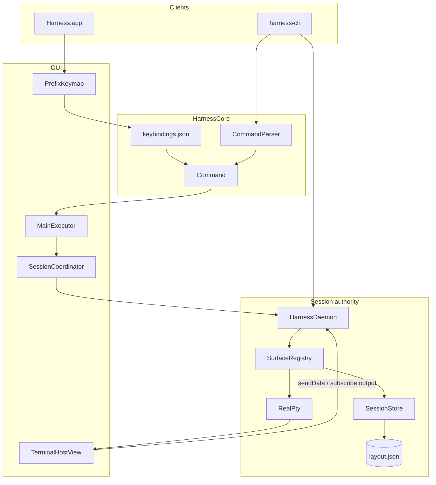

# CLAUDE.md — Harness

Agent handbook for the **Harness** repository. Read before architectural or UI changes.

`claude.md` and `agents.md` are **identical** except the title — update both together.

**Rules:** Do not edit `.cursor/plans/` unless asked. Commit only when requested. Prefer minimal, focused diffs. Fix root causes (Ghostty parity, cwd/title, tab creation) over UI bandaids.

---

## What Harness is

Native macOS terminal combining:

- **Ghostty rendering** — GPU terminals via [libghostty-spm](https://github.com/Lakr233/libghostty-spm)
- **cmux-style organization** — workspaces, sidebar sessions, tabs, splits, agent sidebar
- **tmux-style commands** — prefix keymap, `:` prompt, `harness-cli`, shared `Command` vocabulary
- **Agent awareness** — Codex, Claude Code, Cursor, Pi, Hermes, OpenClaw, and more

### Naming

| Name | What it is |
|------|------------|
| **Harness.app** | macOS GUI (keep this name) |
| **harness-cli** | CLI binary (`Package.swift` product) |
| **HarnessDaemon** | Background session authority |
| **HarnessCore** | Shared models, IPC, commands, persistence |
| **HarnessTerminalKit** | libghostty wrapper (`TerminalHostView`) |

Never rename the app to `harness-cli`.

### Platform

- macOS 14.0+ (Liquid Glass: `NSGlassEffectView` on macOS 26+)
- Swift 6.0, SPM + XcodeGen (`Harness.xcodeproj` from `project.yml`)
- Bundle ID: `com.robert.harness`

---

## Quick start

```bash
cd /path/to/harness
swift package resolve
make preview          # isolated .harness-preview/ (no release artifacts)
make release          # or ./Scripts/build-release.sh
open Harness.app

xcodegen generate && open Harness.xcodeproj
xcodebuild -project Harness.xcodeproj -scheme Harness -configuration Debug \
  -destination 'platform=macOS,arch=arm64' build test

.build/release/harness-cli ping
harness-cli list-workspaces
```

**Preview:** `make preview` → `.harness-preview/HarnessPreview.app` with state under `.harness-preview/`. Stop: `make preview-stop`. Reset: `make preview-clean`. CLI: `HARNESS_HOME=.harness-preview .build/debug/harness-cli ping`.

`HARNESS_HOME` overrides app support (preview uses `HarnessPreviewHome` in Info.plist).

---

## Architecture



### Authority rules (critical)

1. **HarnessDaemon owns session truth.** All layout mutations go through IPC. Only `SurfaceRegistry` writes `layout.json`.
2. **Harness.app is a client.** `SessionCoordinator` → `DaemonSessionService` → `syncFromDaemon()`. Never write `layout.json` from the app.
3. **GUI panes are daemon-backed `RealPty`.** libghostty in-memory backend; input via `sendData`; output via `subscribeSurfaceOutput` + scrollback replay on attach.
4. **One surface ID everywhere.** `PaneLeaf.surfaceID` = daemon PTY ID = `HARNESS_SURFACE` env = `harness-cli notify --surface`.
5. **Reuse terminal views.** `TerminalPaneRegistry` keyed by `SurfaceID`. Rebuild panes only on `structureRevision` change.
6. **Metadata vs structure.** cwd/title/agent/git → `syncFromDaemon(metadataOnly: true)` + `refreshMetadata()`. Topology → `structureRevision` + pane remount.

### Processes

| Process | Started by | Lifetime |
|---------|------------|----------|
| Harness.app | User | While app runs |
| HarnessDaemon | launchd (`LaunchAgentInstaller`); fallback `DaemonLauncher` | `KeepAlive`, respawns on crash/login |
| harness-cli | User/scripts | Per command; `attach` holds TTY |

---

## Repository map

```
harness/
├── Package.swift, project.yml, Makefile
├── claude.md / agents.md          # this handbook
├── Apps/Harness/Sources/HarnessApp/
│   ├── AppDelegate.swift
│   ├── Services/                  # SessionCoordinator, MainExecutor, KeybindingsService,
│   │                              # TerminalPaneRegistry, SurfaceShellTracker, CLIInstaller,
│   │                              # DaemonLauncher
│   ├── Settings/                  # SettingsViewController, KeyRecorderView, LiveTerminalPreview
│   └── UI/                        # MainSplit, sidebar, tabs, PrefixKeymap, CommandPrompt,
│                                  # CopyMode, StatusLine, notifications, CommandPalette, Chrome
├── Packages/
│   ├── HarnessCore/               # Models, IPC, SessionEditor, Commands, Keybindings,
│   │                              # Options, Events, Format, Layouts, Buffers, Agents
│   ├── HarnessTerminalKit/        # TerminalHostView, ThemeManager
│   └── HarnessDaemon/
│       ├── Sources/HarnessDaemon/ # HarnessDaemonCore: SurfaceRegistry, DaemonServer, RealPty
│       └── Sources/HarnessDaemonMain/main.swift
├── Tools/harness/Sources/HarnessCLI/
├── Scripts/                       # build-release, package-app, preview.sh, completions/
└── docs/
    ├── COMMANDS.md                # full command grammar
    ├── KEYBINDINGS.md             # default bindings + FormatString tokens
    ├── ARCHITECTURE.md            # short summary (may lag handbook)
    └── agent-hooks/
```

### SPM products

| Product | Target | Role |
|---------|--------|------|
| `Harness` | `HarnessApp` | GUI |
| `HarnessDaemon` | `HarnessDaemon` | Thin `main` over `HarnessDaemonCore` |
| — | `HarnessDaemonCore` | Testable daemon logic |
| `harness-cli` | `HarnessCLI` | CLI client |
| `HarnessCore` | `HarnessCore` | Shared library |
| `HarnessTerminalKit` | `HarnessTerminalKit` | libghostty wrapper |

Dependency: **libghostty-spm** (`GhosttyTerminal`, `GhosttyTheme`).

---

## Core concepts

| Term | Meaning |
|------|---------|
| **Workspace** | Named group of sidebar sessions |
| **Session** | Sidebar row with its own tab bar |
| **Tab** | Terminal tab: title, cwd, git, agent, split tree |
| **Pane** | `PaneNode` leaf or branch |
| **SurfaceID** | UUID per terminal; `HARNESS_SURFACE` in shell |
| **PaneID** | UUID for pane leaf in split tree |
| **Snapshot** | `SessionSnapshot` from daemon |
| **revision** | Daemon commit counter |
| **structureRevision** | App counter for topology UI reloads |

**Tab status:** `idle` | `waiting` (agent notify) | `error`

**Agent activity:** `idle` | `working` | `awaiting` | `errored`

### Data model (essentials)

```swift
struct SessionSnapshot {
    var version: Int           // schema 2
    var revision: Int
    var workspaces: [Workspace]
    var activeWorkspaceID: WorkspaceID?
    var themeName: String
    var keepSessionsOnQuit: Bool
}

enum PaneNode {
    case leaf(PaneLeaf)
    case branch(direction: SplitDirection, ratio: Double, first: PaneNode, second: PaneNode)
}
// PaneLeaf: id (PaneID), surfaceID (SurfaceID)
```

**UI labels:** Prefer cwd basename over `"Shell"`. Show `tab.title` only when it differs from cwd basename and is not `"Shell"` (`TerminalTabBarView`, `SessionCardRowView`).

---

## On-disk layout

Under `~/Library/Application Support/Harness/` (or `HARNESS_HOME`):

| Path | Owner | Purpose |
|------|-------|---------|
| `harness.sock` | daemon | Unix IPC |
| `daemon.pid` | daemon | PID file |
| `sessions/layout.json` | daemon | Session snapshot |
| `settings.json` | app | `HarnessSettings` |
| `keybindings.json` | app | Key tables (merged with defaults) |
| `options.json` | daemon | `OptionStore` (status line, mouse, …) |
| `hooks.json` | daemon | `HookRegistry` |
| `buffers.json` | daemon | `PasteBufferStore` |
| `agents.json` | optional | Custom agent rules |
| `bin/harness-cli` | install | Installed CLI |
| `logs/daemon.log` | daemon | Rotates at 4 MiB → `.1` |
| `~/Library/LaunchAgents/com.robert.harness.daemon.plist` | launchd | Daemon supervisor |
| `~/.config/ghostty/config` | import | Ghostty settings source |
| `~/.config/fish/completions/harness-cli.fish` | install | Fish completion |

---

## Command system

Every action — prefix key, `:` prompt, palette, hook, many CLI ops — resolves to a **`Command`** ([`Command.swift`](Packages/HarnessCore/Sources/HarnessCore/Commands/Command.swift)), parsed by **`CommandParser`**.

| Layer | Role |
|-------|------|
| `KeyTable` / `KeybindingsStore` | Defaults in `KeyTableSet.defaults`; overrides in `keybindings.json` |
| `PrefixKeymap` | Prefix → `KeySpec` → `Command` |
| `CommandPromptController` | `Cmd+;` or `prefix :` |
| `MainExecutor` | App `CommandExecutor` → `SessionCoordinator` / IPC |
| `SurfaceRegistry` | Daemon IPC for layout, PTY, options, hooks, buffers |
| `HarnessCLI` | Subcommands → `DaemonClient` or local keybinding file ops |

**References:** [docs/COMMANDS.md](docs/COMMANDS.md) (full grammar), [docs/KEYBINDINGS.md](docs/KEYBINDINGS.md) (defaults + `FormatString` tokens).

**Extend a command:** `Command` enum → `CommandParser` → `MainExecutor.dispatch` / `SurfaceRegistry.handle` → `IPCRequest` if needed → `HarnessCLI` subcommand → optional prefix/palette binding.

---

## IPC

JSON over `harness.sock` via `IPCEnvelope` / `IPCReply` (`IPCCodec`). Clients: `DaemonClient` (CLI), `DaemonSessionService` (app). Server: `DaemonServer` → `SurfaceRegistry`.

Extend in [`IPCMessage.swift`](Packages/HarnessCore/Sources/HarnessCore/IPC/IPCMessage.swift).

| Group | Requests (representative) |
|-------|---------------------------|
| **Health / query** | `ping`, `getSnapshot`, `listWorkspaces`, `listSurfaces`, `daemonStats`, `listClients` |
| **Layout** | `newWorkspace`, `newSession`, `newTab`, `newTabInWorkspace`, `newSplit`, `closeTab/Session/Workspace`, `killPane`, `swapPanes`, `resizePane`, `resizePaneRatio`, `zoomPane`, `breakPane`, `joinPane`, `rotatePanes`, `applyLayout`, `nextLayout`, `previousLayout`, `selectPaneDirectional`, `respawnPane` |
| **Selection** | `selectWorkspace`, `selectSession`, `selectTab`, `reorderTab`, `reorderSession`, renames |
| **Metadata** | `updateTabTitle/Cwd/GitBranch`, `setTheme`, `setKeepSessionsOnQuit`, `notify`, `clearNotification` |
| **PTY I/O** | `createSurface`, `ensureSurface`, `attachSurface`, `sendData`, `send`/`sendKeys`, `capturePane`, `setCopyMode`, `resizeSurface` |
| **Streaming** | `subscribeSurfaceOutput`, `cancelSubscription`, `replayScrollback`, `detachSurface`, `identifyClient`, `detachClient` |
| **Buffers** | `setBuffer`, `getBuffer`, `listBuffers`, `deleteBuffer`, `pasteBuffer` |
| **Options / hooks / UI** | `setOption`, `showOptions`, `bindHook`, `unbindHook`, `listHooks`, `displayMessage` |
| **Agents** | `detectAgent` |

**Responses:** `ok`, `pong`, IDs, `snapshot`, `text`, `data`, `agentInfo`, `clients`, `daemonStats`, `buffers`, `options`, `hooks`, `error`.

**markWaiting (invariant):** `notify` must resolve tab by **surface ID string** only — never mark all tabs waiting.

```swift
guard let match = editor.tab(forSurfaceKey: surfaceKey) else { return }
editor.setTabStatus(workspaceID: match.workspaceID, tabID: match.tabID, ...)
```

**Terminal I/O:** `ensureSurface` → `sendData` (GUI keys) → `subscribeSurfaceOutput` → scrollback replay on attach. `listWorkspaces.tabCount` = sidebar **session** count (legacy field name).

---

## harness-cli

Binary: `.build/{debug,release}/harness-cli`, `Harness.app/Contents/MacOS/harness-cli`, or `~/Library/Application Support/Harness/bin/harness-cli` after `install`.

Requires daemon running (app or launchd). Full flags: `harness-cli` (no args) or [docs/COMMANDS.md](docs/COMMANDS.md).

| Category | Examples |
|----------|----------|
| **Health** | `ping`, `daemon-stats`, `list-clients`, `detach-client --client <uuid>` |
| **Query** | `list-workspaces`, `list-surfaces`, `get-snapshot` |
| **Layout** | `new-workspace --name api`, `new-session --workspace Default --cwd ~`, `new-tab --workspace Default`, `new-split --tab <uuid> --direction horizontal`, `select-workspace/tab/session`, `rename-tab/session/workspace`, `close-tab/session` |
| **Pane** | `send-keys --surface <uuid> --keys "C-c Enter"`, `capture-pane`, `kill-pane`, `swap-pane`, `resize-pane --dir L`, `zoom-pane`, `select-pane --pane <uuid> --dir L`, `break-pane`, `join-pane --src --dst --direction`, `respawn-pane`, `copy-mode` |
| **Layouts** | `select-layout tiled`, `next-layout`, `previous-layout`, `rotate-window` |
| **Attach** | `attach --surface <uuid> [--detach-keys "C-a d"]` |
| **Bindings** | `bind-key -T prefix c new-window`, `unbind-key`, `list-keys` (local `keybindings.json`) |
| **Buffers** | `set-buffer`, `list-buffers`, `show-buffer`, `delete-buffer`, `paste-buffer --surface <uuid>` |
| **Options** | `set-option -g status on`, `show-options -g` |
| **Hooks** | `bind-hook after-new-tab 'display-message "new tab"'`, `list-hooks`, `unbind-hook` |
| **Agents** | `notify --surface "$HARNESS_SURFACE" --body "…"`, `detect-agent`, `install-hooks claude-code` |
| **Display** | `display-message '#{cwd_basename}'` |
| **Install** | `install` (copy CLI to app support `bin/`, fish completion, LaunchAgent when bundled) |
| **Legacy** | `send --surface <uuid> --text "y\n"` |

**Key tokens** (`KeyTokenParser`; `TmuxKeyParser` is a deprecated alias): `C-c`, `C-a`, `Enter`, `Up`, `M-x`, etc.

---

## Settings and Ghostty

`HarnessSettings` in `settings.json`. High-signal fields:

| Field | Purpose |
|-------|---------|
| `fontSize`, `fontFamily`, `defaultShell`, `defaultCWD` | Terminal defaults |
| `custom*Hex`, `paletteHex`, `useCustomColors` | Colors (`useCustomColors=false` ignores hex but keeps on disk) |
| `windowPaddingX/Y`, `backgroundOpacity` (0.05–1), `backgroundBlur` (0–100) | Window chrome / transparency |
| `prefixKey` | Prefix binding (`ctrl-a`; empty disables); edited via `KeyRecorderView` in Settings |
| `scrollbackLines` | Scrollback size |
| `cursorStyle`, `cursorBlink`, `copyOnSelect`, `minimumContrast` | Terminal behavior (Ghostty parity) |
| `selection*Hex`, `boldColorHex`, `cursorTextHex`, `dividerHex`, `statusLineHex` | Extended color tuning |
| `agentColorOverrides` | Per-agent brand color overrides |
| `systemNotificationsEnabled` | macOS banners when agent → `waiting` (in-window bell still updates) |
| `ghosttyConfigSignature` | Fingerprint of last Ghostty import (migration) |
| `transparentTitlebar`, `sidebarVisible` | Chrome |

**Ghostty import** (`GhosttyConfigImporter`): reads `~/.config/ghostty/config`. **Do not strip `#` in values** — only lines starting with `#` are comments. Re-import via Settings or `source-config` / prefix `r`.

**Apply colors:** `TerminalHostView.applySettings` and `HarnessChrome.update` use custom hex only when `useCustomColors == true`. Chrome: `ChromeBackdrop` with `.underWindowBackground` or Liquid Glass — **not** `.sidebar` / `.titlebar` (blue tint).

---

## Live metadata

| Source | Mechanism |
|--------|-----------|
| OSC 7 | `terminalDidChangeWorkingDirectory` |
| PID poll | `SurfaceShellTracker` — deepest shell cwd via `proc_pidinfo`, 500ms |
| Shell integration | `shell-integration = detect` in `TerminalHostView` |
| Git | `MetadataProvider` in `SessionCoordinator` |

**metadataOnly sync:** `syncFromDaemon(metadataOnly: true)` posts `NotificationBus.snapshotChanged` with `metadataOnly: true` → sidebar/tab `refreshMetadata()` without pane remount. `structureChanged` triggers full pane rebuild.

---

## Prefix keymap

`settings.prefixKey` (default `ctrl-a`). Flow: prefix → `KeySpec` → `prefix` table → `Command` → `MainExecutor`.

- Cheatsheet (`prefix ?`): generated from live `prefix` table
- Command prompt: `Cmd+;` or `prefix :` — history, any `Command` string
- Directional nav: `select-pane -L/-R/-U/-D` via daemon tree walk (not simple cycle)

**Default bindings:** [docs/KEYBINDINGS.md](docs/KEYBINDINGS.md)

---

## Agent integration

Shell env: `/usr/bin/env HARNESS_SURFACE=<uuid> $SHELL -l`

**Detection:** `AgentDetector` + daemon `AgentScanner` (~1.5s) on process tree from shell PID. Kinds: codex, claude-code, cursor, pi, hermes, openclaw, aider, gemini, goose, generic. **`install-hooks`** writes configs for six agents (codex, claude-code, cursor, pi, hermes, openclaw).

**Title fallback:** `AgentTitleInference.kind(from: tab.title)` when proc-tree misses agent (sidebar/tab use `tab.agent?.kind ?? inference`).

**Hooks for agents:**

```bash
harness-cli install-hooks claude-code
harness-cli notify --surface "$HARNESS_SURFACE" --body "Approval required"
```

Per-agent guides: [docs/agent-hooks/](docs/agent-hooks/). Daemon hooks (`hooks.json`): `after-new-tab`, `after-split-pane`, `pane-exited`, `client-attached`, `agent-state-changed`, …

**UI:** `SessionCardRowView`, `TabPillView`, agent dot when `working`, `NotificationBellButton` / `NotificationDropdownPanel`, `Cmd+Shift+U` jump to notification (skips still-`working` agents). OS banners gated by `systemNotificationsEnabled`.

---

## UI and key classes

```
┌──────────────────────────────────────────────────────────┐
│ Workspace pill │ Tab bar (pills +)                      │
│ Session cards  ├────────────────────────────────────────┤
│                │ Terminal panes (libghostty)            │
│ Footer         │ Status line (FormatString)             │
└────────────────┴────────────────────────────────────────┘
```

| Component | File | Notes |
|-----------|------|-------|
| Main split | `MainSplitViewController` | Snapshot observer |
| Sidebar | `HarnessSidebarPanelViewController` | Sessions, agents |
| Tab bar | `TerminalTabBarView` | `SoftIconButton`: `isBordered = false` for `+` |
| Terminals | `ContentAreaViewController` | Pane mount on structure change |
| Copy mode | `CopyModeViewController` | Vim-style; yank to pasteboard + buffer |
| Status line | `StatusLineView` | `OptionStore` + `FormatString` |
| Notifications | `NotificationBellButton`, `NotificationDropdownPanel` | Waiting-tab badge + dropdown |
| Prefix / prompt | `PrefixKeymap`, `CommandPromptController` | |
| Palette | `CommandPaletteController` | `Cmd+K`, MRU |
| Toast / blur | `Toast`, `WindowBlur` | Transient feedback, backdrop blur |
| Coordinator | `SessionCoordinator` | IPC, registry, themes |
| Executor | `MainExecutor` | `Command` → coordinator |
| Keybindings | `KeybindingsService` | Load/merge `keybindings.json` |
| Pane registry | `TerminalPaneRegistry` | Reuse `TerminalHostView` by `SurfaceID` |
| Terminal | `TerminalHostView` | In-memory ghostty, daemon I/O |
| Settings UI | `KeyRecorderView`, `LiveTerminalPreview` | Prefix capture + live theme preview |
| Daemon | `SurfaceRegistry`, `RealPty`, `DaemonServer` | Session authority |
| Core | `SessionEditor`, `CommandParser`, `OptionStore`, `HookRegistry`, `PasteBufferStore`, `FormatString` | |

---

## Build and test

```bash
make build | preview | preview-stop | preview-clean | release | dmg | sign | icon | clean
xcodegen generate
swift test                                    # fast, deterministic
HARNESS_LIVE_DAEMON_TESTS=1 swift test        # + real shell / socket tests
```

Bundle in `Harness.app/Contents/MacOS/`: `Harness`, `HarnessDaemon`, `harness-cli`, `Harness.icns`.

**HarnessCoreTests:** `SessionEditor`, `SessionEditorPhase4`, `IPCCodec`, `KeyTokenParser`, `KeyTable`, `FormatString`, `CommandParser`, `PasteBufferStore`, `LaunchAgentInstaller`, `HarnessSettings`, `AgentDetector`, `DaemonClient`, `HarnessPaths`, `GhosttyConfigImporter`.

**HarnessDaemonTests:** `SurfaceRegistry`, `ShellLaunchProfile`, `DaemonRoundTrip`, `RealPtyLifecycle` (live PTY/socket opt-in via env var).

**Smoke:**

```bash
harness-cli ping && harness-cli new-tab --workspace Default --cwd "$HOME"
# cd in GUI → sidebar/tab show folder name ~1s
harness-cli notify --surface "$(harness-cli list-surfaces | head -1)" --body test
```

---

## Keyboard shortcuts

| Action | Shortcut |
|--------|----------|
| New workspace / tab | `Cmd+Shift+N` / `Cmd+T` |
| Close tab / workspace | `Cmd+W` / `Cmd+Shift+W` |
| Split H / V | `Cmd+D` / `Cmd+Shift+D` |
| Jump to notification | `Cmd+Shift+U` |
| Command palette | `Cmd+K` |
| Command prompt | `Cmd+;` |
| Settings | `Cmd+,` |
| Toggle sidebar | `Cmd+\` |
| Workspace 1–9 | `Cmd+1` … `Cmd+9` |
| Tab prev/next | `Cmd+Shift+[` / `]` |
| Font +/- | `Cmd++` / `Cmd+-` |

**Prefix (default `Ctrl-A`):** [docs/KEYBINDINGS.md](docs/KEYBINDINGS.md)

---

## Contributor conventions

- `@MainActor` for AppKit; no off-main `NSView` mutation (Swift 6).
- Smallest correct diff; comments only for non-obvious invariants.

### Architecture invariants

1. Daemon writes `layout.json` — never from the app.
2. Preserve terminals on metadata-only changes.
3. Stable `surfaceID` across reloads.
4. Notifications keyed by surface ID string.
5. Ghostty hex parity when `useCustomColors`.
6. No blue sidebar vibrancy.

### Playbooks

**Colors not matching Ghostty:** Check config `#` parsing → `settings.json` `useCustomColors` → `HarnessSettings.load()` → `TerminalHostView.applySettings` → `HarnessChrome` / `ChromeBackdrop`.

**cwd stuck on `Shell`:** `harness-cli get-snapshot` → `SurfaceShellTracker` → `metadataOnly` + `refreshMetadata()` → `displayTitle` logic.

**+ tab dead:** `SoftIconButton` `isBordered = false` → delegate → `SessionCoordinator.addTab` → daemon `newTab` + `bumpScan()`.

**Add IPC command:** `IPCMessage` → `SurfaceRegistry` → `DaemonSessionService` → `HarnessCLI` → optional binding.

**Add agent:** `AgentKind` → `AgentTable` → optional `install-hooks` → `docs/agent-hooks/`.

**Debug socket:** `ls ~/Library/Application\ Support/Harness/harness.sock`; `pgrep HarnessDaemon`; `harness-cli ping`.

---

## Feature index

| Area | Status |
|------|--------|
| Session authority | Daemon-owned layout + IPC; launchd `KeepAlive` |
| PTY / attach | `RealPty` + GUI in-memory ghostty; `harness-cli attach` with detach keys |
| Commands / keys | Unified `Command`; `keybindings.json`; prefix, `:`, CLI `bind-key` |
| Copy mode | Vim-style viewer; paste buffers in `buffers.json` |
| Layouts | `even-horizontal`, `even-vertical`, `main-horizontal`, `main-vertical`, `tiled`; break/join/rotate/respawn |
| Options / status | `OptionStore`; `StatusLineView` + `FormatString` tokens |
| Hooks | `HookRegistry` + `bind-hook`; agent `install-hooks` |
| Agents | Detection, chips, title inference, bell/dropdown + OS notifications |
| Chrome / themes | Custom hex, Liquid Glass, 400+ Ghostty themes, palette `Cmd+K`, live Settings preview |
| CLI install | Menu/palette `install`; copies CLI, fish completion, LaunchAgent |

### Backlog (do not implement unless asked)

- SSH remote workspaces
- Embedded browser pane
- Sparkle auto-update

---

## Troubleshooting

| Symptom | Likely cause | Fix |
|---------|--------------|-----|
| `connection failed` | Daemon down | Open app or check launchd |
| Not true black | Hex stripped or missing | Fix importer; re-import Ghostty |
| Blue sidebar | Wrong material | `.underWindowBackground` / glass |
| Tab shows `Shell` | cwd not updating | `SurfaceShellTracker`, `displayTitle` |
| cwd in daemon, stale UI | No metadata refresh | `refreshMetadata()` |
| `+` dead | Button bezel | `isBordered = false` |
| All tabs waiting | `markWaiting` bug | Filter by surface key |
| Custom colors ignored | `useCustomColors false` | Enable or re-import |
| No agent chip | Proc-tree miss | `AgentTitleInference` |
| Xcode build fails | Stale project | `xcodegen generate` |

---

## Related documentation

- [README.md](README.md) — user overview
- [docs/COMMANDS.md](docs/COMMANDS.md) — command reference
- [docs/KEYBINDINGS.md](docs/KEYBINDINGS.md) — bindings + format tokens
- [docs/agent-hooks/README.md](docs/agent-hooks/README.md) — hook examples
- [docs/RELEASE_CHECKLIST.md](docs/RELEASE_CHECKLIST.md) — release QA

---

MIT — see repository license if present.
