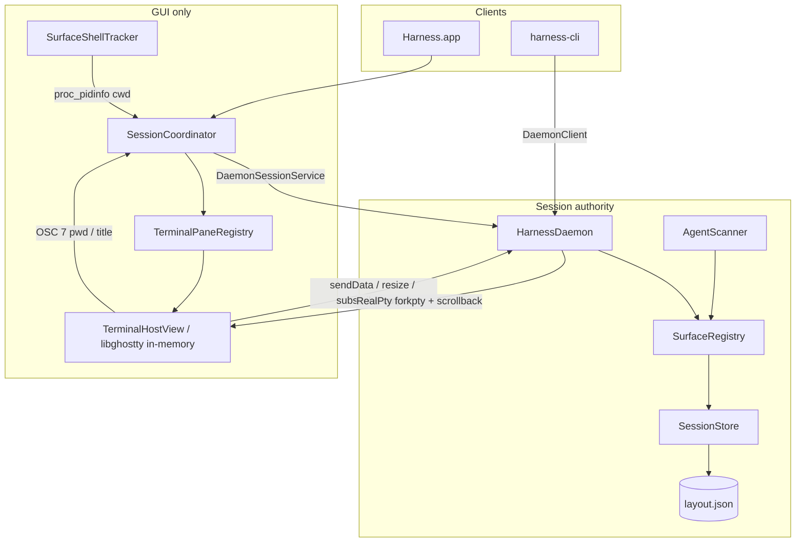

# CLAUDE.md — Harness

This document helps coding agents (Claude Code, Cursor, Codex, and similar tools) work effectively in the **Harness** repository. Read it before making architectural or UI changes.

`claude.md` and `agents.md` are **identical** — update both when you change project guidance.

---

## What Harness is

**Harness** is a native macOS terminal application that combines:

- **Ghostty-quality rendering** — GPU-accelerated terminals via [libghostty-spm](https://github.com/Lakr233/libghostty-spm)
- **cmux-style organization** — workspaces, tabs, splits, agent-oriented sidebar
- **tmux-style control** — prefix keymap, `send-keys`, pane ops, scrollback capture
- **harness-cli automation** — Unix-socket IPC for scripts and agent hooks
- **Agent awareness** — auto-detect Codex, Claude Code, Cursor, Pi, Hermes, OpenClaw, and more

### Naming (do not confuse)

| Name | What it is |
|------|------------|
| **Harness.app** | The macOS GUI application (keep this name) |
| **harness-cli** | The CLI binary for automation (`Package.swift` product name) |
| **HarnessDaemon** | Background session authority process |
| **HarnessCore** | Shared Swift package (models, IPC, persistence) |
| **HarnessTerminalKit** | libghostty wrapper (`TerminalHostView`) |

Never rename the app to `harness-cli`. Docs, install paths, and hooks should say **harness-cli** for the CLI only.

### Version and platform

- **Target:** macOS 14.0+ (Liquid Glass chrome uses `NSGlassEffectView` on macOS 26+)
- **Language:** Swift 6.0
- **Build:** Swift Package Manager and generated Xcode project. `Harness.xcodeproj` is generated from `project.yml` with XcodeGen; run `xcodegen generate` after changing Xcode target/source/resource layout.
- **Bundle ID:** `com.robert.harness` (see `Apps/Harness/Sources/HarnessApp/Resources/Info.plist`)

---

## Quick start for agents

```bash
cd /path/to/harness
swift package resolve
make preview          # isolated debug app under .harness-preview/
make release          # or: ./Scripts/build-release.sh
open Harness.app

# Xcode workflow
xcodegen generate
open Harness.xcodeproj
xcodebuild -project Harness.xcodeproj -scheme Harness -configuration Debug -destination 'platform=macOS,arch=arm64' build
xcodebuild -project Harness.xcodeproj -scheme Harness -configuration Debug -destination 'platform=macOS,arch=arm64' test

# Smoke test IPC (app must be running — it launches the daemon)
.build/release/harness-cli ping
harness-cli list-workspaces
harness-cli list-surfaces
```

Use `make preview` when the user wants to inspect the app without installing or creating release artifacts. Preview packaging creates `.harness-preview/HarnessPreview.app`, sets `HarnessPreviewHome`, and keeps state/socket/settings inside `.harness-preview/` instead of `~/Library/Application Support/Harness`. Stop it with `make preview-stop`; reset preview state with `make preview-clean`. While preview is running, point the CLI at preview state with `HARNESS_HOME=.harness-preview .build/debug/harness-cli ping`.

**Rules:**

- Do **not** edit files under `.cursor/plans/` unless the user explicitly asks.
- Only create git commits when the user requests them.
- Prefer minimal, focused diffs; match existing patterns in neighboring code.
- Industry-standard fixes over bandaids — especially for Ghostty parity, live cwd/title, and tab creation.

---

## Repository map

```
harness/
├── Package.swift                 # SPM manifest and products
├── project.yml                   # XcodeGen spec for Harness.xcodeproj
├── Makefile                      # build, release, dmg, sign, icon
├── claude.md / agents.md         # This handbook (identical files)
├── README.md
├── Harness.app/                  # Built app bundle (gitignored in practice)
├── Apps/Harness/
│   └── Sources/HarnessApp/       # AppKit application
│       ├── main.swift
│       ├── AppDelegate.swift
│       ├── Services/             # SessionCoordinator, SurfaceShellTracker, DaemonLauncher, CLIInstaller
│       ├── Settings/             # SettingsViewController
│       └── UI/                   # Chrome, sidebar, tabs, prefix keymap, palette, AboutPanelController
├── Packages/
│   ├── HarnessCore/              # Models, IPC, SessionEditor, persistence, agents
│   ├── HarnessTerminalKit/       # TerminalHostView, ThemeManager
│   └── HarnessDaemon/            # SurfaceRegistry, DaemonServer, RealPty, AgentScanner
├── Tools/harness/Sources/HarnessCLI/
│   ├── HarnessCLI.swift          # @main CLI entry
│   └── AgentHookInstaller.swift
├── Scripts/                      # build-release, package-app, create-dmg, sign
└── docs/
    ├── ARCHITECTURE.md
    ├── agent-hooks/              # Per-agent hook guides
    └── RELEASE_CHECKLIST.md
```

### SPM products (`Package.swift`)

| Product | Target | Role |
|---------|--------|------|
| `Harness` | `HarnessApp` | GUI executable |
| `HarnessDaemon` | `HarnessDaemon` (thin `main.swift` in `HarnessDaemonMain/`) | Session daemon executable |
| — | `HarnessDaemonCore` | Daemon logic library (`SurfaceRegistry`, `DaemonServer`, `RealPty`, `AgentScanner`) — split out so the daemon is unit-testable |
| `harness-cli` | `HarnessCLI` | CLI client |
| `HarnessCore` | `HarnessCore` | Library |
| `HarnessTerminalKit` | `HarnessTerminalKit` | Library |

External dependency: **libghostty-spm** (`GhosttyTerminal`, `GhosttyTheme`, `GhosttyKit`).

---

## Architecture



### Authority rules (critical)

1. **HarnessDaemon owns session truth.** All workspace/tab/split/select/notify/theme mutations go through IPC. `SurfaceRegistry` is the only component that commits changes to `layout.json`.

2. **Harness.app is a client.** `SessionCoordinator` calls `DaemonSessionService` / `DaemonClient` for mutations, then `syncFromDaemon()` to refresh local `snapshot`. Do not write `layout.json` from the app.

3. **GUI terminals are daemon-backed `RealPty` surfaces rendered by libghostty.** `TerminalHostView` uses libghostty's in-memory backend. User input is sent to the daemon with `sendData`, daemon output streams back through `subscribeSurfaceOutput`, and scrollback is replayed on attach. `RealPty` owns the actual shell process via `forkpty`.

4. **One surface ID everywhere.** `PaneLeaf.surfaceID.uuidString` = daemon `RealPty` ID = shell env `HARNESS_SURFACE` = `harness-cli notify --surface` argument = daemon lookup key for `markWaiting` and agent detection.

5. **Reuse terminal views.** `TerminalPaneRegistry` keeps `TerminalHostView` instances keyed by `SurfaceID`. `ContentAreaViewController` only rebuilds pane structure when `structureRevision` changes — not on title, cwd, git branch, or agent updates.

6. **Metadata vs structure.** Title/cwd/agent/git updates use `syncFromDaemon(metadataOnly: true)` and UI `refreshMetadata()` paths. Topology changes bump `structureRevision` and remount panes.

### Process lifecycle

| Process | Started by | Stays alive when |
|---------|------------|------------------|
| Harness.app | User | App running |
| HarnessDaemon | `DaemonLauncher` on app launch | `keepSessionsOnQuit` or while app runs |
| harness-cli | User/scripts | Exits after each command |

Socket path: `~/Library/Application Support/Harness/harness.sock`

---

## Core concepts

| Term | Meaning |
|------|---------|
| **Workspace** | Named group of sessions (e.g. "Default", "api") |
| **Session** | Sidebar row with its own tab group |
| **Tab** | One terminal tab inside a session: title, cwd, git branch, status, agent, split tree |
| **Pane** | Node in `PaneNode` tree — leaf (terminal) or branch (split) |
| **Surface / SurfaceID** | UUID identifying one terminal pane; drives `HARNESS_SURFACE` |
| **PaneID** | UUID for a pane leaf in the split tree (distinct from surface) |
| **Snapshot** | Full `SessionSnapshot` read from daemon |
| **revision** | Integer incremented on each daemon commit |
| **structureRevision** | App-side counter when workspace/session/tab/pane topology changes |

### Tab status (`TabStatus`)

- `idle` — normal
- `waiting` — agent notification pending (sidebar + optional desktop alert)
- `error` — error state (red status dot)

### Agent activity (`AgentActivity`)

- `idle` — agent present but quiet
- `working` — generating (brand-colored dot in sidebar/tab)
- `awaiting` — needs user input
- `errored` — agent error state

---

## Data model

### SessionSnapshot

```swift
struct SessionSnapshot {
    var version: Int           // schema version (current: 2)
    var revision: Int          // bumps on every daemon commit
    var workspaces: [Workspace]
    var activeWorkspaceID: WorkspaceID?
    var themeName: String      // Ghostty theme name
    var keepSessionsOnQuit: Bool
    var savedAt: Date
}
```

`Workspace.sessions` owns the sidebar rows. `SessionGroup.tabs` owns the top tab bar. `Cmd+T` / `new-tab` appends to the active session; `new-session` creates a new sidebar row.

### Tab (important fields)

```swift
struct Tab {
    var id: TabID
    var title: String              // shell title; default seed is "Shell"
    var cwd: String                // updated via OSC 7 and SurfaceShellTracker
    var gitBranch: String?
    var notificationText: String?
    var status: TabStatus
    var rootPane: PaneNode
    var agent: AgentSnapshot?      // from AgentDetector / AgentScanner
    var zoomedPaneID: PaneID?      // tmux-style zoom
}
```

### PaneNode

```swift
enum PaneNode {
    case leaf(PaneLeaf)
    case branch(direction: SplitDirection, ratio: Double, first: PaneNode, second: PaneNode)
}

struct PaneLeaf {
    var id: PaneID
    var surfaceID: SurfaceID
    var daemonSurfaceID: DaemonSurfaceID?  // when attached to daemon PTY
}
```

`SplitDirection`: `horizontal` | `vertical`.

### UI display rules for tab/sidebar labels

- **Prefer cwd basename** over the generic title `"Shell"`.
- Show explicit `tab.title` only when it differs from cwd basename and is not `"Shell"`.
- Implemented in `TerminalTabBarView.displayTitle` and `SessionCardRowView.configure`.

Persistence: `SessionStore` reads/writes `HarnessPaths.snapshotURL` (`sessions/layout.json`).

---

## On-disk paths

From `Packages/HarnessCore/Sources/HarnessCore/Paths/HarnessPaths.swift`:

| Path | Purpose |
|------|---------|
| `~/Library/Application Support/Harness/` | App support root |
| `.../harness.sock` | Unix domain socket for IPC |
| `.../sessions/layout.json` | Session snapshot (daemon-owned) |
| `.../settings.json` | User settings (`HarnessSettings`) |
| `.../bin/harness-cli` | Installed CLI copy (`harness-cli install`) |
| `.../agents.json` | Optional custom agent detection rules (`AgentDetector`) |
| `~/.config/ghostty/config` | Ghostty config imported on first run / migration |

`HARNESS_HOME` overrides the app-support root for isolated runs. Preview uses `HARNESS_HOME=.harness-preview` via the `HarnessPreviewHome` Info.plist key and passes that value to `HarnessDaemon`.

---

## Settings and Ghostty import

### HarnessSettings (`settings.json`)

| Field | Purpose |
|-------|---------|
| `fontSize`, `fontFamily` | Terminal font (applied to libghostty) |
| `defaultShell`, `defaultCWD` | New tab defaults |
| `backgroundOpacity`, `backgroundBlur` | Window transparency + blur |
| `windowPaddingX/Y` | Terminal padding |
| `customBackgroundHex`, `customForegroundHex`, `customCursorHex` | **Exact Ghostty colors** (`#000000` / `#ffffff`) |
| `prefixKey` | tmux-style prefix (default `ctrl-a`; empty string disables) |
| `scrollbackLines` | Scrollback size (libghostty + RealPty) |
| `ghosttyConfigSignature` | Last imported Ghostty config fingerprint (migration) |
| `transparentTitlebar`, `sidebarVisible` | UI prefs |

### GhosttyConfigImporter

Reads `~/.config/ghostty/config` (or macOS app-support fallback). Maps:

- `background`, `foreground`, `cursor-color` → custom hex fields
- `font-family`, `font-size`, `command`, `background-opacity`, `background-blur`, `window-padding-x/y`

**Critical parser rule:** Do **not** strip `#` inside values as comments. `background = #000000` must parse as `#000000`. Only lines starting with `#` are comments.

### Load / migration (`HarnessSettings.load()`)

1. If `settings.json` exists → decode with fallbacks from live Ghostty config for missing `custom*Hex` fields → persist migration.
2. If missing → `makeDefaults(imported:)` from Ghostty → save immediately.

Settings UI has **Re-import from Ghostty** (`SessionCoordinator.reimportFromGhostty()` / prefix `r`).

### Applying visuals

| Layer | File | Behavior |
|-------|------|----------|
| Terminal colors | `TerminalHostView.applySettings` | `withBackground` / `withForeground` from custom hex |
| Chrome palette | `HarnessChrome.update` | Uses custom hex when set, else named theme |
| Window opacity | `MainWindowController.applyTransparency` | `isOpaque` when opacity ≥ 0.999 |
| Sidebar/tab/terminal chrome | `ChromeBackdrop` in `HarnessDesign.swift` | `NSGlassEffectView` (macOS 26+) or `NSVisualEffectView` with `.underWindowBackground` + theme tint |
| Terminal host background | `TerminalHostView` | Clear layer so libghostty metal shows blur when opacity < 1 |

Avoid `.sidebar` / `.titlebar` vibrancy materials — they add a blue tint that breaks Ghostty's deep-black look.

---

## Live metadata (cwd, title, branch)

### Sources (in priority / combination)

1. **libghostty OSC 7** — `terminalDidChangeWorkingDirectory` when shell integration emits pwd (fish needs integration or explicit hook).
2. **SurfaceShellTracker** — polls shell PID cwd via `proc_pidinfo(PROC_PIDVNODEPATHINFO)` every 500ms.
3. **Shell integration** — `TerminalHostView` sets `shell-integration = detect` and `shell-integration-features = cursor,sudo,title`.
4. **Git branch** — `MetadataProvider` refresh loop in `SessionCoordinator.startMetadataRefresh()`.

### SurfaceShellTracker (`Apps/Harness/.../SurfaceShellTracker.swift`)

- Maps `HARNESS_SURFACE` env (read via `sysctl KERN_PROCARGS2`) → shell PID.
- libghostty spawns: Harness → `/usr/bin/login` → `/usr/bin/env HARNESS_SURFACE=… fish -l`.
- Tracker walks the process tree and picks the **deepest** PID with a readable cwd (the actual shell, not login wrapper).
- Calls `SessionCoordinator.surfaceShellTrackerDidUpdateCwd` → daemon `updateTabCwd` → `syncFromDaemon(metadataOnly: true)`.
- Started in `AppDelegate.applicationDidFinishLaunching`.
- `bumpScan()` after `addTab()` for fast first label.

### metadataOnly sync path

```swift
func syncFromDaemon(metadataOnly: Bool = false) {
    // ...
    if !metadataOnly { applyThemeToAllHosts() }
    NotificationCenter.default.post(
        name: NotificationBus.shared.snapshotChanged,
        userInfo: [
            "revision": remote.revision,
            "structureChanged": structureChanged,
            "chromeChanged": !metadataOnly,
            "metadataOnly": metadataOnly,
        ]
    )
}
```

Observers (`MainSplitViewController`, `ContentAreaViewController`):

- `metadataOnly == true` → `sidebar.refreshMetadata()` + `tabBar.refreshMetadata()` (no pane remount).
- `structureChanged` → full reload of pane container.

---

## IPC protocol

### Transport

- **Codec:** JSON — `IPCEnvelope` / `IPCReply` via `IPCCodec`
- **Client:** `DaemonClient` — `harness.sock`, 2s default timeout
- **App:** `DaemonSessionService`
- **Server:** `DaemonServer` → `SurfaceRegistry.handle(_:)`

### IPCRequest cases

| Request | Purpose |
|---------|---------|
| `ping` | Health check |
| `listWorkspaces` | Workspace summaries |
| `listSurfaces` | Surface → tab/workspace map |
| `getSnapshot` | Full snapshot |
| `newWorkspace(name:)` | Create workspace |
| `newSession(workspaceID:, cwd:, name:)` | Create sidebar session row |
| `newTab(workspaceID:, cwd:)` | Create tab in active session |
| `newTabInWorkspace(named:, cwd:)` | Resolve workspace by name/UUID |
| `newSplit(tabID:, paneID:, direction:)` | Split pane |
| `selectWorkspace(id:)` / `selectWorkspaceByName(name:)` | Focus workspace |
| `selectSession(workspaceID:, sessionID:)` | Focus sidebar session |
| `selectTab(workspaceID:, tabID:)` | Focus tab |
| `reorderTab(workspaceID:, tabID:, toIndex:)` | Move tab within its session (drag-reorder) |
| `closeTab(tabID:)` / `closeSession(sessionID:)` / `closeWorkspace(id:)` | Remove |
| `setTheme(name:)` | Global Ghostty theme name |
| `setKeepSessionsOnQuit(Bool)` | Daemon lifetime |
| `notify(surfaceID:, title:, body:)` | Mark tab waiting |
| `clearNotification(surfaceID:)` | Clear waiting |
| `updateTabTitle(surfaceID:, title:)` | Shell title |
| `updateTabCwd(surfaceID:, path:)` | Working directory |
| `updateTabGitBranch(...)` | Git metadata |
| `send(surfaceID:, text:)` | Inject text (legacy) |
| `sendData(surfaceID:, data:)` | Raw bytes to daemon PTY (GUI input path) |
| `ensureSurface(surfaceID:, cwd:, shell:, rows:, cols:, scrollbackBytes:)` | Create or reuse daemon PTY for a surface |
| `sendKeys(surfaceID:, keys:)` | tmux-style key tokens (`TmuxKeyParser`) |
| `capturePane(surfaceID:, includeScrollback:)` | Scrollback text |
| `killPane(paneID:)` / `swapPanes` / `resizePane` / `resizePaneRatio(tabID:, firstPaneID:, secondPaneID:, ratio:)` / `zoomPane` | Layout ops (`resizePaneRatio` persists divider drags) |
| `setCopyMode(surfaceID:, enabled:)` | Copy mode (via NotificationBus to app) |
| `renameTab` / `renameSession` / `renameWorkspace` | Rename |
| `detectAgent(surfaceID:)` | Query `AgentDetector` |
| `createSurface` / `attachSurface` | Daemon PTY surfaces |
| `subscribeSurfaceOutput` / `cancelSubscription` | Streaming (foundation) |
| `replayScrollback` / `resizeSurface` / `detachSurface` | Attach foundation |

### IPCResponse cases

`ok`, `pong`, `workspaces`, `surfaces`, `workspaceID`, `sessionID`, `tabID`, `paneID`, `surfaceID`, `snapshot`, `text`, `data`, `agentInfo`, `error`.

`listWorkspaces` returns `WorkspaceSummary.tabCount` = number of **sidebar sessions** in that workspace (field name is legacy).

### Terminal I/O path (current)

All visible GUI panes use **daemon-backed `RealPty`** surfaces:

1. `TerminalHostView` calls `ensureSurface` on attach and renders libghostty with an **in-memory backend**.
2. Keystrokes → `sendData` → daemon `RealPty.write`.
3. Output → `subscribeSurfaceOutput` (persistent socket in `DaemonServer`) → replay scrollback on attach → fan into the in-memory session.
4. `sendKeys`, `capturePane`, and `send` from `harness-cli` hit the same daemon PTY and scrollback buffer.

`setCopyMode` still posts `NotificationBus.copyModeRequested`; the in-app prefix `[` toggles copy mode directly via `SessionCoordinator`.

### markWaiting (important)

`notify` resolves the tab by **surface ID string** only:

```swift
private func markWaiting(surfaceKey: String, text: String) {
    guard let match = editor.tab(forSurfaceKey: surfaceKey) else { return }
    editor.setTabStatus(workspaceID: match.workspaceID, tabID: match.tabID, ...)
}
```

Never mark all tabs waiting.

---

## harness-cli reference

Binary locations:

- Built: `.build/debug/harness-cli` or `.build/release/harness-cli`
- Bundled: `Harness.app/Contents/MacOS/harness-cli`
- Installed: `~/Library/Application Support/Harness/bin/harness-cli`

### Commands

```bash
# Health
harness-cli ping

# Query
harness-cli list-workspaces
harness-cli list-surfaces
harness-cli get-snapshot

# Layout
harness-cli new-workspace --name api
harness-cli new-session --workspace api --cwd ~/Code/myproject [--name "api shell"]
harness-cli new-tab --workspace api --cwd ~/Code/myproject
harness-cli new-split --tab <tab-uuid> --direction horizontal|vertical [--pane <pane-uuid>]
harness-cli select-workspace --workspace <name|uuid>
harness-cli select-session --workspace <workspace-uuid> --session <session-uuid>
harness-cli select-tab --workspace <workspace-uuid> --tab <tab-uuid>
harness-cli close-tab --tab <tab-uuid>
harness-cli close-session --session <session-uuid>

# tmux-style
harness-cli send-keys --surface <uuid> --keys "C-c Up Enter"
harness-cli capture-pane --surface <uuid> [--scrollback]
harness-cli kill-pane --pane <uuid>
harness-cli swap-pane --src <uuid> --dst <uuid>
harness-cli resize-pane --pane <uuid> --dir L|R|U|D [--amount N]
harness-cli zoom-pane --pane <uuid>
harness-cli copy-mode --surface <uuid> [--enter|--exit]
harness-cli rename-tab --tab <uuid> --name "..."
harness-cli rename-session --session <uuid> --name "..."
harness-cli rename-workspace --id <uuid> --name "..."

# Agents
harness-cli notify --surface "$HARNESS_SURFACE" --title Agent --body "Needs approval"
# `--message` is an alias for `--body`
harness-cli detect-agent --surface <uuid>
harness-cli install-hooks <codex|claude-code|cursor|pi|hermes|openclaw>

# Attach (scrollback replay today; full streaming WIP)
harness-cli attach --surface <uuid>

# Legacy send
harness-cli send --surface <uuid> --text "y\n"

# Install
harness-cli install
```

**Requires Harness.app running** (or HarnessDaemon already launched).

### Key token encoding (`TmuxKeyParser`)

Examples: `C-c`, `C-a`, `Enter`, `Up`, `Down`, `Tab`, `Escape`, `M-x` (meta). Used by `send-keys` and prefix-driven copy mode.

---

## Agent integration

### HARNESS_SURFACE

Every GUI terminal pane launches:

```bash
/usr/bin/env HARNESS_SURFACE=<surface-uuid> $SHELL -l
```

(via libghostty `command` config and `/usr/bin/login` wrapper.)

### Auto-detection (`AgentDetector` + `AgentScanner`)

- Daemon walks process tree from registered shell PID (`proc_listpids`, `proc_pidpath`).
- Matches executables against `AgentTable` (built-in + `agents.json`).
- Kinds: `codex`, `claude-code`, `cursor`, `pi`, `hermes`, `openclaw`, `aider`, `gemini`, `goose`, `generic` (detection table).
- `install-hooks` writes config for: `claude-code`, `codex`, `cursor`, `pi`, `hermes`, `openclaw` only.
- `AgentScanner` runs ~1.5s cadence, calls `SurfaceRegistry.applyAgentChanges`.
- Activity decays from `working` → `idle` after 3s quiet; I/O bumps `working`.

### UI

- **Sidebar:** `SessionCardRowView` — cwd basename, git/notification meta, `AgentChipView`, status dot.
- **Tab bar:** `TabPillView` — minimal 24px pills, hover-only close, inline `+`.
- **Agent dot:** brand hex when `agent.activity == .working`.
- **Jump to notification:** `Cmd+Shift+U` — skips tabs where agent is still `working`.

### Hooks

```bash
harness-cli install-hooks claude-code   # writes standard hook JSON
harness-cli notify --surface "$HARNESS_SURFACE" --body "Approval required"
```

Per-agent docs: `docs/agent-hooks/*.md`.

### Example Claude Code hook

```json
{
  "hooks": {
    "Stop": [{
      "matcher": "",
      "hooks": [{
        "type": "command",
        "command": "harness-cli notify --surface \"${HARNESS_SURFACE:-}\" --body \"Agent finished — review output\""
      }]
    }]
  }
}
```

Ghostty delegates on `TerminalHostView` also handle desktop notifications and bells.

---

## Prefix keymap (in-app tmux)

Configured via `settings.prefixKey` (default `ctrl-a`). Implemented in `UI/PrefixKeymap.swift`, installed from `AppDelegate`.

After prefix, one-shot binding (2s timeout):

| Key | Action |
|-----|--------|
| `c` | New tab |
| `%` | Split vertical |
| `"` | Split horizontal |
| `x` | Kill active pane |
| `z` | Zoom active pane |
| `o` / `;` | Cycle pane forward / backward |
| `[` | Toggle copy mode |
| `d` | Detach active surface |
| `0`–`9` | Select workspace by index |
| `,` | Rename active tab |
| `?` | Cheatsheet overlay |
| `r` | Re-import Ghostty settings |

Cheatsheet: `PrefixCheatsheetWindow`. Indicator: `PrefixIndicatorWindow`.

---

## App UI map

### Window layout

```
┌──────────────────────────────────────────────────────────┐
│ [traffic-light safe area — chrome header on left]        │
├─────────────────┬────────────────────────────────────────┤
│ Workspace pill  │ Tab bar (pills + inline +)             │
│ Session cards   ├────────────────────────────────────────┤
│ (cwd, agent,    │                                        │
│  status dot)    │     libghostty terminal (PaneContainer) │
│ Footer: + ?     │                                        │
└─────────────────┴────────────────────────────────────────┘
```

| Region | Primary file(s) |
|--------|-----------------|
| Main split | `UI/MainSplitViewController.swift` |
| Left rail | `UI/HarnessSidebarPanelViewController.swift` |
| Tab bar | `UI/TerminalTabBarView.swift` |
| Terminal area | `UI/ContentAreaViewController.swift` |
| Window chrome | `UI/MainWindowController.swift` |
| Theme / glass | `UI/HarnessChrome.swift`, `UI/HarnessDesign.swift` (`ChromeBackdrop`) |
| Prefix / palette | `UI/PrefixKeymap.swift`, `UI/CommandPaletteController.swift` |
| Settings | `Settings/SettingsViewController.swift` |
| Menus | `UI/MainMenuBuilder.swift` |

### SessionCoordinator (`Services/SessionCoordinator.swift`)

- Holds `snapshot`, `settings`, `TerminalPaneRegistry`
- Mutations → daemon IPC → `syncFromDaemon()`
- `TerminalHostDelegate` + `surfaceShellTrackerDidUpdateCwd`
- `structureRevision` gates structural UI reloads
- `applyThemeToAllHosts()` passes custom hex to `HarnessChrome` and all hosts

### TerminalHostView (`Packages/HarnessTerminalKit/.../TerminalHostView.swift`)

- Wraps Ghostty `TerminalView` + `TerminalController`
- Delegates: title, pwd, focus, bell, desktop notification
- `showsWaitingRing` / `showsActiveBorder` in `draw(_:)`
- Shell integration enabled in config

### SoftIconButton

Round icon buttons (`HarnessDesign.swift`). **Must** set `isBordered = false` and `bezelStyle = .smallSquare` so clicks reach `target`/`action` reliably (new tab `+`, footer icons).

---

## Key classes cheat sheet

| Class | Package | Responsibility |
|-------|---------|----------------|
| `SessionCoordinator` | App | IPC client, terminal registry, delegates, metadata sync |
| `SurfaceShellTracker` | App | PID-based cwd polling for fish/non-OSC shells |
| `SurfaceRegistry` | Daemon | Single writer, IPC handler, agent batch updates |
| `SessionEditor` | Core | Pure snapshot mutations |
| `SessionStore` | Core | Load/save `layout.json` |
| `DaemonServer` | Daemon | Unix socket accept loop |
| `AgentScanner` | Daemon | Periodic `AgentDetector.scan` |
| `AgentDetector` | Core | Process-tree agent matching |
| `RealPty` / `PtySession` | Daemon | `forkpty` sessions + scrollback |
| `DaemonClient` | Core | CLI/app IPC transport |
| `TerminalPaneRegistry` | App | `[SurfaceID: TerminalHostView]` |
| `NotificationBus` | Core | Cross-process notifications |
| `HarnessSettings` | Core | `settings.json` + Ghostty import |
| `GhosttyConfigImporter` | Core | Parse `~/.config/ghostty/config` |
| `TmuxKeyParser` | Core | Key token → bytes |
| `PrefixKeymap` | App | In-app tmux bindings |
| `HarnessChrome` / `ChromeBackdrop` | App | Theme-derived UI + liquid glass |

---

## Build, release, and test

```bash
make build          # debug SPM build
make preview        # debug HarnessPreview.app in .harness-preview (no release artifacts)
make preview-stop   # stop only preview app/daemon processes
make preview-clean  # remove preview state and preview bundle
make release        # release binaries + Harness.app
make dmg            # Harness.dmg
make sign           # codesign + optional notarization
make icon           # regenerate Harness.icns
make clean
xcodegen generate   # regenerate Harness.xcodeproj from project.yml
xcodebuild -project Harness.xcodeproj -scheme Harness -configuration Debug -destination 'platform=macOS,arch=arm64' build
xcodebuild -project Harness.xcodeproj -scheme Harness -configuration Debug -destination 'platform=macOS,arch=arm64' test
```

`Scripts/build-release.sh` / `package-app.sh` copies into `Harness.app/Contents/MacOS/`:

- `Harness`, `HarnessDaemon`, `harness-cli`, `Harness.icns`

Pre-release: `docs/RELEASE_CHECKLIST.md`.

### Tests

Two test targets (the daemon is testable because its logic lives in the `HarnessDaemonCore` library; `HarnessDaemon` is a thin `main.swift` wrapper):

- **`HarnessCoreTests`** — deterministic unit tests for the data + IPC layer: `SessionEditor` (incl. reorder-tab, split-ratio, kill-pane, and the markWaiting surface-targeting regression), `IPCCodec` round-trip + framing edge cases, `HarnessPaths`, `TmuxKeyParser`, `GhosttyConfigImporter`, `AgentDetector`, `DaemonClient` timeout.
- **`HarnessDaemonTests`** — drives `SurfaceRegistry.handle(...)` directly. The real-shell / in-process-socket integration tests (`RealPty` lifecycle, full `DaemonServer` round-trip + output streaming) spawn real shells and don't reap cleanly inside the local XCTest runner, so they are **opt-in** behind `HARNESS_LIVE_DAEMON_TESTS=1` — intended for a CI runner that handles subprocess lifecycle.

```bash
swift test                                # deterministic suite (green, fast, no subprocesses)
HARNESS_LIVE_DAEMON_TESTS=1 swift test    # + live daemon/PTY integration tests
# or via Xcode scheme Harness
```

### Smoke tests agents should run

```bash
make release && open Harness.app
harness-cli ping
harness-cli new-session --workspace Default --cwd "$HOME"
harness-cli new-tab --workspace Default --cwd "$HOME"
# In GUI tab: cd somewhere — sidebar + tab label should show folder name within ~1s
# Settings should show customBackgroundHex #000000 if Ghostty config has background = #000000
harness-cli notify --surface "$(harness-cli list-surfaces | head -1)" --body "test"
```

---

## Keyboard shortcuts

### Menu shortcuts

| Action | Shortcut |
|--------|----------|
| New workspace | `Cmd+Shift+N` |
| New tab | `Cmd+T` |
| Close tab | `Cmd+W` |
| Close workspace | `Cmd+Shift+W` |
| Split horizontal / vertical | `Cmd+D` / `Cmd+Shift+D` |
| Jump to notification | `Cmd+Shift+U` |
| Command palette | `Cmd+K` |
| Settings | `Cmd+,` |
| Toggle sidebar | `Cmd+\` |
| Switch workspace 1–9 | `Cmd+1` … `Cmd+9` |
| Previous / next tab | `Cmd+Shift+[` / `Cmd+Shift+]` |
| Increase / decrease font | `Cmd++` / `Cmd+-` |

### Prefix (default `Ctrl-A`)

See [Prefix keymap](#prefix-keymap-in-app-tmux) above.

---

## Contributor conventions

### Swift and AppKit

- Use `@MainActor` for AppKit view controllers and UI helpers.
- Swift 6: do not mutate `NSView` off the main thread.
- Match import style and naming in the file you edit.

### Architecture invariants

1. **Daemon writes layout** — never write `layout.json` from the app.
2. **Preserve terminals on metadata changes** — only rebuild panes on structure change.
3. **Surface ID stability** — do not regenerate `surfaceID` on reload.
4. **Notification targeting** — always key by `surfaceID` string.
5. **Ghostty hex parity** — honor `customBackgroundHex` / `customForegroundHex` in both libghostty and `HarnessChrome`.
6. **No blue sidebar tint** — use `.underWindowBackground` or Liquid Glass, not `.sidebar` material.

### Scope and quality

- Smallest correct diff; no drive-by refactors.
- Comments only for non-obvious invariants.
- Prefer root-cause fixes (e.g. cwd polling, config parser) over UI-only workarounds.

### Git

- Commit only when the user asks.
- Never force-push `main`/`master`.
- Never skip hooks unless requested.

---

## Common agent tasks (playbook)

### Fix colors not matching Ghostty

1. Verify `~/.config/ghostty/config` has `background = #000000` (parser must not strip `#`).
2. Check `settings.json` for `customBackgroundHex` / `customForegroundHex`.
3. Trace `HarnessSettings.load()` migration and `HarnessChrome.update(..., backgroundHex:foregroundHex:)`.
4. Trace `TerminalHostView.applySettings` → `withBackground` / `withForeground`.
5. Check `ChromeBackdrop` tint uses `HarnessChrome.current` not hardcoded colors.

### Fix sidebar/tab cwd stuck on `~` or `Shell`

1. Confirm daemon has cwd: `harness-cli get-snapshot` → tab `cwd` field.
2. If daemon stale → `SurfaceShellTracker` (fish without OSC 7).
3. If daemon correct but UI stale → `metadataOnly` path + `refreshMetadata()`.
4. Check `displayTitle` prefers cwd over `"Shell"`.

### Fix new tab button (+) not working

1. `TerminalTabBarView` → `newTabButton.target` / `action` → `tabBarDidRequestNewTab`.
2. `SoftIconButton` must have `isBordered = false`.
3. `ContentAreaViewController` delegate → `SessionCoordinator.addTab`.
4. Daemon `newTab` IPC + `syncFromDaemon()` + `SurfaceShellTracker.bumpScan()`.

### Add an IPC command

1. `IPCRequest` / `IPCResponse` in `IPCMessage.swift`.
2. `SurfaceRegistry.handle(_:)`.
3. `DaemonSessionService` if app needs it.
4. `HarnessCLI.swift` subcommand.
5. Optional menu/palette/prefix binding.

### Add agent to detection table

1. `AgentKind` in `AgentSnapshot.swift` if new brand chip/dot needed.
2. `AgentTable.default` in `AgentDetector.swift`.
3. Optional `install-hooks` in `AgentHookInstaller.swift`.
4. Doc in `docs/agent-hooks/`.

### Debug CLI connection

```bash
ls -la ~/Library/Application\ Support/Harness/harness.sock
pgrep -l HarnessDaemon
harness-cli ping
```

---

## Implemented vs backlog

### Implemented (current)

- Daemon-owned JSON layout + IPC surface above
- Daemon `RealPty` (`forkpty`) owns shell processes; GUI panes use `ensureSurface` + `sendData` + live output subscription
- libghostty in-memory rendering in GUI with Ghostty config import
- Custom hex chrome + terminal parity (`#000000` black)
- Liquid Glass / vibrancy chrome (`ChromeBackdrop`)
- Live cwd via OSC 7 + `SurfaceShellTracker`
- metadataOnly UI refresh (tabs/sidebar without remounting)
- tmux-style CLI + in-app prefix keymap
- Agent detection, chips, colored dots, `install-hooks` (six agents)
- `harness-cli attach` scrollback replay; GUI streams daemon output on attach
- 400+ Ghostty themes via `GhosttyTheme`

### Backlog (do not implement unless asked)

- Full GUI detach/reattach (survive app quit with visible surfaces wired to daemon PTY)
- `harness-cli attach` live streaming (today: scrollback replay only)
- LaunchAgent daemon without app
- SSH remote workspaces
- Embedded browser pane
- Sparkle auto-update

See `docs/ARCHITECTURE.md`.

---

## Troubleshooting

| Symptom | Likely cause | Fix |
|---------|--------------|-----|
| `harness-cli: connection failed` | Daemon not running | Open Harness.app |
| Background not true black | Missing `customBackgroundHex` or parser stripped `#` | Fix `GhosttyConfigImporter`; re-import |
| Blue-tinted sidebar | Wrong vibrancy material | Use `.underWindowBackground` in `ChromeBackdrop` |
| Tab shows `Shell` not folder | Title fallback; cwd not updating | `SurfaceShellTracker`; `displayTitle` logic |
| cwd in daemon but not UI | Missing metadataOnly refresh | `refreshMetadata()` on snapshot notification |
| `+` tab button dead | `SoftIconButton` bezel intercepting clicks | `isBordered = false` |
| All tabs show waiting on notify | `markWaiting` bug | Must filter by surface key |
| Opacity wrong (e.g. 0.33) | Old corrupted `settings.json` | Delete settings; re-import from Ghostty (0.85) |
| Xcode build fails | Project out of sync with `project.yml` | Run `xcodegen generate`, then `xcodebuild -project Harness.xcodeproj -scheme Harness -configuration Debug -destination 'platform=macOS,arch=arm64' build` |

---

## Related documentation

- [README.md](README.md) — user-facing overview
- [docs/ARCHITECTURE.md](docs/ARCHITECTURE.md) — short architecture summary
- [docs/agent-hooks/README.md](docs/agent-hooks/README.md) — hook examples
- [docs/RELEASE_CHECKLIST.md](docs/RELEASE_CHECKLIST.md) — release QA

---

## License

MIT — see repository license file if present.
