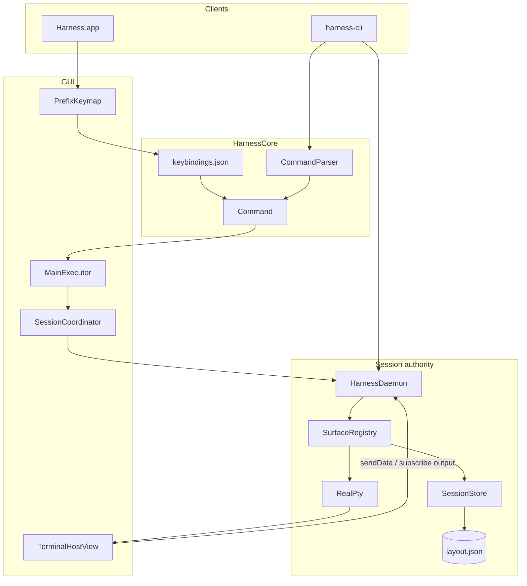

# CLAUDE.md — Harness

Agent handbook for the **Harness** repository. Read before architectural or UI changes.

`claude.md` and `agents.md` are **identical** except the title — update both together.

**Rules:** Do not edit `.cursor/plans/` unless asked. Commit only when requested. Prefer minimal, focused diffs. Fix root causes (render/color fidelity, cwd/title, tab creation) over UI bandaids.

---

## Native terminal renderer

Harness renders terminals with its **own** self-contained stack — there is **no Ghostty/
libghostty dependency** (`swift build` resolves zero external packages). `TerminalHostView`
hosts `HarnessTerminalSurfaceView` (a `CAMetalLayer` view) driving `HarnessTerminalEngine`
(VT parser + screen/scrollback), `HarnessTheme` (485-theme catalog + `.harnesstheme`), and
`HarnessTerminalRenderer` (CoreText atlas + Metal). Features: themed translucent canvas with
untouched program output (`applyThemeToTerminalOutput` toggles theme-colored output), window
padding, cursor styles + blink, text selection + copy / paste (bracketed-paste aware) /
copy-on-select / right-click menu, mouse reporting (SGR 1006), scrollback (wheel /
Shift+PageUp/Down), reflow on resize, procedurally-rendered block elements + box-drawing
(seamless, font-independent), and IME / dead keys (`NSTextInputClient`).

The only remaining "ghostty" is the **opt-in config import** (`TerminalConfigImporter` reads
`~/.config/ghostty` so Ghostty.app users keep their colors/font) — kept by product decision.

**Before touching the terminal renderer or theme system, read
[docs/ARCHITECTURE.md](docs/ARCHITECTURE.md).** Modules under `Packages/`:
`HarnessTerminalEngine`, `HarnessTheme`, `HarnessTerminalRenderer`, `HarnessTerminalKit`.

**Renderer/engine invariants** (recently hardened — keep these):
- **Block elements** (`U+2580–U+259F`) and **box-drawing** (`U+2500–U+257F`) render
  *procedurally*, not from the font, so they tile seamlessly (the Ghostty/kitty approach):
  blocks as exact-fill rects in the background pass (`TerminalMetalRenderer.blockElementRects`),
  box-drawing as cell-sized sprites (`BoxDrawing` → `GlyphRasterizer.rasterizeBox`, drawn at the
  cell origin via `bearingX 0` / `bearingY = ascent`). Doubles, diagonals and mixed-weight
  variants fall back to the font. The glyph emitters skip these codepoints.
- **CSI private introducers** `< = > ?` are *all* flagged private in `VTParser` — so `\e[>4;1m`
  (XTMODKEYS, emitted by fish at startup) is never misread as SGR `4;1m` (the old bug: a
  permanently bold + underlined prompt). SGR is never a private sequence.
- **Resize:** `HarnessTerminalSurfaceView.updateGridSize` *rounds* the drawable (no edge seam
  under `.topLeft`) and `layout()` renders synchronously inside a `CATransaction` (no stretch
  flicker). The drawable resizes every frame, but the **grid reflow + PTY `SIGWINCH` are
  coalesced** (`scheduleResizeCommit`, ~60ms debounce, kept in lockstep via `commitGridSize`):
  a sidebar slide / window drag calls `layout()` per frame, and firing the reflow + SIGWINCH
  each time storms the shell — fish/zsh redraw their prompt faster than they coalesce, leaving
  overlapping garbage in the pane. The first sizing commits immediately (no open-flash).
  `TerminalScreen.resize` *reflows* the primary screen — rejoin soft-wrapped rows via a per-row
  wrap flag, re-wrap to the new width (wide chars never split), map the cursor; the alternate
  screen just clamps (TUIs redraw on SIGWINCH). The PTY env sets `COLORTERM=truecolor`.
- **Decorations** (underline/strike/overline) are pixel-snapped for crisp 1–2px lines.
- **Glyph baseline** is pixel-snapped at rasterization: `GlyphRasterizer.render` draws each glyph
  with its pen origin (baseline + left edge) on integer device pixels, so every glyph shares the
  exact same baseline row. Drawing at a fractional position while rounding the bearing
  independently (the old path) left a sub-pixel residual per glyph — a wavy / "squiggly" baseline.

---

## What Harness is

Native macOS terminal combining:

- **Native GPU rendering** — Harness's own self-contained terminal stack: `HarnessTerminalEngine` (VT emulator + scrollback), `HarnessTheme` (485-theme catalog + `.harnesstheme`), and `HarnessTerminalRenderer` (CoreText glyph atlas + Metal). No external terminal dependency
- **cmux-style organization** — workspaces, sidebar sessions, tabs, splits, agent sidebar
- **Harness command system** — prefix keymap, `:` prompt, `harness-cli`, shared `Command` vocabulary (familiar multiplexer verbs, Harness-owned)
- **Agent awareness** — Codex, Claude Code, Cursor, Pi, Hermes, OpenClaw, and more

### Naming

| Name | What it is |
|------|------------|
| **Harness.app** | macOS GUI (keep this name) |
| **harness-cli** | CLI binary (`Package.swift` product) |
| **HarnessDaemon** | Background session authority |
| **HarnessCore** | Shared models, IPC, commands, persistence |
| **HarnessTerminalKit** | Native terminal surface host + compositor (`TerminalHostView`, `HarnessTerminalSurfaceView`, `GridCompositor`) |

Never rename the app to `harness-cli`.

### Platform

- macOS 14.0+ (Liquid Glass: `NSGlassEffectView` on macOS 26+)
- Swift 6.0, SPM + XcodeGen (`Harness.xcodeproj` from `project.yml`)
- Bundle ID: `com.robert.harness`

---

## Quick start

```bash
cd /path/to/harness
swift package resolve
make preview          # isolated .harness-preview/ (no release artifacts)
make release          # or ./Scripts/build-release.sh
open Harness.app

xcodegen generate && open Harness.xcodeproj
xcodebuild -project Harness.xcodeproj -scheme Harness -configuration Debug \
  -destination 'platform=macOS,arch=arm64' build test

.build/release/harness-cli ping
harness-cli list-workspaces
```

**Preview:** `make preview` → `.harness-preview/HarnessPreview.app` with state under `.harness-preview/`. Stop: `make preview-stop`. Reset: `make preview-clean`. CLI: `HARNESS_HOME=.harness-preview .build/debug/harness-cli ping`.

`HARNESS_HOME` overrides app support (preview uses `HarnessPreviewHome` in Info.plist).

---

## Architecture



### Authority rules (critical)

1. **HarnessDaemon owns session truth.** All layout mutations go through IPC. Only `SurfaceRegistry` writes `layout.json`.
2. **Harness.app is a client.** `SessionCoordinator` → `DaemonSessionService` → `syncFromDaemon()`. Never write `layout.json` from the app.
3. **GUI panes are daemon-backed `RealPty`.** The native `HarnessTerminalSurfaceView` emulates the pane locally; input via `sendData`; output via `subscribeSurfaceOutput` + scrollback replay on attach.
4. **One surface ID everywhere.** `PaneLeaf.surfaceID` = daemon PTY ID = `HARNESS_SURFACE` env = `harness-cli notify --surface`.
5. **Reuse terminal views.** `TerminalPaneRegistry` keyed by `SurfaceID`. Rebuild panes only on `structureRevision` change.
6. **Metadata vs structure.** cwd/title/agent/git → `syncFromDaemon(metadataOnly: true)` + `refreshMetadata()`. Topology → `structureRevision` + pane remount.

### Processes

| Process | Started by | Lifetime |
|---------|------------|----------|
| Harness.app | User | While app runs |
| HarnessDaemon | launchd (`LaunchAgentInstaller`); fallback `DaemonLauncher` | `KeepAlive`, respawns on crash/login |
| harness-cli | User/scripts | Per command; `attach` holds TTY |

---

## Repository map

```
harness/
├── Package.swift, project.yml, Makefile, Harness.entitlements
├── Harness.xcodeproj/             # generated via xcodegen
├── claude.md / agents.md          # this handbook
├── Apps/Harness/
│   ├── Resources/Assets.xcassets, Harness.icns (generated)
│   └── Sources/HarnessApp/
│       ├── AppDelegate.swift, main.swift, Resources/Info.plist
│       ├── Services/              # SessionCoordinator, MainExecutor, KeybindingsService,
│       │                          # TerminalPaneRegistry, TerminalPaneRegistryAccess,
│       │                          # SurfaceShellTracker, CLIInstaller, DaemonLauncher
│       ├── Settings/              # SettingsViewController, KeyRecorderView, LiveTerminalPreview
│       └── UI/                    # MainSplit, sidebar, tabs, PrefixKeymap, CommandPrompt,
│                                  # CopyMode, StatusLine, notifications, CommandPalette, Chrome,
│                                  # DisplayPanesOverlay, AboutPanelController, HarnessControls
├── Packages/
│   ├── HarnessCore/               # Models, IPC, SessionEditor, Commands, Keybindings,
│   │                              # Options, Events, Format, Layouts, Buffers, Agents,
│   │                              # Session/PaneRectSolver (compositor pane layout)
│   ├── HarnessTerminalKit/        # TerminalHostView, ThemeManager, GridCompositor,
│   │                              # HarnessTerminalSurfaceView (native CAMetalLayer view)
│   └── HarnessDaemon/
│       ├── Sources/HarnessDaemon/ # HarnessDaemonCore: SurfaceRegistry, DaemonServer,
│       │                          # RealPty, AgentScanner
│       └── Sources/HarnessDaemonMain/main.swift
├── Tools/harness/Sources/HarnessCLI/  # HarnessCLI, AttachClient, WindowAttachClient,
│                                      # AgentHookInstaller
├── Tests/
│   ├── HarnessCoreTests/
│   ├── HarnessDaemonTests/
│   └── HarnessTerminalKitTests/
├── Scripts/                       # build-release, package-app, preview.sh, generate-app-icon.sh,
│                                  # create-dmg.sh, sign-and-notarize.sh, completions/
└── docs/
    ├── COMMANDS.md                # full command grammar
    ├── KEYBINDINGS.md             # default bindings + FormatString tokens
    ├── ARCHITECTURE.md            # short summary (may lag handbook)
    └── agent-hooks/
```

### SPM products

| Product | Target | Role |
|---------|--------|------|
| `Harness` | `HarnessApp` | GUI |
| `HarnessDaemon` | `HarnessDaemon` | Thin `main` over `HarnessDaemonCore` |
| — | `HarnessDaemonCore` | Testable daemon logic |
| `harness-cli` | `HarnessCLI` | CLI client (depends on `HarnessTerminalKit` for the compositor) |
| `HarnessCore` | `HarnessCore` | Shared library |
| `HarnessTerminalKit` | `HarnessTerminalKit` | Native terminal surface host + compositor |

**No external dependencies.** Every product is first-party pure Swift (`Package.swift` `dependencies: []`); `swift build` / `xcodegen generate` resolve zero remote packages, so `git clone && swift build` just works on any machine.

---

## Core concepts

| Term | Meaning |
|------|---------|
| **Workspace** | Named group of sidebar sessions |
| **Session** | Sidebar row with its own tab bar |
| **Tab** | Terminal tab: title, cwd, git, agent, split tree |
| **Pane** | `PaneNode` leaf or branch |
| **SurfaceID** | UUID per terminal; `HARNESS_SURFACE` in shell |
| **PaneID** | UUID for pane leaf in split tree |
| **Snapshot** | `SessionSnapshot` from daemon |
| **revision** | Daemon commit counter |
| **structureRevision** | App counter for topology UI reloads |

**Tab status:** `idle` | `waiting` (agent notify) | `error`

**Agent activity:** `idle` | `working` | `awaiting` | `errored`

### Data model (essentials)

```swift
struct SessionSnapshot {
    var version: Int           // schema 2
    var revision: Int
    var workspaces: [Workspace]
    var activeWorkspaceID: WorkspaceID?
    var themeName: String
    var keepSessionsOnQuit: Bool
    var savedAt: Date
}

enum PaneNode {
    case leaf(PaneLeaf)
    case branch(direction: SplitDirection, ratio: Double, first: PaneNode, second: PaneNode)
}
// PaneLeaf: id (PaneID), surfaceID (SurfaceID)
```

**UI labels:** Prefer cwd basename over `"Shell"`. Show `tab.title` only when it differs from cwd basename and is not `"Shell"` (`TerminalTabBarView`, `SessionCardRowView`).

**Session persistence:** `SessionGroup.persistent` (per-session pin, decodes to `false` on old snapshots). A session survives a *clean* quit iff `keepSessionsOnQuit || persistent` — so keep-on-quit keeps its "keep all" meaning and the flag is a pure pin (Plain-mode "promote to persistent"). The GUI calls `closeEphemeralSessions` on a clean quit only (a crash leaves everything; reaped next clean quit); `SessionEditor.ephemeralSessionIDs` is the reap set. Promote/demote: sidebar context menu, `harness-cli promote-session`/`demote-session`, IPC `setSessionPersistent`. See [docs/MODES.md](docs/MODES.md).

---

## On-disk layout

Under `~/Library/Application Support/Harness/` (or `HARNESS_HOME`):

| Path | Owner | Purpose |
|------|-------|---------|
| `harness.sock` | daemon | Unix IPC |
| `daemon.pid` | daemon | PID file |
| `sessions/layout.json` | daemon | Session snapshot |
| `settings.json` | app | `HarnessSettings` |
| `keybindings.json` | app | Key tables (merged with defaults) |
| `options.json` | daemon | `OptionStore` (status line, mouse, …) |
| `hooks.json` | daemon | `HookRegistry` |
| `buffers.json` | daemon | `PasteBufferStore` |
| `agents.json` | optional | Custom agent rules |
| `bin/harness-cli` | install | Installed CLI |
| `logs/daemon.log` | daemon | Rotates at 4 MiB → `.1` |
| `~/Library/LaunchAgents/com.robert.harness.daemon.plist` | launchd | Daemon supervisor |
| `~/.config/fish/completions/harness-cli.fish` | install | Fish completion |

**Ghostty import sources** (`TerminalConfigImporter.candidatePaths`): `~/.config/ghostty/config`, `~/.config/ghostty/config.ghostty`, `~/Library/Application Support/com.mitchellh.ghostty/config`, and `…/config.ghostty`.

**Note:** The on-disk table lists all persisted paths; [`HarnessPaths`](Packages/HarnessCore/Sources/HarnessCore/Paths/HarnessPaths.swift) exposes only a subset (socket, snapshot, settings, logs, buffers, fish completion, launch agent). `keybindings.json`, `options.json`, `hooks.json`, `agents.json`, and `bin/harness-cli` live at the same root but are owned by their respective stores/installers.

---

## Command system

GUI actions — prefix key, `:` prompt, palette picks, menu items, daemon hooks — resolve to a **`Command`** ([`Command.swift`](Packages/HarnessCore/Sources/HarnessCore/Commands/Command.swift)), parsed by **`CommandParser`**. Marked `join-pane -h/-v` (prefix `j` after `m`/`M`) is a normal `Command`. Many **`harness-cli` subcommands bypass `Command`** and call `DaemonClient` IPC directly (`notify`, `attach`, buffers, hooks, options, `detect-agent`, explicit `join-pane --src/--dst`, layout ops with explicit `--tab`, etc.).

| Layer | Role |
|-------|------|
| `KeyTable` / `KeybindingsStore` | Defaults in `KeyTableSet.defaults`; overrides in `keybindings.json` |
| `PrefixKeymap` | Prefix → `KeySpec` → `Command` |
| `CommandPromptController` | `Cmd+;` or `prefix :` |
| `MainExecutor` | App `CommandExecutor` → `SessionCoordinator` / IPC |
| `SurfaceRegistry` | Daemon IPC for layout, PTY, options, hooks, buffers |
| `HarnessCLI` | Subcommands → `DaemonClient` or local keybinding file ops |

**References:** [docs/COMMANDS.md](docs/COMMANDS.md) (full grammar), [docs/KEYBINDINGS.md](docs/KEYBINDINGS.md) (defaults + `FormatString` tokens).

**Extend a command:** `Command` enum → `CommandParser` → `MainExecutor.dispatch` / `SurfaceRegistry.handle` → `IPCRequest` if needed → `HarnessCLI` subcommand → optional prefix/palette binding.

---

## IPC

JSON over `harness.sock` via `IPCEnvelope` / `IPCReply` (`IPCCodec`). Clients: `DaemonClient` (CLI), `DaemonSessionService` (app). Server: `DaemonServer` → `SurfaceRegistry`.

Extend in [`IPCMessage.swift`](Packages/HarnessCore/Sources/HarnessCore/IPC/IPCMessage.swift).

| Group | Requests (representative) |
|-------|---------------------------|
| **Health / query** | `ping`, `getSnapshot`, `listWorkspaces`, `listSurfaces`, `daemonStats`, `listClients` |
| **Layout** | `newWorkspace`, `newSession`, `newTab`, `newTabInWorkspace`, `newSplit`, `closeTab/Session/Workspace`, `killPane`, `swapPanes`, `resizePane`, `resizePaneRatio`, `zoomPane`, `breakPane`, `joinPane`, `rotatePanes`, `applyLayout`, `nextLayout`, `previousLayout`, `selectPaneDirectional`, `respawnPane` |
| **Selection** | `selectWorkspace`, `selectWorkspaceByName`, `selectSession`, `selectTab`, `reorderTab`, `swapTab`, `reorderSession`, renames |
| **Metadata** | `updateTabTitle/Cwd/GitBranch`, `setTheme`, `setKeepSessionsOnQuit`, `notify`, `clearNotification` |
| **PTY I/O** | `createSurface`, `ensureSurface`, `attachSurface`, `sendData`, `send`/`sendKeys`, `capturePane`, `setCopyMode`, `resizeSurface` |
| **Streaming** | `subscribeSurfaceOutput`, `cancelSubscription`, `replayScrollback`, `detachSurface`, `identifyClient`, `detachClient` |
| **Buffers** | `setBuffer`, `getBuffer`, `listBuffers`, `deleteBuffer`, `pasteBuffer` |
| **Options / hooks / UI** | `setOption`, `showOptions`, `bindHook`, `unbindHook`, `listHooks`, `displayMessage` |
| **Agents** | `detectAgent` |

**Responses:** `ok`, `pong`, typed IDs, `clientID`, `snapshot`, `text`, `data`, `agentInfo`, `clients`, `daemonStats`, `buffer`, `buffers`, `options`, `hooks`, `workspaces`, `surfaces`, `error`.

**IPC-only (no CLI subcommand):** `closeWorkspace`, `reorderTab`, `swapTab`, `reorderSession`, `resizePaneRatio`, `setTheme`, `setKeepSessionsOnQuit`, `clearNotification`, tab metadata updates (`updateTabTitle/Cwd/GitBranch`), streaming internals (`subscribeSurfaceOutput`, `ensureSurface`, etc.).

**markWaiting (invariant):** `notify` must resolve tab by **surface ID string** only — never mark all tabs waiting.

```swift
guard let match = editor.tab(forSurfaceKey: surfaceKey) else { return }
editor.setTabStatus(workspaceID: match.workspaceID, tabID: match.tabID, ...)
```

**Terminal I/O:** `ensureSurface` → `sendData` (GUI keys) → `subscribeSurfaceOutput` → scrollback replay on attach. `listWorkspaces.tabCount` = sidebar **session** count (legacy field name).

---

## harness-cli

Binary: `.build/{debug,release}/harness-cli`, `Harness.app/Contents/MacOS/harness-cli`, or `~/Library/Application Support/Harness/bin/harness-cli` after `install`.

Requires daemon running (app or launchd). Full flags: `harness-cli` (no args) or [docs/COMMANDS.md](docs/COMMANDS.md).

| Category | Examples |
|----------|----------|
| **Health** | `ping`, `daemon-stats`, `list-clients`, `detach-client --client <uuid>` |
| **Query** | `list-workspaces`, `list-surfaces`, `get-snapshot` |
| **Layout** | `new-workspace --name api`, `new-session --workspace Default --cwd ~`, `new-tab --workspace Default`, `new-split --tab <uuid> --direction horizontal`, `select-workspace/tab/session`, `rename-tab/session`, `rename-workspace --id <uuid> --name "…"`, `close-tab/session` |
| **Pane** | `send-keys --surface <uuid> --keys "C-c Enter"`, `capture-pane [-S <n> -E <n>] [-e] [-J]` (`-e` raw escapes, `-J` joins soft-wraps; plain = grid-reconstructed), `pipe-pane --surface <uuid> "<cmd>"`, `kill-pane`, `swap-pane`, `resize-pane --dir L`, `zoom-pane`, `select-pane --pane <uuid> --dir L`, `break-pane`, `join-pane --src --dst --direction`, `respawn-pane --clear-history`, `copy-mode` |
| **Window link / control** | `link-window --tab <uuid> --target-session <uuid>`, `unlink-window --tab <uuid>`, `control-mode` / `-CC` (tmux control protocol over stdio) |
| **Layouts** | `select-layout --tab <uuid> --layout tiled`, `next-layout --tab <uuid>`, `previous-layout --tab <uuid>`, `rotate-window --tab <uuid> [--reverse]` |
| **Attach** | `attach --surface <uuid> [--detach-keys "C-a d"]` (single pane); `attach-window [--tab <id> \| --session <id\|name> \| --window <id>] [--detach-keys …]` (full split layout — the compositor) |
| **Bindings** | `bind-key` (`bind`), `unbind-key` (`unbind`), `list-keys` (local `keybindings.json`) |
| **Buffers** | `set-buffer`, `list-buffers`, `show-buffer`, `delete-buffer`, `paste-buffer --surface <uuid>` |
| **Options** | `set-option` (`setw`) `-g status on`, `show-options -g` |
| **Environment** | `set-environment [-g] [-u] [-s <sessionID>] <key> [value]` (`setenv`), `show-environment [-g] [-s <sessionID>]` (`showenv`) — injected into pane shells on spawn/respawn |
| **Hooks** | `bind-hook after-new-tab 'display-message "new tab"'`, `list-hooks`, `unbind-hook --id <uuid>` |
| **Agents** | `notify --surface "$HARNESS_SURFACE" --body "…"` (`--message` alias), `detect-agent`, `install-hooks claude-code` |
| **Display** | `display-message '#{cwd_basename}'` |
| **Install** | `install` (copy CLI to app support `bin/`, fish completion, LaunchAgent when bundled) |
| **Legacy** | `send --surface <uuid> --text "y\n"` |

**Key tokens** (`KeyTokenParser`): `C-c`, `C-a`, `Enter`, `Up`, `M-x`, etc.

**Note:** Marked `join-pane -h/-v` is a normal `Command` (prefix `j`). The explicit `harness-cli join-pane --src --dst --direction` form bypasses `CommandParser` and calls IPC directly.

---

## Terminal compositor (`attach-window`)

The headline feature: `harness-cli attach-window` renders a tab's **full split layout** (every pane, borders, status line, active-pane cursor) into any plain terminal, including over ssh — like tmux, but Harness-native.

**Why a native engine.** Faithful compositing of N side-by-side panes needs each pane's **styled cell grid**, not just text. `HarnessGridTerminal` (in `HarnessTerminalEngine`) is a headless VT emulator exposing `readGrid()` for exactly that — pure Swift, no external dependency.

**Headless + synchronous.** `HarnessGridTerminal` wraps the engine's `TerminalEmulator` with a value-snapshot `readGrid()` — no Metal, no IO thread — so compositing N panes off-screen is fully synchronous and crash-free.

**Pipeline (client-side emulation; the daemon stays a dumb byte pipe):**

```
daemon PTY bytes ──subscribeSurfaceOutput──▶ HarnessGridTerminal (per pane)
                  replayScrollback (seed)        │ readGrid() → TerminalGridSnapshot
PaneNode tree ──PaneRectSolver──▶ [PaneRect] ────┤
                                                 ▼
                              GridCompositor ──ANSI frame (diffed)──▶ TTY
```

| Piece | File | Role |
|-------|------|------|
| `HarnessGridTerminal` | `HarnessTerminalEngine` | Headless per-pane VT emulator; `readGrid()` → snapshot |
| `TerminalGridSnapshot` | `HarnessTerminalEngine` | Value snapshot of a viewport (codepoints, SGR colors, attrs, wide, cursor) |
| `PaneRectSolver` | `HarnessCore/Session/PaneRectSolver.swift` | `PaneNode` + cols×rows → interior `[PaneRect]` with 1-cell dividers |
| `GridCompositor` | `HarnessTerminalKit/GridCompositor.swift` | Panes → ANSI frame: box-drawing borders, SGR re-emit, back-buffer diff, status, cursor |
| `WindowAttachClient` | `HarnessCLI/WindowAttachClient.swift` | Live wiring: subscribe/seed/composite, raw TTY (reuses `AttachClient`), SIGWINCH, **snapshot-push** structure tracking, prefix bytes → `KeyTable` → `CommandIPCTranslator`, follows the session's active tab |

**Geometry invariant:** `.horizontal` = side-by-side (first = left), `.vertical` = stacked (first = top), `ratio` = first child's fraction — matches the GUI's `split.isVertical = direction == .horizontal`. **Surface-key invariant:** `PaneLeaf.surfaceID.uuidString` is the daemon surface key (used directly for `subscribeSurfaceOutput`/`sendData`/`resizeSurface`). **Active pane is server-authoritative** (`Tab.activePaneID`/`lastActivePaneID`, schema v3): cycle/directional select commit via `selectPane`/`selectPaneDirectional` IPC and the GUI + compositor mirror it.

**Prefix routing:** the compositor decodes post-prefix bytes (printable / `C-x` / `M-x` / CSI+SS3 arrows with xterm mod codes, tolerant of split reads) into a `KeySpec`, looks it up in the merged prefix `KeyTable` (`KeybindingsStore.load` — user `keybindings.json` overrides apply), and runs the resulting `Command` through the shared **`CommandIPCTranslator`** (the same mapping the GUI `MainExecutor` and the daemon hook executor use). Status line is `FormatString` over `status`/`status-left`/`status-right` from `showOptions`.

**`CommandIPCTranslator`** (`HarnessCore/Commands`): pure `Command` + `CommandTarget` → `.requests([IPCRequest])` / `.clientLocal(Command)` / `.unresolved`. The **one** home of the split-direction inversion (`Command.SplitDirection` is divider-orientation — `.vertical` = side-by-side per `CommandParser`; the layout `SplitDirection` is the opposite, so `layoutDirection(for:)` inverts). Adopted by the GUI, the compositor, and `DaemonCommandExecutor` so a prefix verb, a `keybindings.json` override, and a hook-fired command behave identically.

**Multi-client sizing:** `DaemonServer` records each client's requested PTY size per surface and resizes to the **smallest** (tmux `window-size smallest`); a surface grows back when a small client detaches.

**Concurrency invariant (compositor):** the stdin reader thread does **only** `read()` — every byte is handed to `renderQueue`, the single owner of all input/mode/layout state (`inPrefix`, `prefixPending`, `pendingTable`, `copyMode`, `rects`, `activeSurface`, …). Never touch that state off `renderQueue`. Teardown drains the queue (`renderQueue.sync`) and sets `tornDown` before the final cleanup write, so no `composeAndWrite` races the reset sequence.

**Robustness invariants (daemon/IPC):** client sockets are **non-blocking**; `DaemonServer.send` buffers unsent bytes per-fd and flushes from a writable `DispatchSource` (a slow/stuck client can never block the serial queue or hang shutdown), dropping a client past `maxWriteBacklog`. IPC frames are length-prefixed and bounded by `IPCCodec.maxPayloadLength` (16 MiB); an over-cap declared length **throws** so the reader drops the (unrecoverable) connection instead of mis-framing. `capture-pane` and reattach `replay` decode scrollback **lossily** (`String(decoding:as:UTF8.self)`) so a multibyte split at an eviction seam can't blank the history. Corrupt `layout.json`/`options.json`/`hooks.json` are renamed `.corrupt` (not silently reseeded). `VTParser` caps OSC (1 MiB)/CSI-params (32)/intermediates (8) so hostile output can't grow them without bound and always recovers to ground (`ParserRobustnessTests`). The **control socket is `0o600` and `accept()` verifies the peer euid via `getpeereid`** (only the owning user can drive the daemon); the Harness home + subdirs are `0o700`. `pipe-pane`/hook failures never log the command (secret hygiene). See [docs/RELIABILITY.md](docs/RELIABILITY.md).

**Tests:** `GridCompositorTests` (borders/SGR/diff), `PaneRectSolverTests` (layout), `CommandIPCTranslatorTests` (verb mapping + split inversion), `HarnessGridTerminalTests` (engine fidelity). Run the AppKit-linked grid suite via `xcrun xctest` if `swift test`'s parallel runner is flaky.

**Parity (see [docs/TMUX_PARITY.md](docs/TMUX_PARITY.md)):** the compositor now has copy-mode + SGR mouse, `-t session:window.pane` targeting, `wait-for`, the `bind -n` root table, and `switch-client -T` modal key tables — the full tmux verb surface (control mode `-CC`, `link-window`, `display-popup`/`-menu`, `lock`/`clock-mode`, `command-prompt`, `choose-*`, `confirm-before`, `pipe-pane`, `capture-pane -S/-E/-e/-J`, command aliases). The only open ledger entries are **deliberate architectural divergences** (grouped sessions, session-lifecycle options) that conflict with Harness's value-typed session-owned tabs + always-visible-sessions model — documented as 🟰, not shipped half-wired.

---

## Settings

`HarnessSettings` in `settings.json`. High-signal fields:

| Field | Purpose |
|-------|---------|
| `fontSize`, `fontFamily`, `defaultShell`, `defaultCWD` | Terminal defaults |
| `customBackgroundHex`, `customForegroundHex`, `customCursorHex` | Canvas colors; resolved via `ThemeManager.resolvedCanvas` (custom > theme preset > baseline) for terminal **and** chrome |
| `windowPaddingX/Y`, `backgroundOpacity` (0.05–1), `backgroundBlur` (0–100) | Chrome translucency; one uniform CGS `WindowBlur` for the whole window (terminal stays opaque) |
| `vividColors`, `linearBlending` | Display-P3 vs sRGB layer colorspace; gamma-correct glyph coverage when linear |
| `ligatures`, `applyThemeToTerminalOutput` | Programming ligatures (CoreText shaping); theme palette recolors program output (off = untouched) |
| `prefixKey` | Prefix binding (`ctrl-a`; empty disables); edited via `KeyRecorderView` in Settings |
| `experienceMode` | `ExperienceMode` (plain/persistent/tmux/agent). Gates chrome + default persistence on the one daemon core. Fresh installs → `.plain`; pre-modes files migrate → `.tmux`. See [docs/MODES.md](docs/MODES.md) |
| `tmuxControlsEnabled` | `Bool?` override for tmux chrome; nil derives from mode. `showsTmuxChrome` (mode default ⊕ override) is the single gate `PrefixKeymap`/`StatusLineView`/onboarding consult; `effectivePrefixKey` is nil when chrome is hidden or the key is blank |
| `scrollbackLines` | Scrollback size |
| `cursorStyle`, `cursorBlink`, `copyOnSelect` | Terminal behavior |
| `dividerHex`, `statusLineHex` | Chrome accents (nil → derive from theme) |
| `selection*Hex`, `boldColorHex`, `cursorTextHex`, `paletteHex[16]` | Terminal colors; seeded by theme preset, applied by the native renderer |
| `agentColorOverrides` | Per-agent brand color overrides |
| `systemNotificationsEnabled` | Push banner when an agent stops or needs input (in-window bell still updates) |
| `notificationSoundEnabled` | Chime with agent alerts; banner carries the sound, or an in-app `NSSound` chime when banners are off |
| `importedConfigSignature` | Fingerprint of last imported terminal config (migration) |
| `transparentTitlebar`, `sidebarVisible` | Chrome |
| `showStatusLine` | GUI hard override for the bottom status band (independent of the tmux `status` option); off collapses the band height to 0 |

**Terminal config import** (`TerminalConfigImporter`): reads an existing terminal config (the `~/.config/ghostty` paths in On-disk layout) so users migrating in keep their colors/font. The font **face** is imported but the font **size** is not — `fontSize` is Harness-owned (default 16); `makeDefaults`/`applyImportedDefaults`/`resetToImportedConfig` deliberately don't pull `font-size` from the source terminal (a terminal's size preference doesn't carry over). **Do not strip `#` in values** — only lines starting with `#` are comments. Re-import via Settings or `source-config` / prefix `r`. `minimumContrast` is parsed for the fingerprint only — not stored in `settings.json`.

**Apply colors (single source of truth):** `ThemeManager.resolvedCanvas(themeName:custom*Hex:)` resolves the canvas bg/fg/cursor (explicit custom > theme preset > baseline). **Both** `TerminalHostView.applyNativeAppearance` (→ `HarnessTerminalSurfaceView.configureAppearance`) and `HarnessChrome.update` consume it, so terminal canvas and chrome paint the **identical** color — no seam. Chrome is **fully flat**: `HarnessChromePalette` paints the resting sidebar/tab/status background as the *exact* terminal color (no lift), so the window reads as one seamless surface — only interaction states (active/hover) blend toward the foreground. Program **output** keeps untouched/default ANSI colors unless `applyThemeToTerminalOutput` is on; the daemon PTY exports `COLORTERM=truecolor` (with `TERM=xterm-256color`, see `RealPty`) so TUIs like Claude Code emit true 24-bit color instead of a washed 256-color fallback, and the off-mode baseline ANSI palette (`ThemeManager.defaultBaselinePaletteHex`) is the standard vivid xterm-16 set. Selecting a theme seeds the full editable color set into `settings.json` (`SessionCoordinator.setTheme` + `ThemeManager.presetColors`); colors flow from settings. **Translucency + blur:** the native canvas honors `backgroundOpacity` (default-bg cells get the alpha so the one window-wide CGS `WindowBlur` shows through), while glyphs and explicit program backgrounds stay opaque so output reads true. Chrome backdrop: `ChromeBackdrop` with `.underWindowBackground` or Liquid Glass — **not** `.sidebar` / `.titlebar` (blue tint).

---

## Live metadata

| Source | Mechanism |
|--------|-----------|
| OSC 7 | `terminalDidChangeWorkingDirectory` |
| PID poll | `SurfaceShellTracker` — deepest shell cwd via `proc_pidinfo`, 500ms |
| Shell integration | `shell-integration = detect` in `TerminalHostView` |
| Git | `GitMetadataProvider` (`MetadataProvider`) in `SessionCoordinator` |

**metadataOnly sync:** `syncFromDaemon(metadataOnly: true)` posts `NotificationBus.snapshotChanged` with `metadataOnly: true` → sidebar/tab `refreshMetadata()` without pane remount. `structureChanged` triggers full pane rebuild.

---

## Prefix keymap

`settings.prefixKey` (default `ctrl-a`). Flow: prefix → `KeySpec` → `prefix` table → `Command` → `MainExecutor`.

- Cheatsheet (`prefix ?`): generated from live `prefix` table
- Command prompt: `Cmd+;` or `prefix :` — history, any `Command` string
- Directional nav: `select-pane -L/-R/-U/-D` via daemon tree walk (not simple cycle)
- GUI prefix pane nav uses **arrow keys** (`Up`/`Down`/`Left`/`Right`). The `attach-window` compositor uses **`hjkl`** instead.

**Default bindings:** [docs/KEYBINDINGS.md](docs/KEYBINDINGS.md)

---

## Agent integration

Shell env: `/usr/bin/env HARNESS_SURFACE=<uuid> $SHELL -l`

**Detection:** `AgentDetector` + daemon `AgentScanner` (~1.5s) on process tree from shell PID. Kinds: codex, claude-code, cursor, pi, hermes, openclaw, opencode, aider, gemini, goose, generic. **`install-hooks`** writes configs for six agents (codex, claude-code, cursor, pi, hermes, openclaw); it **deep-merges** into the agent's existing config (e.g. `~/.claude/settings.json`) — never overwrites — and is idempotent (`JSONMerge.deepMerge` in HarnessCore, covered by `HarnessCoreTests`). Codex's hooks use the event/matcher shape (NOT the inert `on_pause`/`on_done` keys) **and** `install` enables `[features] hooks = true` in `~/.codex/config.toml` (Codex won't load `hooks.json` otherwise — mirrors the Skillz integration). Agents with no shell-command hook mechanism (opencode, aider, gemini, goose) are **not** installable — they notify via the hook-independent activity path once detected. The install logic lives in **`HarnessCore.AgentHookInstaller`** (`install`/`isInstalled`/`installableAgents`, `homeOverride` for tests), shared by the CLI shim (`AgentHookInstallerCLI`) **and** the GUI's per-agent "Install hooks" button (Settings ▸ Agents) — no shelling out, no duplication.

**Title fallback:** `AgentTitleInference.kind(from: tab.title)` when proc-tree misses agent (sidebar/tab use `tab.agent?.kind ?? inference`).

**Hooks for agents:**

```bash
harness-cli install-hooks claude-code
harness-cli notify --surface "$HARNESS_SURFACE" --body "Approval required"
```

Per-agent guides: [docs/agent-hooks/](docs/agent-hooks/). Daemon hooks (`hooks.json`): `after-new-tab`, `after-new-session`, `after-kill-tab`, `after-split-pane`, `after-kill-pane`, `after-resize-pane`, `pane-exited`, `client-attached`, `client-detached`, `agent-state-changed`, `notification-posted` (full list in [docs/COMMANDS.md](docs/COMMANDS.md)).

**UI:** `SessionCardRowView`, `TabPillView`, **`AgentChipView`** in sidebar/session rows when agent kind is detected or inferred (static chip, not activity-gated), `NotificationBellButton` / `NotificationDropdownPanelView`, `Cmd+Shift+U` jump to notification (skips still-`working` agents). OS banners gated by `systemNotificationsEnabled` and presented even in-foreground via `DesktopNotifier`'s `ForegroundPresenter` (`UNUserNotificationCenterDelegate`).

**Notification delivery (one path):** `SessionCoordinator.deliverAgentAlert(title:body:)` is the single sink honoring both toggles — banner (`systemNotificationsEnabled`) and chime (`notificationSoundEnabled`). Two triggers feed it: (1) the explicit `harness-cli notify` path (`pushNewRemoteNotifications`, rich message, owns `.waiting` tabs), and (2) a **hook-independent** path (`pushAgentActivityNotifications`) that fires on the agent-activity `working → idle/awaiting` edge — i.e. the AI stopped producing output — so a ping lands for **any detected agent under any shell** with no hook install. The activity path skips `.waiting` tabs (so the two never double-fire), skips the pane you're actively watching, and has a 30s per-surface cooldown so a streaming agent can't spam.

**Chrome icon buttons (one source of truth):** every circular chrome button — `NotificationBellButton`, the sidebar toggle, footer gear/＋/palette, tab-strip ＋/overflow (all `SoftIconButton`) — paints through **`HarnessDesign.applyIconButtonChrome(to:bounds:isHovered:)`**: a subtle `surfaceElevated` disc + `borderStrong` rim (the same as the adjacent search field), flat (no drop shadow), hover lifts toward foreground. They follow the theme like the session cards instead of floating as opaque near-black discs. The **active top-tab pill** (`TabPillView.applyChrome`) is painted identically to the **selected session card** (`SessionCardRowView`): accent-tinted fill + accent rim + `elevation1` + card radius, so the tab strip and the side tab read as one system.

**Brand icons:** `AgentChipView`, `TabPillView`, the `MenuBarController` menu, and Settings ▸ Agents render each agent's mark from **`AgentIconArt`** via **`SVGPathParser`** → `CGPath` and **`AgentIconRenderer`** (`templateImage` tintable by `contentTintColor`; `coloredImage` baked for `NSMenuItem`; `monogramTemplate` for the text-only fallback). Sources (attribution in [docs/THIRD-PARTY-NOTICES.md](docs/THIRD-PARTY-NOTICES.md)): **lobe-icons** `@lobehub/icons-static-svg` (MIT) for `codex`, `claude`, `cursor`, `openclaw`, `opencode`, `gemini`, `goose`; a **vendor brand mark** (matching the Skillz app) for `pi` (Inflection). No bundled raster assets — vector, crisp at any size, the same procedural approach as the box-drawing. Agents with no mark (Hermes, Aider) fall back to a tinted two-letter monogram (`AgentIconRenderer.monogramTemplate`); the per-agent color override tints it. **Hermes** uses the monogram deliberately: its official mark is a detailed portrait that is illegible at the 14–18px sizes the icon is shown at.

---

## UI and key classes

```
┌──────────────────────────────────────────────────────────┐
│ Search 🔔 ▢   │ Tab bar (pills +)                      │
│ Session cards  ├────────────────────────────────────────┤
│                │ Terminal panes (native renderer)       │
│ Footer         │ Status line (FormatString)             │
└────────────────┴────────────────────────────────────────┘
```

> Sidebar header is **search field + notification bell + sidebar toggle** (single active
> workspace — the workspace pill / switcher and footer "new workspace" button are dormant,
> not wired into the UI; `WorkspacePillButton` / `WorkspaceSwitcherPanelView` stay in
> `HarnessSidebarPanelViewController` for easy re-enable).

| Component | File | Notes |
|-----------|------|-------|
| Window shell | `MainWindowController` | Root window, chrome palette |
| Main menu | `MainMenuBuilder` | Global shortcuts (Cmd+T, Cmd+K, …) |
| Main split | `MainSplitViewController` | Snapshot observer; sidebar collapse via `SplitChromeDelegate.allowFullCollapse` (divider min drops to 0 for a programmatic collapse, stays 200 for user drags) + a tab-strip toggle button + a traffic-light leading inset on the tab bar when collapsed |
| Sidebar | `HarnessSidebarPanelViewController` | Sessions, agents |
| Tab bar | `TerminalTabBarView` | `SoftIconButton`: `isBordered = false` for `+` |
| Terminals | `ContentAreaViewController` | Pane mount on structure change |
| Copy mode | `CopyModeViewController` | Vim-style; yank to pasteboard + buffer |
| Status line | `StatusLineView` | `OptionStore` + `FormatString` |
| Notifications | `NotificationBellButton`, `NotificationDropdownPanelView` | Waiting-tab badge + dropdown |
| Display panes | `DisplayPanesOverlay` | Prefix `q` / `display-panes` — tmux-style numbered overlay |
| About | `AboutPanelController` | Menu → About Harness |
| Onboarding | `OnboardingController` | First-run + Help → Welcome; Liquid-Glass panel, app-logo hero in a glass tile, SF-Symbol badge tiles, grid-aligned shortcut bullets, monochrome buttons |
| Prefix / prompt | `PrefixKeymap`, `CommandPromptController` | |
| Palette | `CommandPaletteController` | `Cmd+K`, MRU; featured themes only |
| Menu bar | `MenuBarController` | `NSStatusItem` (Harness mark, template); menu lists active agent sessions + every workspace's sessions from the daemon snapshot (shell-agnostic); rebuilt on open |
| Design / chrome | `HarnessDesign`, `HarnessChrome` | Tokens, `ChromeBackdrop`, `HarnessPillButton` (theme-aware monochrome primary/secondary — used by onboarding + settings instead of system-blue bezels), Liquid Glass |
| Toast / blur | `Toast`, `WindowBlur` | Transient feedback, backdrop blur |
| App launch | `AppDelegate` | Daemon, prefix keymap, shell tracker |
| Coordinator | `SessionCoordinator` | IPC, registry, themes |
| Executor | `MainExecutor` | `Command` → coordinator |
| Keybindings | `KeybindingsService` | Load/merge `keybindings.json` |
| Pane registry | `TerminalPaneRegistry` | Reuse `TerminalHostView` by `SurfaceID` |
| Pane lookup | `TerminalPaneRegistryAccess` | `@MainActor` lookup by `SurfaceID` |
| Shell tracker | `SurfaceShellTracker` | cwd polling via proc tree |
| Daemon fallback | `DaemonLauncher` | Starts daemon when launchd unavailable |
| Terminal | `TerminalHostView` | Hosts `HarnessTerminalSurfaceView`; daemon I/O |
| Settings UI | `SettingsViewController`, `KeyRecorderView`, `LiveTerminalPreview`, `HarnessControls` | Standalone window via `SettingsWindowController` (not embedded); rebuilt per open; theme-aware glass shell, pages **Appearance · Colors · Terminal · Keys · Agents · Advanced** as grouped `sectionCard`s. **Fully monochrome — no system-blue:** every form control is a custom theme-driven control from `HarnessControls.swift` (`HarnessToggle`, `HarnessSlider`, `HarnessSwatchWell`, `HarnessSegmented`, `HarnessSelect` searchable popover, `HarnessSearchField`, `HarnessTextField`) colored only from `HarnessChrome.current` — no `NSColorWell`/`NSSlider`/`NSSwitch`/`NSPopUpButton`/`NSSearchField`/`controlAccentColor`. `LiveTerminalPreview` is a clean theme-true mini pane (no gaudy desktop/rainbow strip). **Agents** page = per-agent rows (icon + matched executables + color swatch + one-click Install hooks). **Advanced** = curated daemon-owned `OptionStore` options (status format, mouse, base-index, monitor, repeat-time, pane borders…) read/written via `showOptions`/`setOption` IPC. |
| Daemon | `SurfaceRegistry`, `RealPty`, `DaemonServer` | Session authority |
| Core | `SessionEditor`, `CommandParser`, `OptionStore`, `HookRegistry`, `PasteBufferStore`, `FormatString` | |

---

## Build and test

```bash
make build | preview | preview-stop | preview-clean | release | package | dmg | sign | icon | clean
xcodegen generate
swift test                                    # fast, deterministic
HARNESS_LIVE_DAEMON_TESTS=1 swift test        # + real shell / socket tests
```

`make package` is an alias for `make release`.

Bundle in `Harness.app/Contents/MacOS/`: `Harness`, `HarnessDaemon`, `harness-cli`; icon at `Contents/Resources/Harness.icns`.

**Building in Xcode:** `xcodegen generate` (only after adding/removing files or editing `project.yml`), then `open Harness.xcodeproj`; pick the **`Harness`** scheme + **My Mac** and ⌘B / ⌘R. The app target depends on `HarnessDaemon` + `harness-cli` and a `postBuildScript` copies both into the bundle, so one build refreshes all three.

**Daemon restart (critical, learned the hard way):** `HarnessDaemon` is a separate launchd process (`KeepAlive`) — rebuilding/relaunching the app does **not** restart it. Daemon-code changes (PTY env like `COLORTERM`, IPC, session authority) only take effect after you restart it **and** open a fresh pane (PTY env is applied at shell spawn):

```bash
launchctl kickstart -k gui/$(id -u)/com.robert.harness.daemon
```

App/renderer changes (colors, chrome, opacity, Settings) need only ⌘R. The launchd plist points at the build it was installed from (often DerivedData Debug); `make release` users run `harness-cli install` once to repoint it at the release bundle, else the old binary keeps running.

**HarnessCoreTests:** `SessionEditor`, `SessionEditorPhase4`, `IPCCodec`, `KeyTokenParser`, `KeyTable`, `FormatString`, `CommandParser`, `PasteBufferStore`, `LaunchAgentInstaller`, `HarnessSettings`, `AgentDetector`, `DaemonClient`, `HarnessPaths`, `TerminalConfigImporter`, `PaneRectSolver`, `JSONMerge`, `AgentHookInstaller`.

**HarnessDaemonTests:** `SurfaceRegistry`, `ShellLaunchProfile`, `DaemonRoundTrip`, `RealPtyLifecycle` (`DaemonRoundTrip` and `RealPtyLifecycle` opt-in via `HARNESS_LIVE_DAEMON_TESTS=1`).

**HarnessTerminalKitTests:** `GridCompositorTests`, `CommandIPCTranslatorTests`.

**HarnessTerminalRendererTests:** `FrameBuilderTests` (incl. selection), `GlyphRasterizerTests` (incl. shaping), `CellColorResolverTests`, `MetalRendererTests`.

**HarnessTerminalEngineTests:** `HarnessGridTerminalTests`, `InputEncoderTests` (incl. mouse), `ScrollbackTests`, `EngineConformanceTests`, `ParserRobustnessTests` (hostile/oversized OSC/CSI/DCS stay bounded + recover), `GhosttyQuickWinsTests` (OSC 9/777/22, tab stops, charsets), `KittyKeyboardTests` (CSI u + modifyOtherKeys; legacy byte-identical when off), `ImageProtocolTests` (Sixel/Kitty/iTerm2 decode + placement, headless). Renderer `MetalRendererTests` adds an offscreen inline-image render-readback.

**HarnessBenchmarks** (opt-in perf baselines for VT parse / readGrid / scrollback / IPC codec / compositor): `HARNESS_BENCHMARKS=1 swift test --filter HarnessBenchmarks` (skipped otherwise so `swift test` stays fast).

New mode/persistence/security tests also live in **HarnessCoreTests** (`ExperienceModeTests`, `SessionPersistenceTests`, `HookRegistryTests`, perms in `HarnessPathsTests`) and **HarnessDaemonTests** (`closeEphemeralSessions` + socket-perms in `DaemonRoundTripTests`).

**Smoke:**

```bash
harness-cli ping && harness-cli new-tab --workspace Default --cwd "$HOME"
# cd in GUI → sidebar/tab show folder name ~1s
harness-cli notify --surface "$(harness-cli list-surfaces | head -1)" --body test
```

---

## Keyboard shortcuts

Global menu shortcuts are defined in `MainMenuBuilder`, not `KeyTableSet.root` (which only holds prefix/copy-mode tables).

| Action | Shortcut |
|--------|----------|
| New workspace / tab | `Cmd+Shift+N` / `Cmd+T` |
| Close tab / workspace | `Cmd+W` / `Cmd+Shift+W` |
| Split H / V | `Cmd+D` / `Cmd+Shift+D` |
| Jump to notification | `Cmd+Shift+U` |
| Command palette | `Cmd+K` |
| Command prompt | `Cmd+;` |
| Settings | `Cmd+,` |
| Toggle sidebar | `Cmd+\` |
| Switch to tab 1–9 | `Cmd+1` … `Cmd+9` (Ghostty-style; shown as ⌘N on the pills) |
| Tab prev/next | `Cmd+Shift+[` / `]` |
| Font +/- / reset | `Cmd++` / `Cmd+-` / `Cmd+0` |

**Prefix (default `Ctrl-A`):** [docs/KEYBINDINGS.md](docs/KEYBINDINGS.md)

---

## Contributor conventions

- `@MainActor` for AppKit; no off-main `NSView` mutation (Swift 6).
- Smallest correct diff; comments only for non-obvious invariants.

### Architecture invariants

1. Daemon writes `layout.json` — never from the app.
2. Preserve terminals on metadata-only changes.
3. Stable `surfaceID` across reloads.
4. Notifications keyed by surface ID string.
5. Terminal and chrome resolve the canvas through the one `ThemeManager.resolvedCanvas` (custom > theme preset > baseline) so they never drift; a theme seeds the editable colors, colors flow from `settings.json`.
6. No blue sidebar vibrancy.
7. Blur is one window-wide CGS `WindowBlur`. The native terminal canvas honors `backgroundOpacity` (translucent over the blur); glyphs and explicit cell backgrounds stay opaque so output reads true. The terminal-host fill (`ContentAreaViewController.refreshTerminalHostFill`) goes **`.clear` when opacity < 1** (solid terminal color only when fully opaque) so the single translucent canvas — not an opaque backing layer — composites over the blur, matching the chrome (`sidebarBackground × opacity`) exactly. An opaque host fill here makes the terminal look solid while the chrome is see-through. **Rounded corners with blur:** the rectangular CGS blur is rounded by the *system's titled-window frame* — but only if the window is **not** layer-backed. **INVARIANT — no site may layer-back the root `contentView`:** neither `applyTransparency`, `MainSplitViewController.loadView` (creates the root as a plain `NSView`), nor `MainSplitViewController.applyChrome` may call `HarnessDesign.makeClear` on the root (`makeClear` sets `wantsLayer`). The root is transparent by default, so the blur shows through without a layer. Layer-backing the contentView makes the whole window layer-backed, which clips the CGS blur to the contentView's *rectangle* instead of the rounded frame — squaring the corners **and** leaving a dark compositing seam (a hairline that hardens at the corners as the blur thins) whenever blur is on (Ghostty keeps the same CGS blur rounded the same way: its window stays non-layer-backed). The `applyChrome` re-layer-backing was the subtle one — it re-armed the bug on every theme/opacity refresh even after `loadView` was fixed. Deep `NSVisualEffectView`/`CAMetalLayer` subviews are layer-backing *islands* and do **not** force the ancestor contentView to be layer-backed. Likewise never corner-clip the contentView (`cornerRadius`/`masksToBounds`): a clip makes the corners transparent and *reveals* the rectangular blur behind them.

### Playbooks

**Colors look wrong:** Check `settings.json` hex fields → `HarnessSettings.load()` → `ThemeManager.resolvedCanvas` (one resolver for terminal **and** chrome) → `applyNativeAppearance` / `configureAppearance`. Seam between sidebar and terminal ⇒ a caller bypassing `resolvedCanvas`.

**cwd stuck on `Shell`:** `harness-cli get-snapshot` → `SurfaceShellTracker` → `metadataOnly` + `refreshMetadata()` → `displayTitle` logic.

**+ tab dead:** `SoftIconButton` `isBordered = false` → delegate → `SessionCoordinator.addTab` → daemon `newTab` + `bumpScan()`.

**Add IPC command:** `IPCMessage` → `SurfaceRegistry` → `DaemonSessionService` → `HarnessCLI` → optional binding.

**Add agent:** `AgentKind` → `AgentTable` → optional `install-hooks` → `docs/agent-hooks/`.

**Debug socket:** `ls ~/Library/Application\ Support/Harness/harness.sock`; `pgrep HarnessDaemon`; `harness-cli ping`.

---

## Feature index

| Area | Status |
|------|--------|
| Session authority | Daemon-owned layout + IPC; launchd `KeepAlive` |
| PTY / attach | `RealPty` (PTY env sets `COLORTERM=truecolor`) + GUI native renderer; `harness-cli attach` (single pane) with detach keys |
| Rendering | Native Metal renderer: themed translucent canvas, ligatures, pixel-snapped decorations; **block elements + box-drawing drawn procedurally** (seamless, font-independent); reflow on resize; copy / paste / right-click menu. **Ghostty-class terminal features:** synchronized output (DEC 2026, frame-hold), DECSCUSR cursor shape, OSC 8 hyperlinks + URL auto-detect (⌘-click opens), dynamic-color queries (OSC 10/11/12/4), **inline images** (Sixel + Kitty graphics + iTerm2 OSC 1337 — `HarnessTerminalEngine/Images/`, a 4th Metal `image` pass + `ImageTextureCache`; viewport-anchored, scroll-aware, dropped on reflow; compositor degrades to text), **Kitty keyboard protocol** (CSI u push/pop/set/query + modifyOtherKeys, gated so legacy is byte-identical), programmable tab stops (HTS/TBC/CHT/CBT), DEC special-graphics charset, OSC 9/777 notifications, OSC 22 cursor shape. See [docs/GHOSTTY_COMPARISON.md](docs/GHOSTTY_COMPARISON.md) |
| Terminal compositor | `harness-cli attach-window` renders a tab's full split layout in any plain terminal (incl. ssh): client-side `HarnessGridTerminal` emulation per pane + `PaneRectSolver` + `GridCompositor` (borders, SGR, diff, status); prefix (`Ctrl-A`) routes `%`/`"` split, `x` kill, `z` zoom, `hjkl` select, `o`/`;` cycle, `c` new-tab, `n`/`p` tab, `d` detach |
| Commands / keys | `Command` for GUI prefix/prompt; CLI subcommands + `keybindings.json`; prefix, `:`, `bind-key`, `bind -n` root table, `switch-client -T` modal tables; display panes (`prefix q`); universal `-t session:window.pane` targets (`TargetSpec` → `CommandIPCTranslator`) + `base-index`/`pane-base-index`; `move-pane`, `renumber-windows` |
| Copy mode | Vim-style viewer; paste buffers in `buffers.json` |
| Layouts | `even-horizontal`, `even-vertical`, `main-horizontal`, `main-vertical`, `tiled`; break/join/rotate/respawn |
| Options / status | `OptionStore`; `StatusLineView` + `FormatString` tokens |
| Hooks | `HookRegistry` + `bind-hook`; agent `install-hooks` |
| Agents | Detection, chips, title inference, bell/dropdown + OS notifications |
| Chrome / themes | Custom hex, Liquid Glass; 485 built-in themes + `.harnesstheme` import/export; palette `Cmd+K` lists featured themes only; live Settings preview |
| CLI install | Menu/palette `install`; copies CLI, fish completion, LaunchAgent |

### Backlog (do not implement unless asked)

- SSH remote workspaces
- Embedded browser pane
- Sparkle auto-update

---

## Troubleshooting

| Symptom | Likely cause | Fix |
|---------|--------------|-----|
| `connection failed` | Daemon down | Open app or check launchd |
| Not true black | Hex stripped or missing | Fix importer; re-import terminal config |
| Blue sidebar | Wrong material | `.underWindowBackground` / glass |
| Tab shows `Shell` | cwd not updating | `SurfaceShellTracker`, `displayTitle` |
| cwd in daemon, stale UI | No metadata refresh | `refreshMetadata()` |
| `+` dead | Button bezel | `isBordered = false` |
| All tabs waiting | `markWaiting` bug | Filter by surface key |
| Terminal colors wrong | Stale hex or import path | Re-import terminal config; check `ThemeManager.resolvedCanvas` + `applyNativeAppearance` |
| Seam: sidebar ≠ terminal | A caller bypassed `resolvedCanvas` | Route bg/fg/cursor through `ThemeManager.resolvedCanvas` |
| Blur does nothing | Window opaque | Blur is a window-wide CGS `WindowBlur`; set `backgroundOpacity` < 1 so the canvas + chrome show it |
| Blur squares the corners / dark hairline seam around the window | the root `contentView` was forced layer-backed (`wantsLayer`) — via `makeClear` in `MainSplitViewController.loadView` **or** `applyChrome` — making the window layer-backed → CGS blur clipped to the contentView rectangle, not the rounded frame (dark seam at the rounded edge, hard at the corners as blur thins) | No site may layer-back the root contentView: `loadView` keeps it a plain `NSView`, `applyChrome` must not `makeClear` it, `applyTransparency` must not touch its layer (and never corner-clip it). Leave it non-layer-backed so the system rounds the frame + blur (Ghostty's approach) |
| Hard dark corner edge on a translucent window when blur is low/off | macOS derives the window drop-shadow from the content's *rectangular* alpha → a dark band hugging the rounded frame, hidden by a strong blur but sharpening as blur drops (the "edge that won't go away") | `applyTransparency` sets `window.hasShadow = isOpaque` + `invalidateShadow()`: translucent windows shed the shadow (the blur gives separation), opaque windows keep it |
| Dragging a tab moves the whole window | the tab strip sits in the `.fullSizeContentView` titlebar drag region and AppKit treats a pill drag as a window move | `TabPillView.mouseDownCanMoveWindow = false` — pills reorder via their own `mouseDragged` → `onDragChanged`; the empty tab-bar background keeps the default `true` so it still drags the window |
| Sidebar won't fully collapse | Divider min clamped at 200 | Set `SplitChromeDelegate.allowFullCollapse` during the programmatic collapse so the divider can reach 0 |
| No agent chip | Proc-tree miss | `AgentTitleInference` |
| Xcode build fails | Stale project | `xcodegen generate` |

---

## Related documentation

- [README.md](README.md) — user overview
- [docs/MODES.md](docs/MODES.md) — experience modes (Plain / Persistent / Tmux / Agent) + persistence
- [docs/MIGRATION.md](docs/MIGRATION.md) — tested tmux + Ghostty migration paths
- [docs/RELIABILITY.md](docs/RELIABILITY.md) — daemon crash/restart, corrupted-state recovery, security model, benchmarks
- [docs/COMMANDS.md](docs/COMMANDS.md) — command reference
- [docs/TMUX_PARITY.md](docs/TMUX_PARITY.md) — tmux capability parity ledger (done / Harness-equivalent / roadmap)
- [docs/GHOSTTY_COMPARISON.md](docs/GHOSTTY_COMPARISON.md) — Ghostty ↔ Harness terminal-feature side-by-side
- [docs/KEYBINDINGS.md](docs/KEYBINDINGS.md) — bindings + format tokens
- [docs/ARCHITECTURE.md](docs/ARCHITECTURE.md) — short summary (may lag; this handbook is authoritative)
- [docs/agent-hooks/README.md](docs/agent-hooks/README.md) — hook examples
- [docs/RELEASE_CHECKLIST.md](docs/RELEASE_CHECKLIST.md) — release QA

---

MIT — see repository license if present.
