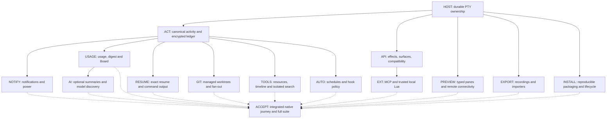

# Harness development implementation

This is the development-only implementation record for the user-approved plan, based
on `c5644df`. The candidate remains uncommitted on `codex/harness-development`.
No release has been created: no version bump, tag, publishing, uploads, marketing,
release-workflow changes, new CI matrix, telemetry or recurring validation machinery.
Installer, signing and local packaging engineering remain in scope.

## Dependency graph

All source integration has one writer. Isolated proofs use disposable homes and
repositories; the installed production daemon and its running programs are untouched.
Solid edges are implementation dependencies; dashed edges are acceptance dependencies.

## Implementation and evidence

| Node | Completed behavior | Evidence and documentation |
|---|---|---|
| HOST | Stable PTY owner; independent public streams; exclusive daemon generation and process-held writer lease; bounded checkpoint/replay handover, accepted-mutation drain, retry identities, rollback and crash recovery; guarded owner updates; actual child exit receipts | Isolated active/idle/background-job/pipe, failed adoption, replacement, crash, orphan fencing and host-loss scenarios pass. Fast-child registration/reaping regression and live PTY lifecycle checks pass; a signed fan-out test produces exit 0 and accurate digest totals. [Service updates](SESSION-SERVICE-UPDATES.md) |
| ACT | Stable execution/conversation/host/process identities; separate turn/process/attention state; versioned provider hooks, authoritative freshness, identifier deduplication and tool anchors | Provider fixtures cover Stop versus process exit, duplicates and generations. Hooks are bounded and quiet. [Activity](ACTIVITY-AND-SEARCH.md) |
| HISTORY | One daemon-owned transactional SQLite activity store; separate bounded streaming output; authenticated macOS envelopes before sensitive writes/WAL; shared Keychain keys, interruption-safe migration, bounded unavailable-key memory, recovery, retention and complete capture opt-out | Migration, corruption, interrupted append, unavailable keys, retention and privacy fixtures pass. Provisioned native app/host/daemon/CLI capture and recover encrypted history with unchanged process IDs. Recovery also passes after atomic app-bundle replacement, using running-task entitlements. Linux storage is documented owner-only plaintext. [Native acceptance](NATIVE-ACCEPTANCE.md) |
| API | Explicit effects, required capabilities and allowed surfaces; request/response negotiation, old-client terminal projection, actionable unsupported errors; local administrative boundaries; typed backward-compatible settings; owned bounded cancellable work | Existing catalog/dispatch and denied-exposure fixtures pass. Public command/wire contracts are retained. [MCP](MCP.md) |
| NOTIFY | Shared notification policy across native banners, real sink-specific external payloads, chimes and optional speech; opt-in secrets/content, mute/snooze, IANA quiet hours, burst coalescing, sink throttling, bounded retry/expiry and redacted diagnostics | Policy, payload, receipt and failure fixtures pass. Signed native permission is Allowed; macOS accepts the local test. No external sink has been invoked. [Notifications and power](NOTIFICATIONS-AND-POWER.md) |
| POWER | Daemon-owned keep-awake assertion; AC/battery defaults, grace, predictable On/Off/Auto overrides, prompt sleep acknowledgement and truthful elapsed-wake reporting | Real AC assertion, Auto release and battery restriction pass. The user-triggered physical sleep/wake reports 2.06 seconds with unchanged host/daemon/shell/background-job PIDs and continuous ordered records; Auto then releases the assertion. No continued execution during sleep is claimed. |
| USAGE | Approved provider roots and profile labels; transactional incremental cursors, partial lines, identity/rotation/truncation and cumulative accounting; freshness/unknowns, account-wide limit deduplication, observed reset evidence and optional explicit pricing | Provider/accounting fixtures pass. Digest SQL aggregates are independent of the bounded timeline; explicit tests only are counted. Repository reports group verified worktrees. [Activity](ACTIVITY-AND-SEARCH.md) |
| BOARD | Overview mode and existing shortcut; accessible stable selection, filters/sorting/jump/peek/snooze/resources; bounded concurrent hosts, stale/offline/capability rows and quiet digest indicator | Native local/remote/offline walkthrough passes; offline rows do not fabricate shells. [Native acceptance](NATIVE-ACCEPTANCE.md) |
| RESUME | Trustworthy launch specifications and exact directory/profile/conversation; fresh-shell validation; default insertion without Enter; per-pane opt-in once per restore generation; OSC 133 Copy Output and bounded quoted Explain | Focused fresh-shell/refusal/once-only tests and actual native unsubmitted exact command insertion pass. Unknown argv0 yields information only. [Activity](ACTIVITY-AND-SEARCH.md) |
| EXT | Official Swift MCP SDK 0.12.1 isolated from terminal core; lifecycle negotiation, explicit read/write allowlists, canonical own-pane refusal, cancellation/errors and paginated screen resources; backed-up JSON/TOML install; trusted local Lua metadata registry | Real initialize/list/call, denial, screen resource and cancellation exchanges pass. Trusted plugin review/invocation/revoke fixtures and isolated CLI execution pass. [MCP](MCP.md), [plugins](LOCAL-PLUGINS.md) |
| GIT | Validated managed worktrees outside repositories; clean or explicit committed base; shared pinned base and prompt metadata; provider argv/stdin launches; durable actual workload/test outcomes, partial failure, cancellation, comparisons, difftool and guarded cleanup | Disposable repository/host checks cover dirty/active/unpushed paths, lease retention, duplicate requests and partial failure. Final signed fixture retains both dirty worktrees, reaps a fast explicit test and reports exactly one passed test. [Worktrees](MANAGED-WORKTREES.md), [fan-out](FAN-OUT.md) |
| PREVIEW | Typed terminal/preview content through actual pane hosting, layout, focus, drag/split, Overview and Saved Setups; compatible legacy decoding; private loopback WebKit, navigation/download restrictions; owned SSH forwards, probed reconnect/backoff/manual fences, explicit resync and authenticated private image paste | Layout/compatibility and remote fixtures pass. Native local/remote split, restore and private remote PNG paste insert a correctly quoted path without Enter. [Preview and remote](PREVIEW-AND-REMOTE.md) |
| EXPORT | Timed UTF-8/asciicast with dimensions/resizes, input omitted, bounded cross-chunk heuristic masking and unsafe-control removal; reviewed redaction/share; nested stable tmux layouts, Ghostty conflict reports and iTerm colors with dry runs/backups | Export/import fixtures and disposable real tmux checks pass. Native redaction/save/share chooser and unchecked Saved Setup import pass without acquiring PTYs. [Recordings](RECORDINGS.md), [importers](IMPORTERS.md) |
| TOOLS | Actual process-tree CPU/RSS with sampling intervals and identity-validated confirmed signals; honest retained/evicted tool anchors; paginated agent/time search and isolated time/result-bounded regex | Worker/cancellation/resource fixtures pass. Native process confirmation, exact result jump and visible matched-text highlight pass. A presented-frame regression covers actual search colors. [Activity](ACTIVITY-AND-SEARCH.md) |
| AUTO | Durable one-shot/cron/event schedules with IANA timezone and occurrence identity, duplicate/overlap fences, missed default and explicit predicted-reset opt-in; trusted provider-specific deny/ask guardrails, fail-open observation, fail-closed supported enforcement and redacted audit | DST/duplicate/recovery and harmless policy fixtures plus real helper IPC pass. Native review starts disabled and reports unavailable/unsupported states. [Scheduling](SCHEDULING.md), [hook policy](HOOK-POLICY.md) |
| AI | Native Responses/Messages/Gemini/compatible adapters and all named cloud/local/custom presets; live catalogs/cache freshness, preserved explicit model, credential references and reviewed content consent; bounded tool-free generation, cancellation/provenance, no uncertain billable retry and optional Apple on-device model | Protocol-family fixtures and isolated real HTTP discovery/submission/recovery pass. Native preset/consent review passes with external generation off. A live cloud smoke check is conditional on supplied credentials; none have been supplied or used. [AI summaries](AI-SUMMARIES.md) |
| INSTALL | Atomic owner-checked signed helper bundles and aliases, shared installer/uninstaller fence and rollback; exact component profiles/Keychain group; isolated explicit-home install; pinned dual-architecture Linux archives, declared runtime dependencies, verified install/recovery/rollback/systemd, supplied-metadata cask engineering and source option | Native signed install/recovery after bundle replacement and guarded empty-home uninstall pass, retaining unrelated files. Final arm64 and x86_64 archives pass installation, interruption recovery, rollback, lifecycle and MCP checks without Swift. The x86_64 proof uses a full Linux kernel VM and every declared library package version matches. Independent arm64 clean/reused caches reproduce normalized binaries and archive bytes. [Installation](INSTALLATION-LIFECYCLE.md), [Linux](LINUX-PACKAGING.md) |
| INTEROP | Published OSC 7501 vectors, representative synthetic TUI/replay fixtures, reusable persistence/survival proof, correct 514 themes, privately available iOS label and accurate reboot/logout/sleep/owner-failure survival distinctions | Parser/replay and lifecycle checks pass. Documentation explicitly distinguishes saved state from live processes. [Service updates](SESSION-SERVICE-UPDATES.md) |

## Completion checklist

- [x] Session preservation, safe update decisions and atomic guarded installation.
- [x] Stable session host, exclusive mutation ownership and validated handover/recovery.
- [x] Canonical activity, encrypted persistence, migration, retention and opt-out.
- [x] Explicit API exposure/effects/capabilities and response compatibility.
- [x] Notifications and secure sink configuration.
- [x] Physical AC/battery and sleep/wake acceptance of daemon power policy.
- [x] Incremental usage, limits, complete digest/repository reports and Board.
- [x] Exact resume, command output and Explain insertion.
- [x] MCP and trusted local plugins.
- [x] Worktrees, fan-out, actual test outcomes and protected cleanup.
- [x] Typed previews, remote connectivity and private image paste.
- [x] Recordings, review/share and supported importers.
- [x] Resources, timeline and isolated filtered regex search.
- [x] Durable scheduling and provider hook policy.
- [x] Optional AI summaries and provider/model configuration.
- [x] Interoperability, installer/cask engineering and truthful documentation.
- [x] Final Linux source snapshot and affected runtime verification.
- [x] Integrated native acceptance, affected failure checks and completion record.

## Focused verification record

The existing full suite ran once after integration: 2421 tests were discovered, with
63 skips from existing platform/opt-in/fixture gates. Eight tests reported 13
assertions: seven old plaintext/system-key assumptions and one echoed completion
marker race. Those failures were corrected and passed their affected rechecks;
29 focused persistence checks cover the protected-original unavailable-key case.
No full-suite rerun is warranted by the current focused changes.

The matched terminal comparison delivered every one of 50,331,731 ordered bytes:
67.45 MB/s before the PTY split, 67.93 MB/s afterward. No dropped/duplicated bytes or
regression above 10% was observed. Other unmatched drain workloads are not presented
as this comparison.

Late native findings were fixed and rechecked: Board horizontal scrolling and
history/staleness separation, typed offline rows, preview toolbar contrast,
notification failure reporting, stale palette actions, exact regex span mapping and
visible frame colors, signed helper installation/resource renewal/uninstall fences,
running-task Keychain access after app replacement, fast-child reaping after
asynchronous process-watcher registration, and kernel peer/birth verification for
restart controls after macOS deletes an exchanged executable bundle. The final reaping change passes 23 live
outcome/lifecycle/bookkeeping checks and the actual signed fan-out test/digest flow.

[Native acceptance](NATIVE-ACCEPTANCE.md) records actual user-facing observations.
External sink delivery and a billable provider smoke check are configuration-dependent,
not silently skipped claims or required background requests. Physical sleep/wake is confirmed through the user's hardware action and native daemon events. Local artifacts and all source changes remain
reviewable; nothing has been published.

The deleted-executable owner check passes 19 focused client/compatibility checks.
Against the actual atomically exchanged signed previews, `--if-empty` reports and
preserves two live shells, while explicit stop retires the private Keychain fixture.
The vanished executable pathname never authorizes a competing owner.

Signed-preview UI state is isolated by explicit home without changing the regular
installation's legacy preference keys. Persistence-mode acceptance now requires an
actual success response. The affected app builds and signs; a native preview rebuild
leaves exactly one GUI process and preserves its existing host, daemon and two shells.

The slower x86_64 runtime exposed premature descriptor reuse in short-lived control
connections. Host and daemon sockets now retain their descriptors until all Dispatch
reader/writer cancellation handlers finish, including writers cancelled after a flush.
The focused mixed-frame and repeated replacement-peer checks pass, as does the signed
macOS lifecycle/MCP proof. The reusable proof also waits for completed PID/marker
contents rather than treating file creation as evidence that the fixture finished.

The final arm64 and x86_64 archive runtime proofs both pass after that fix, including
active shells/background jobs, failed adoption and activation rollback, replacement
and crash recovery, terminal/pipe continuity, actual repository digest totals, MCP
negotiation/denial/cancellation, interrupted install recovery, rollback, preserved
unrelated files, resolved dynamic dependencies and checksum/architecture rejection.
Four focused transport checks pass, including existing live disconnect/reconnect
checks. The signed macOS lifecycle proof passes with the same source change.

The pre-review frozen Linux build input is
`bf752bf2cad8142c1848cab9d944e7a6cb53ca18072ddd0a917728ca5e08be14`.
Artifact manifests record this identity and each executable hash. These archives
predate the subsequent source-review fixes below; their runtime proofs apply to
that snapshot, not to the current uncommitted source. Local archive
SHA-256 values are:

| Architecture | Archive SHA-256 |
|---|---|
| arm64 | `384b2789674e0fc977b6993518996d8da48035271343c7c7de6361c6c5220ab5` |
| x86_64 | `dd75d445afa4bd376b7e832258d526bc65745cbe933c34ae6e847ec49fa08752` |

All development nodes and required available-environment observations are complete.
Live cloud-summary and external-delivery checks remain conditional on user-supplied
configuration; neither feature sends anything until explicitly configured. The
candidate source and signed private-home preview remain available for review. The
private preview also predates the source-review fixes below.

## Subsequent source review

The review covered the tracked changes and new modules against `c5644df`, focusing
on process ownership, recovery, privacy, API exposure, bounded asynchronous work,
provider adapters, app/CLI integration and installation. It found and corrected:

- AI catalog storage used the ordinary 64 KiB ledger limit despite discovery
  allowing 4 MiB. Catalog objects now use that bounded allowance in storage and
  checkpoint restoration; ordinary activity records retain their smaller limit.
- A canceled notification's delayed callback could consume a newer attempt for
  the same delivery. Completion now checks an attempt identity. Command-duration
  thresholds are read on the notification policy's owner queue.
- Board reloads could process transient AppKit selection notifications before
  restoring the selected pane. Selection is restored by identity, pending detail
  work is canceled when selection disappears, and resume responses cannot reopen
  UI after the Board closes.
- Restart could treat an unavailable process-generation lookup as proof of exit.
  It now requires positive evidence of exit, reaping state or changed identity;
  uncertainty keeps a replacement from starting.
- Remote preview forwards always targeted `127.0.0.1`, even for an IPv6 or other
  approved loopback URL. They now retain the requested address, format IPv6 for
  SSH, and replace a forward when that address changes at the same port.
- The tmux CLI importer now requires the expected successful save response before
  reporting that a Saved Setup was created.

Focused verification passed: the existing AI-summary and notification service
checks (2), preview-forward lifecycle check (1), and compatibility/lease checks
(8). The AI fixture stores and reads an encrypted 1,000-model catalog while
confirming the ordinary-record size bound. The preview fixture covers IPv6,
same-port address replacement, reuse, stale views and manual disconnect. The
application and CLI builds pass, as does `git diff --check`.

No full-suite rerun, additional test framework, live cloud request, production
restart or release was performed. Earlier native and Linux runtime observations
remain scoped to their recorded artifacts; this review does not claim a new
native walkthrough or rebuilt Linux archives. The corrected source is the current
review candidate.

## Integration follow-up review

A further pass through recovery, notification consent, scheduling/resume, recordings
and remote connection callbacks corrected four additional integration issues:

- AI startup recovery now pages every retained receipt in stable identity order.
  The former 501-row read could miss recent submissions under the 512-receipt
  budget. Recovery marks them uncertain without sending another request.
- Notification expiry and revoked event/destination policy now apply to in-flight
  requests as well as queued notices. Cancellation cannot recall a payload already
  received by its destination. Disabled desktop sinks retire queued delivery.
- Recording review invalidates its saved share target whenever masks or source
  change. Load clears the prior review, and save/protection callbacks cannot replace
  a newer review or re-enable sharing of an older export.
- Obsolete remote reconnect callbacks no longer clear a newer generation's retry
  status. Explicit disconnect still clears its own connection state.

The two existing service checks pass with expanded recovery and policy-revocation
fixtures; recovery includes more than 500 retained receipts. The affected app and
daemon build, and `git diff --check` passes. No full-suite rerun, new test machinery,
live notification/provider request, production restart or release was performed.
The prior native and packaged-runtime evidence retains the snapshot scope above.
