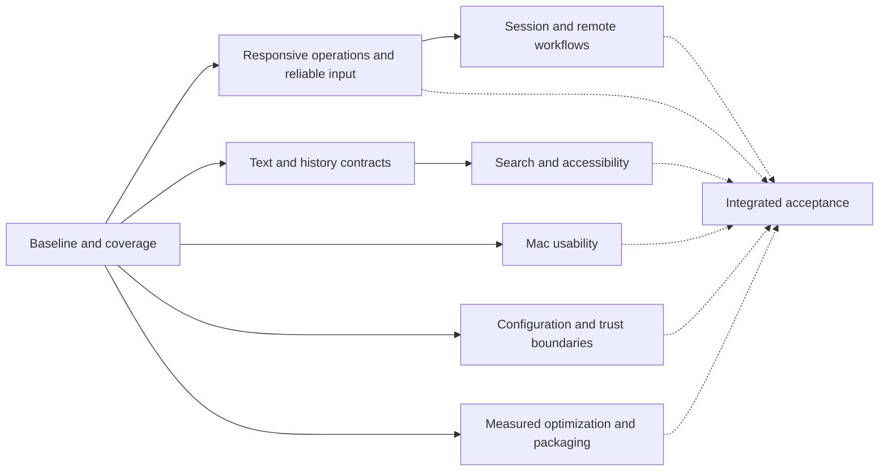

# Terminal excellence execution ledger

Baseline: `56edc52` (2026-10-08). Implementation branch: `codex/terminal-excellence`.
Preserve existing user data and `.supergoal/`. Use a separate `HARNESS_HOME` for live checks.
Public release is outside this change. One implementer owns all source edits; builds,
performance measurements, and interactive checks run serially on the Mac.

## Outcomes and dependencies

Solid edges are implementation prerequisites; dashed edges are acceptance dependencies.
T precedes S because text position and history lifetime rules must agree. R precedes W
because asynchronous operations must preserve host and session identity.

| Node | Coverage / acceptance | State |
|---|---|---|
| B | Source inventory, old roadmaps, issues, PRs 180/184; release baseline tied to source | Audited; scoped measurements recorded; physical latency/power gaps open |
| R | GUI/IPC/CLI input admission, deadlines, cancellation, ordering, stale results | Integrated, built, targeted/live CI passed; paused-daemon GUI check passed |
| T | Engine, Unicode, reflow, history allocation, renderer, graphics, keyboard/mouse protocols | Integrated and verified by named suites; color emoji and newer width data remain open |
| S | Literal/regex/wrapped search, global pagination, accessibility text/cursor/selection | Integrated; targeted/CI and Find UI checks passed; spoken VoiceOver unverified |
| M | Native scrollbar, settings, keyboard/IME, window management, themes, onboarding, menus | Integrated; compact Mac pass complete; physical IME/displays/Spaces unverified |
| W | Persistence, multi-window/host ownership, setups, activity, agents, shell integration, CLI/Lua/API | Audited and CI passed; raw-replay fidelity and real remote recovery remain open |
| H | Config recovery, storage failures, hostile output, files/clipboard/socket/SSH boundaries, Linux | Integrated; recovery/deadline tests and Linux live suite passed; Linux job mandatory |
| P | Profiling, release packaging/resources/dependencies, docs and reproducible measurements | Packaged and measured; truecolor consumer and short-row memory targets exceeded; other throughput, search CPU and startup targets remain open |
| F | Focused checks, one full macOS/live-daemon run, compact UI pass, final performance comparison | Reviewable local candidate delivered; open acceptance limits explicitly retained |

## Findings

These are source findings unless a runtime observation is explicitly named. Prior roadmap
completion markers and tests on a different commit do not verify the final candidate.

| ID | Severity | Finding | Outcome / status |
|---|---|---|---|
| R1 | High | GUI session actions synchronously wait for daemon requests | R / implemented; admission and bounded-I/O regressions pass |
| R2 | High | PTY writer drops input exceeding its pending capacity without reporting failure | R / implemented; admission and bounded-I/O regressions pass |
| R3 | Medium | Request timeout excludes connect/write; discovery processes lack whole-operation deadlines | R / implemented; admission and bounded-I/O regressions pass |
| T1 | High | Fixed two-mark cells lose longer combining sequences and compound emoji | T / implemented; grapheme/history regressions pass |
| T2 | High | Raw-byte-to-line estimate is not a decoded-history memory ceiling | T / implemented; grapheme/history regressions pass |
| S1 | High | Find synchronously scans all history; spacer tails prevent adjacent CJK matches | S / implemented; mapping, cancellation, pagination checks pass |
| S2 | Medium | Global search captures and splits whole histories again for each page | S / implemented; mapping, cancellation, pagination checks pass |
| S3 | Medium | Each accessibility getter rebuilds all history; visible range reports entire history | S / implemented; mapping, cancellation, pagination checks pass |
| M1 | Medium | Scrollbar is click-through and ignores always-visible system preference (#181) | M / integrated; appearance/repaint checks pass; hands-on evidence below |
| M2 | Medium | Experience summary contradicts explicit keep-sessions override | M / integrated; appearance/repaint checks pass; hands-on evidence below |
| M3 | Medium | Idle display invalidation can leave a pane blank; existing PR #180 | M / integrated; appearance/repaint checks pass; hands-on evidence below |
| M4 | Medium | Quick Terminal blur/settings refresh differs from main window; existing PR #184 | M / integrated; appearance/repaint checks pass; hands-on evidence below |
| H1 | High | Invalid live config replaces working settings with defaults | H / integrated; recovery/persistence and Linux live CI pass |
| H2 | Medium | Debounced session-save failures are swallowed | H / integrated; recovery/persistence and Linux live CI pass |
| H3 | Medium | Linux parked-snapshot test assumes ciphertext despite documented plaintext fallback | H / integrated; recovery/persistence and Linux live CI pass |
| B1 | Medium | Existing scorecard conflates PTY drain with rendering speed and internal timing with photons | B/P / claims corrected; matched consumer/startup/memory results committed; physical latency/power open |

## Verification policy

Use targeted existing suites and small regressions for substantive bugs. No coverage quota,
repetitive full runs, broad mechanical refactor, or new testing framework. Run one final full
macOS suite with live daemon tests; reuse identical-candidate CI evidence. Re-run only for a
changed dependency, demonstrated failure, or invalid measurement. Record skipped and blocked
observations honestly. Baseline/final microbenchmarks use warm-up and short median samples;
PTY drain rate, consumer throughput, presentation timing, and physical input-to-photon are
different measurements. Sum app and daemon resource usage for cross-terminal comparisons.

## Evidence and environment

- Starting tree has no tracked edits; `.supergoal/` is unrelated untracked material.
- Initial inspected CI was for preceding commit `0385658`: macOS and Xcode build passed;
  Linux failed `SnapshotTests.testParkDropsTheGridKeepsTheChildAndANewClientSeesTheScreen`.
- Running preview predates this candidate and is not acceptance evidence.
- Local Swift: 6.4, arm64 macOS; active developer directory is CommandLineTools. Full Xcode
  is available at `/Applications/Xcode-beta.app`. Commands select it per process; global
  developer-directory settings remain unchanged. SwiftPM uses its native backend because
  the default backend with CommandLineTools could not locate XCTest.
- Baseline measurements and subsequent check logs: `.benchmark-results/terminal-excellence/`
  (untracked, not included in source changes).

## Source coverage and integration dispositions

This is a subsystem audit, not a claim that every possible execution is proved correct.
“Implemented” means source exists; “integrated” means its consumers use it; “built” means
compiled on this toolchain; “verified” is reserved for a named check or observation.

| Subsystem | Inspected boundaries and disposition | Evidence / remaining acceptance |
|---|---|---|
| Engine / parser / VT / terminfo | VTParser bounds and abort handling; TerminalScreen, width lookup, alternate screens, 2026 timeout, replies and TerminalIdentity. Added compact exceptional grapheme IDs, immutable snapshot ownership, decoded-history accounting. ASCII cells remain POD. | GraphemeHistoryTests, ThaiCombiningMarkTests, HistoryRestoreTests pass. Existing conformance/reflow/damage/width suites passed in final CI. |
| Renderer / fonts / images | Frame construction, row hashes, glyph lookup, ligature runs, Metal uploads, image cache and bounded atlas. Frame and compositor carry cluster dictionaries. Existing image-cache eviction and capture-grid idle release retained. | FrameBuilder/Occlusion/WindowAppearance checks pass; offscreen renderer and font fallback suites passed in final CI. Color glyph support remains open. External-display sharpness remains physical acceptance. |
| Terminal view / input | SurfaceIO admission before enqueue; generation-bound reconnect work; native scroller; keyboard, Option/Meta, IME, drop/paste and responder paths. Removed synchronous initial attach. | Writer admission, old writer, replay/ownership and async Find checks pass; compact GUI pass completed below. |
| Find / accessibility | COW text snapshots, shared UTF-16/cell spans (wide tails excluded), soft wraps, NFC, cancellable worker search, explicit invalid-regex status. AX text cached by content revision with real visible/selection ranges. | Search, Thai, accessibility text, restore, and newest-query tests pass. VoiceOver spoken-output quality not inferred from headless checks. |
| Daemon / lifecycle | RealPty fd generation, queued writer, authoritative parser, idle parking, attach history gate, sequence ordering and resize ownership. Input rejection negotiated on attach; old daemons use JSON input. | 22 existing live daemon round-trip cases passed after nonblocking transport change; final lifecycle/contention/ownership suites passed in CI. |
| Storage / config | Separate non-mutating live reload; startup preserves unreadable originals; existing corrupt backups retained. Save debounces report failures, immediate flush cancels older saves. Runtime persistence health travels in additive snapshots. | Settings and SessionPersistence tests pass. Errors do not automatically replay mutations. |
| IPC / CLI / JSON API | Frame caps before decode, peer UID and 0600 socket, bounded write backlog, whole connect/write/read deadline, nonblocking Unix descriptors, poll-based subscriptions/follow. GUI uses captured endpoint queues; CLI retains synchronous semantics. | BoundedIO, IPCCodec and live daemon tests pass; final CLI/API/target suites passed in CI. |
| Lua / hooks | Vendored Lua 5.1.5 remains confined to CLI; config permissions and local-script trust model retained. Shared command targeting and error codes retained. | ScriptEngine/command/format suites passed in final CI. User Lua is trusted executable code, not a sandbox. |
| Shell integration | bash/zsh/fish startup injection, custom startup paths, disable switch, quoting and OSC 7/133 paths reviewed. Explicit `/bin/sh` used for portable pagination fixture rather than inheriting user shell customization. | Existing shell injection/profile tests passed in final CI; bash/zsh/fish and less checked live. |
| Settings / menus / palette | Effective quit-persistence text, async daemon-owned settings, save error feedback, captured targets and ordered command sequences. Appearance refresh shared with Quick Terminal. | Settings/layout/catalog checks passed in final CI. Existing explicit overrides retained. |
| Onboarding / themes | Short first-run flow and optional installs retained. Theme import/settings merge boundaries, resource loading and fallback reviewed. | Existing onboarding/theme tests passed in final CI; first-run flow inspected live. |
| Windows / workspaces | Multi-window owner capture, async create/move completion, split focus/drag and restoration paths reviewed. PR #180 idle repaint and #184 shared transparency integrated before terminal-view changes. | Targeted appearance/repaint passed; split focus and utility-window closure checked live. Quick Terminal appearance has targeted checks; Spaces/display transitions remain unverified. |
| Agents / Activity / setups | Existing per-pane activity identities, snooze/read timestamp semantics, setup open/new-copy separation, Recently Closed fresh-shell behavior retained. Metadata IPC moved off main. | Existing workspace/agent/setup suites passed in final CI. |
| Remote | DaemonLink and active snapshot attachment connect off main, stale generations discarded. SSH trust/argument validation retained; discovery has cancellation, 12 s total deadline and 1 MiB output cap. | Endpoint/reconnect/SSH tests passed in final CI. Real network sleep/wake/tunnel recovery requires a reachable test host. |
| Packaging / updates | SwiftPM and Xcode macOS 15 target, arm64 products, Sparkle 2.9.2 pin agreement, version 1.13.0/build 128 agreement, EdDSA appcast and release signing gates reviewed. | Local resource/version/arm64/macOS-15/ad-hoc signature validation passed; no public release or notarization performed. |
| Generated / vendored resources | Width table and generator use UCD 15.1; existing all-scalar equivalence suite checks them. Release notes generator/version guard, themes bundles, Nerd Font license, C base64 and CLua boundaries reviewed. | Generated resources unchanged unless noted; no blind dependency upgrades. Newer Unicode width-table coverage remains a separate compatibility limit. |

Additional findings resolved during implementation:

- R4 (high): large AF_UNIX sends on macOS could block with `MSG_DONTWAIT` alone.
  Keep sockets nonblocking and poll readers; a real stalled-write regression caught this.
- R5 (medium): selection coalescing could cross a queued command. Commands are now barriers.
- H4 (medium): Kitty file size was checked before opening, followed by an unbounded read.
  Validate the opened regular file, cap the read, and avoid unlinking a replaced temporary file.
- H5 (high): pathological trigger regex could monopolize the parser despite a batch budget.
  Progress callbacks stop regex work after a 2 ms line budget; patterns are capped at 4 KiB.
- H6 (medium): early subprocess stdin closure could raise SIGPIPE. Writes suppress it on macOS;
  portable worker-thread masking handles it without changing the application's signal policy.
- H7 (high): a release build with an isolated home could refresh global installed binaries or
  restart the normal launchd job. Explicit-home launchers now avoid both paths.
- M5 (medium): several custom fades ignored Reduce Motion. Shared and direct fades honor it.
- S4 (medium): per-cell search mapping added avoidable allocation and CPU cost. Consecutive
  one-column text now shares a span; wide/compound glyphs retain exact non-linear mappings.

## Roadmap and issue reconciliation

- `AUDIT_ROADMAP.md` and `V1_10_ROADMAP.md` are historical plans, not current parity percentages.
  Their old missing-DECSTR/REP/IRM/DECOM, Kitty-ack/delete, pixel-mouse, secure-input, VoiceOver,
  synchronous-layout-save and periodic-git-process findings have implementations in current
  source and existing suites. Do not recreate their obsolete replacements.
- PR #180 (`5ae404e`) and PR #184 (`92d1c839`) are integrated here; overlapping files were
  reconciled before this work. Neither PR is treated as independently verifying this candidate.
- #181: native interactive scrollbar implemented; track click and thumb drag moved history without selecting terminal text.
- #182: Dynamic Island was removed in v1.13; it is absent from current chrome.
- #99: source-aware remote rail exists; this pass hardens its async subscriptions.
- #12: engine, renderer, kit and core already export Swift package products.
- #27: PTY drain is not renderer throughput. Consumer measurements are recorded separately;
  cross-terminal leadership stays open until the corresponding workload has matched evidence.
- #179 (iOS app): outside this Mac-terminal candidate; no GUI-platform expansion.

## Retention and trust contracts

- Raw PTY retention and decoded history are separate: raw output is bounded at 512 MiB; the scrollback setting now reaches new/restored/live daemon surfaces rather than a fixed 1 MiB replay buffer. Disk-backed raw history has a 64 KiB minimum cap;
  decoded history is independently bounded at 512 MiB including stored row capacities,
  ring metadata and a conservative exceptional-cluster allowance. Configured line caps
  still apply first. Active screen, transient COW snapshots, rendering caches and raw bytes
  are additional memory, so 512 MiB is **not** a whole-process RSS promise.
- Exceptional clusters are limited to 256 UTF-8 bytes each and an 8 MiB pool per screen.
  Ordinary inline marks and ASCII stay allocation-free; extreme extending sequences beyond
  these limits are truncated. Pool reclamation is throttled under hostile output.
- Find retains at most 50,000 matches, limits one logical line to 262,144 UTF-16 units,
  and gives matching 250 ms per search. It reports limited results; it does not claim a full
  scan when the budget expires. Global pagination keeps at most 32 small cursors for 60 s;
  output/resize/layout changes invalidate a cursor instead of silently skipping old output.
- Accepted PTY writes preserve byte order; queue exhaustion rejects the entire incoming write
  with feedback. Failed stream delivery has an unknown outcome and is never retried. Input
  held for an old attachment is never replayed into its replacement.
- Clipboard reading stays disabled by default. SSH host verification, peer-UID checks, socket
  permissions, image quotas and user-owned configuration boundaries remain in place.

Additional allocation/host findings: geometry is capped before multiplication (4,096 per
axis and 1,048,576 cells); unsupported daemon resize requests fail explicitly. Local Git HEAD
watchers now run only for local tabs, so a remote cwd cannot be mistaken for this Mac's path.

## Verification and local delivery

- Focused checks covered input admission/overflow/order, socket deadlines, subprocess
  cancellation, Unicode/cell mapping, history eviction, invalid configuration reload,
  persistence failures, stale Find/global pages, attachment/reconnect ordering, and appearance.
  Suites were selected for changed contracts, without a coverage quota or repeated full runs.
- One local full macOS/live-daemon pass exercised 2,255 tests, with 58 intentional skips.
  Two obsolete importer source-string assertions failed; a behavioral split-theme import
  check replaced them, and the focused 16-test correction pass passed.
- The preceding production source `7dbebe7` passed [CI run 37865660157](https://github.com/robzilla1738/harness-terminal/actions/runs/37865660157):
  macOS **2,259 tests, 58 skipped, zero failures**; Linux **1,720 tests, two skipped,
  zero failures**; debug/release builds, Xcode build, manifest agreement and benchmark job
  passed. Reused this evidence for identical production code instead of another local full run.
- Linux CI exposed a descendant-pipe cancellation wait and a cold fixture timeout. The
  cancellation path no longer waits on inherited pipes after termination. The pagination
  fixture gives setup RPCs a bounded ten-second deadline with request-specific diagnostics;
  production timeouts remain unchanged. Linux is no longer an advisory job.
- Compact GUI acceptance: first-run flow and optional-install choices; bash/zsh/fish;
  Unicode output and copy/paste; emoji Find with accurate matches; malformed regex feedback;
  native scroller track click and thumb drag; split creation/focus; less alternate-screen
  restoration; effective persistence text under explicit overrides; Settings ⌘W behavior.
- Paused only the isolated daemon for twenty seconds: tab creation did not stop Settings
  from opening/closing. After resume exactly one tab appeared, with no mutation retry.
- Measurements use release builds, one warm-up and three samples, one exclusive local Mac
  slot, and an isolated application home. One ambiguous parser run and one initially invalid
  grid probe were repeated; the accepted results are in the [scorecard](SCORECARD.md) and
  [machine-readable receipt](benchmarks/terminal-excellence-2026-10-08.json).
- Packaged local app: `dist/terminal-excellence/HarnessExcellence.app`, bundle
  `com.robert.harness.excellence`, separate `dist/terminal-excellence/home`, automatic updates
  disabled. App, daemon and CLI are arm64 with macOS 15 minimum; version 1.13.0/build 128
  agrees. All 485 embedded community themes match their generator input; the Nerd Font,
  font license, icon, logo and Sparkle framework are present. Deep strict ad-hoc code-signature
  verification passed. This is a local candidate, not a signed/notarized public release.
- Existing `.supergoal/`, normal installation, normal launchd service, and user data were
  preserved. The previous running preview was not used as candidate verification.

## Additional findings from integration and measurement

| ID | Severity | Affected behavior | Fix / evidence |
|---|---|---|---|
| R6 | High | Linux subprocess timeout waits for descendants that inherited output pipes | Terminate owned process group where possible, close capture handles, stop awaiting Foundation pipe completion; cancellation regression and Linux CI pass |
| T3 | High | GUI history preference never reaches daemon raw replay; defaults silently retain only 1 MiB | Share budget calculation, update new/restored/live surfaces and disk compaction; retention regressions and 4.70 MB live replay observation pass |
| M6 | Medium | Finder-launched shells without locale render UTF-8 as escaped bytes in less | Add LC_CTYPE=UTF-8 only when no locale is supplied; explicit environment wins; environment test and live less check pass |
| M7 | High | ⌘W in Settings closes the terminal pane behind it | Route utility-window closure to the key window; disable pane mutation menu entries there; live Settings close preserves original pane |
| P1 | High target gap | End-to-end consumer throughput | Follow-up: 43–58% less elapsed time than previous candidate; leads truecolor, still trails Ghostty by 20–60% in six workloads. Viewport copies and main-thread drawable waits removed; remaining parity target open |
| P2 | Medium target gap | Correct Find uses more CPU than old search | Follow-up literal 17.65 ms, regex 73.70 ms; original baseline 14/50 ms. UTF-16 buffer reuse improves literal; parity target remains open |
| P3 | Resolved for measured workload | Retained short-row memory | Follow-up 178.53 MiB app+daemon versus preceding 665.95 MiB and Ghostty 249.83 MiB; all 100k rows / 4.70 MB raw output retained. Lossless uniform-row compaction, original widths and actual allocation accounting; other workloads not inferred |
| P4 | Medium target gap | Startup consistency and responsiveness | Readiness median 395.87 ms versus Ghostty 305.84 ms, including a 1375.77 ms outlier; open. Unicode parse+frame improves to 20.21 ms, previously about 51 ms |
| T4 | Medium compatibility gap | Compound emoji retain text but use monochrome/tinted coverage | Open: existing R8 glyph atlas does not carry color emoji; text correctness is not color-rendering parity |
| W1 | Medium fidelity gap | Raw history replay after daemon restart at a different width can show old shell redraw/prompt artifacts | Open: persisted raw output is not an exact saved grid. Live sequence/ownership checks pass, but do not prove restart fidelity |
| F1 | Unverified | Real IME/non-US keyboard, VoiceOver spoken output, external displays/Spaces, real remote sleep/wake/tunnel loss | Requires the corresponding hardware/interaction or reachable test host; not inferred from unit tests |
| F2 | Unmeasured | Physical input-to-photon, scrolling frame pacing, privileged power/wakeups | Internal presentation marks, parser acknowledgements, reflow CPU and short idle CPU samples are different metrics |

## Performance and presentation follow-up

Engine, memory and initial consumer source `08e4fba`; packaged source and final consumer
check `b41b325`. Later changes correct divider geometry, Settings contrast/copy, and stale
output delivery after cancellation. All timing and memory samples are retained in the [follow-up receipt](benchmarks/terminal-excellence-2026-10-08-followup.json).
The final consumer check covers the added output-subscription identity guard.

- A release engine profile attributed about 80% of sampled feed work to copying the whole
  viewport during scrolling. Full-screen scrolling now rotates physical rows; partial-region
  scrolling normalizes before its existing copy. Snapshot/text/reflow/cell readers resolve
  logical rows consistently. Existing scalar/fast-path and damage suites passed.
- Uniform history rows store codepoints plus one attribute template and the original width;
  heterogeneous rows keep full cells. Exact default padding is reconstructed; colored blanks,
  explicit spaces, hyperlinks, wide tails and exceptional graphemes survive. History accounts
  for backing-array capacity and metadata. Two focused regressions check content and budget.
- Cell attributes now fit in 32 bytes with the same public properties and POD ownership.
  Engine and renderer checks: 741 tests, two intentional skips, zero failures.
- Search reuses the UTF-16 mapping buffer for ASCII literal matching. International text,
  normalization, regex errors, soft wraps and cell coordinates retain their shared mapping.
  Search/Thai/grapheme/reflow focused pass: 53 tests, zero failures.
- Output scanners borrow contiguous bytes and avoid appending empty event arrays per byte.
  Program status/bell/surface checks: 64 tests, three opt-in skips, zero failures.
- Coalesced attachment replay now carries the first byte's sequence instead of the final
  chunk's start. Daemon client checks: ten tests, zero failures.
- Linux CI on `c0c22ef` exposed a binary output frame arriving on a fresh RPC connection
  after attachment cancellation; macOS passed that candidate. PTY callbacks already queued
  at cancellation could outlive their subscription and use a recycled descriptor. Output
  delivery now checks the exact subscription identity on the socket queue before writing.
  All 23 live-daemon round-trip checks pass, including a regression interleaving output,
  cancellation and fresh RPC requests.
- A full-app release profile then attributed 1478/1801 UI-thread samples to `nextDrawable`.
  Regular acquisition now runs on a dedicated queue, with one in-flight request and one latest
  pending frame. Coalescing invalidates damage reuse, stale dimensions/generations are rejected,
  and encoding stays on main. Resize transaction semantics, vsync and drawable count remain
  unchanged. Timing records still include the off-main wait. Apple's [drawable contract](https://developer.apple.com/documentation/quartzcore/cametallayer/nextdrawable())
  explains the potentially blocking call. Synchronous layout/resize still acquires on main;
  that remaining path is not claimed to be stall-free.
- Worker/scheduler checks: 36 tests pass. Resize/overlay/occlusion checks: 53 tests pass,
  including a held-drawable regression proving replies remain live and the latest rows present.
- Comfortable dividers now derive a centered, full-length drag target from pane geometry
  even when AppKit supplies an empty proposed rectangle. Appearance/geometry checks pass. Accessible divider adjustment changed both panes
  from 67 columns to 83/51 with intact reflow; pointer dragging was not conclusively
  established by the automation coordinate path.
- Live follow-up confirmed ANSI bold/italic/underline/strike, truecolor, Unicode pasted text,
  grapheme Find, split creation/reflow, history scrolling, and command execution in a second
  pane while the first was still streaming. This validates visible behavior, not physical
  latency or a comprehensive hardware/IME pass. CUA typed Unicode omitted characters;
  clipboard paste preserved them, so synthetic typing is not treated as an IME result.
- Live light-theme inspection found dark sidebar fill left behind light text in Settings.
  The sidebar backdrop now refreshes with chrome changes (including opacity), and a focused
  transition regression verifies its light background. All four Settings layout/keyboard/transition
  tests pass. The packaged app was then verified live in both appearances, including sidebar
  contrast, the corrected default hint, and Settings closure preserving the pane.
- A restarted isolated fish session showed a retained device-query timeout warning from
  its earlier unwatched lifetime. Current attached query/typing checks pass; detached-shell
  negotiation remains an explicit lifecycle finding rather than a claimed clean bill of health.
- Full-history 10k-row reflow now costs 11.31 ms versus 6.07 ms: decoding/repacking compact
  storage is a documented CPU tradeoff. Bounded viewport previews and off-main full reflow
  preserve interactive behavior. Further optimization remains open, as do regex CPU and startup.

- Final release consumer check retains the large gains: 43–58% less elapsed time than
  `7dbebe7`. Six workloads are within roughly 4% of the earlier follow-up; Unicode returned
  30.33 ms versus 26.84 ms. A paired Unicode-only check returned 26.60/28.36 ms. This possible
  slowdown remains open amid sample variation; the receipt retains every sample. The
  cancellation guard stays in place to protect correctness.

- Final production source `b41b325` passed [CI run 37871847760](https://github.com/robzilla1738/harness-terminal/actions/runs/37871847760):
  macOS **2,265 tests, 58 skipped, zero failures**; Linux **1,723 tests, two skipped,
  zero failures**. Debug/release builds, Xcode build, manifest agreement, and benchmark job
  passed. The final release app was repackaged and strictly ad-hoc signature verified;
  its source and binary hashes are recorded beside the app and in the measurement receipt.
  Later documentation-only changes reuse this identical production-source evidence.

## Cursor-anchored path insertion follow-up

- Replaced the centered path browser with a 340-point cursor-anchored popup, available
  through View → Insert Path and ⌥⌘I. Folder navigation, project fuzzy search, remote
  targeting, multiple selection, and shell-quoted insertion remain available.
- Search and result labels use 13-point system type; breadcrumb, scope, and hints use
  11-point system type. Folder/Project uses the shared segmented control with the tab
  strip’s pill geometry, selected fill, and border colors. Consistent padding and adaptive
  result height keep short lists compact. Cursor placement reads the presented frame
  without waiting for the parser.
- Focused placement checks pass (four cases: below cursor, bottom-edge flip, stable side
  during filtering, and a narrow window on a display with a negative origin). Existing
  path-search and two-host directory checks passed. Live checks covered shell-quoted
  insertion without execution, empty results, cancellation/focus restoration, project
  scope, and light/dark appearance. This follow-up has not yet received a full CI run;
  the `b41b325` results above describe the preceding production source.

## Onboarding review follow-up

- Reviewed all five screens, their setup paths, defaults, menu shortcuts, return-to-terminal
  behavior, and the app-level notification authorization path. Copy now distinguishes
  persistence while the Mac remains running, optional hooks, per-agent event support, and
  system permission from Harness notification preferences. The final screen teaches Find
  and Insert Path and points back to setup and the current shortcut list.
- Notification permission no longer runs at startup or in response to background events.
  Permission and hook installation are separate choices; permission requests are single-flight,
  failures remain actionable, and a hook requiring manual merge is not reported as installed.
- The wizard scrolls long content within the panel, keeps navigation visible, respects Reduce
  Motion for button presses, and pauses the ambient animation when the app becomes inactive.
- CLI installation preserves working binaries if staging fails. Profile edits retain symlinks,
  refuse unreadable text, recognize active PATH assignments rather than comments, and honor
  existing bash login profiles, ZDOTDIR, and XDG_CONFIG_HOME. Completion failures remain retryable.
- Isolated application homes now apply to onboarding too. Preview setup cannot change the
  regular installation, shell profiles, agent settings, or notification permissions; its UI
  explains this. LaunchAgent registration is also guarded at the installer boundary.
- Focused onboarding suite: **32 tests, zero failures**, including permission retry and
  single-flight behavior, profile preservation, custom locations, and atomic copy failure.
  Release build and strict ad-hoc signature verification passed. The live five-screen pass
  verified readable overview/completion layouts, Return and Back navigation, isolated setup
  paths and disabled writes, and completion restoring the original pane and both tabs.
  Real user notification permission and agent configuration are deliberately not changed by
  the preview acceptance pass. Full CI for the new candidate remains separate from earlier evidence.

## Tab badge design follow-up

- Flat 20×16-point tab badges, 12-point pane-header agent marks, 28×23-point
  Settings/Overview badges, a seven-point
  leading inset, and existing title spacing. The shell badge uses a drawn prompt
  mark, a darker charcoal face, and a quieter border. Removed the backing layer, gradient,
  inset bevel, and shadow. Static Core Animation layers do not animate.
- Added sourced logos for all 23 named coding tools, replacing every named-tool
  monogram. Pi uses the coding agent's press kit. Source SVGs/PNG, hashes, upstream
  URLs, license texts, and an offline generator are checked in.
- Added Copilot, Cline, Kilo, Qwen, Amp, Droid, Crush, Kiro, Vibe, OpenHands, Auggie,
  and Kimi identities. Detection uses exact executable names or published npm
  entry points; ordinary file arguments are not scanned. New tools do not claim
  one-click hooks where no adapter exists.
- Removed agent color pickers, Reset Colors, and palette color actions. Legacy
  settings values are preserved for round-trip compatibility; fixed identities
  render consistently across tabs, sidebar, Overview, pane headers, and Settings.
- Verification: 14 focused detection/settings checks passed; release build passed.
  The preview was reopened and both the actual tab bar and all 23 Settings logos
  were visually inspected. Both local app bundles passed strict signature checks.
  No terminal performance claim follows from this UI change.
- Separate W follow-up observed during preview restart: retained Claude startup
  text reattached with missing spaces/overprinted prompt fragments. The shell and
  tabs survived. Cause is unverified; do not treat reconnect rendering as cleared
  by this icon review.

## Recessed glass frame follow-up

- Darker theme-derived chrome and a slightly denser dark-mode tint separate the
  tab bar, sidebar, and gutters from the terminal panes. Terminal backgrounds,
  foregrounds, ANSI colors, pane headers, and stored opacity remain unchanged.
- Uses the existing shared window blur. No new blur instances, shadows, rendering
  passes, or per-frame work. Clear/opaque opacity endpoints remain unchanged;
  fully opaque pure-black themes naturally have no darker tone available.
- Verification: release build passed; both local packages passed strict ad-hoc
  signature verification. The running dark preview was visually inspected at the
  existing 85% opacity, and its tabs reattached. No broad test suite was repeated
  for this appearance-only change.

## Tab-strip proportions follow-up

- New windows default to 960×640 points: room for three 240-point tabs plus the
  traffic lights, Sessions control, and New Tab control. Saved window frames still
  take precedence. Tabs compress to 160 points before using the existing overflow.
- Removed the enclosing tab-group capsule and divider layers. Only the selected
  tab carries the glass pill; inactive tabs sit on the frame. Shared control gaps
  are 12 points, inter-tab gaps 8 points, and badge leading padding 12 points.
- Increased traffic-light clearance to 94 points and share it between title-bar
  and sidebar controls. Badge sizes and title typography remain unchanged.
- Deepened dark frame tint (34% toward black and a stronger opacity bias), keeping
  the existing blur, exact terminal colors, and explicit transparency endpoints.
- Verification: release build and three focused tab spacing/drag checks passed;
  both packaged apps passed strict signature checks. Visually reviewed three tabs
  at the new default width in the running preview. The existing reconnect-text
  issue reproduced after reopening and remains open under W. No performance claim
  or broad-suite rerun for these chrome changes.

## Pane-header polish follow-up

- A consistent 18×14-point terminal outline replaces the faint symbol squeezed
  into a square. Recognized agents add their compact 12-point mark beside the
  title, matching the reference's terminal / agent / identity hierarchy.
- Retained the shared 13-point medium label font, aligned text to display pixels,
  and exposed full paths on hover. Split controls use matching medium strokes,
  28-point click targets, 4-point spacing, and balanced edge padding.
- Verification: release build passed and both packages passed strict signature
  verification. Visually inspected the live Claude pane header. No broad test
  rerun for this appearance-only adjustment.

## Completion disposition

The candidate is reviewable, packaged, audited by subsystem, and supported by named
verification and honest release measurements. Performance leadership and the open
compatibility/physical acceptance targets above are **not complete**. No fastest-terminal
claim, public release, signing identity change, or replacement of the user's installation
is part of this delivery.
