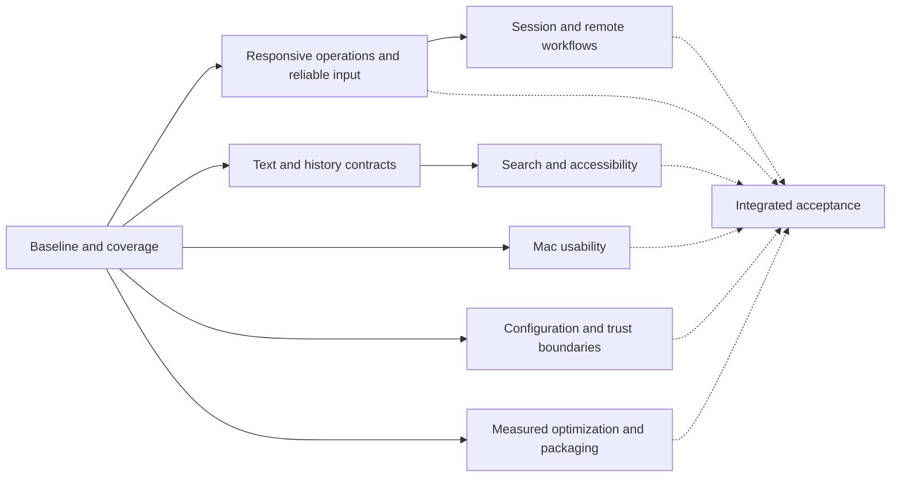

# Terminal excellence execution ledger

Baseline: `56edc52` (2026-10-08). Implementation branch: `codex/terminal-excellence`.
Preserve existing user data and `.supergoal/`. Use a separate `HARNESS_HOME` for live checks.
Public release is outside this change. One implementer owns all source edits; builds,
performance measurements, and interactive checks run serially on the Mac.

## Outcomes and dependencies

Solid edges are implementation prerequisites; dashed edges are acceptance dependencies.
T precedes S because text position and history lifetime rules must agree. R precedes W
because asynchronous operations must preserve host and session identity.

| Node | Coverage / acceptance | State |
|---|---|---|
| B | Source inventory, old roadmaps, issues, PRs 180/184; release baseline tied to source | Implemented; measurement coverage below |
| R | GUI/IPC/CLI input admission, deadlines, cancellation, ordering, stale results | Implemented; integrated acceptance pending |
| T | Engine, Unicode, reflow, history allocation, renderer, graphics, keyboard/mouse protocols | Implemented; integrated acceptance pending |
| S | Literal/regex/wrapped search, global pagination, accessibility text/cursor/selection | Implemented; integrated acceptance pending |
| M | Native scrollbar, settings, keyboard/IME, window management, themes, onboarding, menus | Implemented; integrated acceptance pending |
| W | Persistence, multi-window/host ownership, setups, activity, agents, shell integration, CLI/Lua/API | Implemented; integrated acceptance pending |
| H | Config recovery, storage failures, hostile output, files/clipboard/socket/SSH boundaries, Linux | Implemented; integrated acceptance pending |
| P | Profiling, release packaging/resources/dependencies, docs and reproducible measurements | Implemented; integrated acceptance pending |
| F | Focused checks, one full macOS/live-daemon run, compact UI pass, final performance comparison | Implemented; integrated acceptance pending |

## Findings

These are source findings unless a runtime observation is explicitly named. Prior roadmap
completion markers and tests on a different commit do not verify the final candidate.

| ID | Severity | Finding | Outcome / status |
|---|---|---|---|
| R1 | High | GUI session actions synchronously wait for daemon requests | R / implemented; admission and bounded-I/O regressions pass |
| R2 | High | PTY writer drops input exceeding its pending capacity without reporting failure | R / implemented; admission and bounded-I/O regressions pass |
| R3 | Medium | Request timeout excludes connect/write; discovery processes lack whole-operation deadlines | R / implemented; admission and bounded-I/O regressions pass |
| T1 | High | Fixed two-mark cells lose longer combining sequences and compound emoji | T / implemented; grapheme/history regressions pass |
| T2 | High | Raw-byte-to-line estimate is not a decoded-history memory ceiling | T / implemented; grapheme/history regressions pass |
| S1 | High | Find synchronously scans all history; spacer tails prevent adjacent CJK matches | S / implemented; mapping, cancellation, pagination checks pass |
| S2 | Medium | Global search captures and splits whole histories again for each page | S / implemented; mapping, cancellation, pagination checks pass |
| S3 | Medium | Each accessibility getter rebuilds all history; visible range reports entire history | S / implemented; mapping, cancellation, pagination checks pass |
| M1 | Medium | Scrollbar is click-through and ignores always-visible system preference (#181) | M / implemented; appearance/repaint checks pass; hands-on pending |
| M2 | Medium | Experience summary contradicts explicit keep-sessions override | M / implemented; appearance/repaint checks pass; hands-on pending |
| M3 | Medium | Idle display invalidation can leave a pane blank; existing PR #180 | M / implemented; appearance/repaint checks pass; hands-on pending |
| M4 | Medium | Quick Terminal blur/settings refresh differs from main window; existing PR #184 | M / implemented; appearance/repaint checks pass; hands-on pending |
| H1 | High | Invalid live config replaces working settings with defaults | H / implemented; recovery/persistence checks pass; Linux CI pending |
| H2 | Medium | Debounced session-save failures are swallowed | H / implemented; recovery/persistence checks pass; Linux CI pending |
| H3 | Medium | Linux parked-snapshot test assumes ciphertext despite documented plaintext fallback | H / implemented; recovery/persistence checks pass; Linux CI pending |
| B1 | Medium | Existing scorecard lacks matched current release throughput/memory/power/latency evidence | B/P / open |

## Verification policy

Use targeted existing suites and small regressions for substantive bugs. No coverage quota,
repetitive full runs, broad mechanical refactor, or new testing framework. Run one final full
macOS suite with live daemon tests; reuse identical-candidate CI evidence. Re-run only for a
changed dependency, demonstrated failure, or invalid measurement. Record skipped and blocked
observations honestly. Baseline/final microbenchmarks use warm-up and short median samples;
PTY drain rate, consumer throughput, presentation timing, and physical input-to-photon are
different measurements. Sum app and daemon resource usage for cross-terminal comparisons.

## Evidence and environment

- Starting tree has no tracked edits; `.supergoal/` is unrelated untracked material.
- Latest inspected CI is for preceding commit `0385658`: macOS and Xcode build passed;
  Linux failed `SnapshotTests.testParkDropsTheGridKeepsTheChildAndANewClientSeesTheScreen`.
- Running preview predates this candidate and is not acceptance evidence.
- Local Swift: 6.4, arm64 macOS; active developer directory is CommandLineTools. Full Xcode
  is available at `/Applications/Xcode-beta.app`. Commands select it per process; global
  developer-directory settings remain unchanged. SwiftPM uses its native backend because
  the default backend with CommandLineTools could not locate XCTest.
- Baseline measurements and subsequent check logs: `.benchmark-results/terminal-excellence/`
  (untracked, not included in source changes).

## Source coverage and integration dispositions

This is a subsystem audit, not a claim that every possible execution is proved correct.
“Implemented” means source exists; “integrated” means its consumers use it; “built” means
compiled on this toolchain; “verified” is reserved for a named check or observation.

| Subsystem | Inspected boundaries and disposition | Evidence / remaining acceptance |
|---|---|---|
| Engine / parser / VT / terminfo | VTParser bounds and abort handling; TerminalScreen, width lookup, alternate screens, 2026 timeout, replies and TerminalIdentity. Added compact exceptional grapheme IDs, immutable snapshot ownership, decoded-history accounting. ASCII cells remain POD. | GraphemeHistoryTests, ThaiCombiningMarkTests, HistoryRestoreTests pass. Existing conformance/reflow/damage/width suites included in final pass. |
| Renderer / fonts / images | Frame construction, row hashes, glyph lookup, ligature runs, Metal uploads, image cache and bounded atlas. Frame and compositor carry cluster dictionaries. Existing image-cache eviction and capture-grid idle release retained. | FrameBuilder/Occlusion/WindowAppearance checks pass; offscreen renderer and font fallback in final pass. External-display sharpness remains physical acceptance. |
| Terminal view / input | SurfaceIO admission before enqueue; generation-bound reconnect work; native scroller; keyboard, Option/Meta, IME, drop/paste and responder paths. Removed synchronous initial attach. | Writer admission, old writer, replay/ownership and async Find checks pass; compact GUI pass pending. |
| Find / accessibility | COW text snapshots, shared UTF-16/cell spans (wide tails excluded), soft wraps, NFC, cancellable worker search, explicit invalid-regex status. AX text cached by content revision with real visible/selection ranges. | Search, Thai, accessibility text, restore, and newest-query tests pass. VoiceOver spoken-output quality not inferred from headless checks. |
| Daemon / lifecycle | RealPty fd generation, queued writer, authoritative parser, idle parking, attach history gate, sequence ordering and resize ownership. Input rejection negotiated on attach; old daemons use JSON input. | 22 existing live daemon round-trip cases passed after nonblocking transport change; final lifecycle/contention/ownership suites pending. |
| Storage / config | Separate non-mutating live reload; startup preserves unreadable originals; existing corrupt backups retained. Save debounces report failures, immediate flush cancels older saves. Runtime persistence health travels in additive snapshots. | Settings and SessionPersistence tests pass. Errors do not automatically replay mutations. |
| IPC / CLI / JSON API | Frame caps before decode, peer UID and 0600 socket, bounded write backlog, whole connect/write/read deadline, nonblocking Unix descriptors, poll-based subscriptions/follow. GUI uses captured endpoint queues; CLI retains synchronous semantics. | BoundedIO, IPCCodec and live daemon tests pass; final CLI/API/target suites pending. |
| Lua / hooks | Vendored Lua 5.1.5 remains confined to CLI; config permissions and local-script trust model retained. Shared command targeting and error codes retained. | ScriptEngine/command/format suites in final pass. User Lua is trusted executable code, not a sandbox. |
| Shell integration | bash/zsh/fish startup injection, custom startup paths, disable switch, quoting and OSC 7/133 paths reviewed. Explicit `/bin/sh` used for portable pagination fixture rather than inheriting user shell customization. | Existing shell injection/profile tests in final pass; live shell/TUI pass pending. |
| Settings / menus / palette | Effective quit-persistence text, async daemon-owned settings, save error feedback, captured targets and ordered command sequences. Appearance refresh shared with Quick Terminal. | Settings/layout/catalog checks in final pass. Existing explicit overrides retained. |
| Onboarding / themes | Short first-run flow and optional installs retained. Theme import/settings merge boundaries, resource loading and fallback reviewed. | Existing onboarding/theme tests in final pass; first-run visual check pending. |
| Windows / workspaces | Multi-window owner capture, async create/move completion, split focus/drag and restoration paths reviewed. PR #180 idle repaint and #184 shared transparency integrated before terminal-view changes. | Targeted appearance/repaint passed; window/split/Quick Terminal acceptance pending. |
| Agents / Activity / setups | Existing per-pane activity identities, snooze/read timestamp semantics, setup open/new-copy separation, Recently Closed fresh-shell behavior retained. Metadata IPC moved off main. | Existing workspace/agent/setup suites in final pass. |
| Remote | DaemonLink and active snapshot attachment connect off main, stale generations discarded. SSH trust/argument validation retained; discovery has cancellation, 12 s total deadline and 1 MiB output cap. | Endpoint/reconnect/SSH tests in final pass. Real network sleep/wake/tunnel recovery requires a reachable test host. |
| Packaging / updates | SwiftPM and Xcode macOS 15 target, arm64 products, Sparkle 2.9.2 pin agreement, version 1.13.0/build 128 agreement, EdDSA appcast and release signing gates reviewed. | Local packaging/resource/signature validation pending; no public release or notarization requested. |
| Generated / vendored resources | Width table and generator use UCD 15.1; existing all-scalar equivalence suite checks them. Release notes generator/version guard, themes bundles, Nerd Font license, C base64 and CLua boundaries reviewed. | Generated resources unchanged unless noted; no blind dependency upgrades. Newer Unicode width-table coverage remains a separate compatibility limit. |

Additional findings resolved during implementation:

- R4 (high): large AF_UNIX sends on macOS could block with `MSG_DONTWAIT` alone.
  Keep sockets nonblocking and poll readers; a real stalled-write regression caught this.
- R5 (medium): selection coalescing could cross a queued command. Commands are now barriers.
- H4 (medium): Kitty file size was checked before opening, followed by an unbounded read.
  Validate the opened regular file, cap the read, and avoid unlinking a replaced temporary file.
- H5 (high): pathological trigger regex could monopolize the parser despite a batch budget.
  Progress callbacks stop regex work after a 2 ms line budget; patterns are capped at 4 KiB.
- H6 (medium): early subprocess stdin closure could raise SIGPIPE. Writes suppress it on macOS;
  portable worker-thread masking handles it without changing the application's signal policy.
- H7 (high): a release build with an isolated home could refresh global installed binaries or
  restart the normal launchd job. Explicit-home launchers now avoid both paths.
- M5 (medium): several custom fades ignored Reduce Motion. Shared and direct fades honor it.
- S4 (medium): per-cell search mapping added avoidable allocation and CPU cost. Consecutive
  one-column text now shares a span; wide/compound glyphs retain exact non-linear mappings.

## Roadmap and issue reconciliation

- `AUDIT_ROADMAP.md` and `V1_10_ROADMAP.md` are historical plans, not current parity percentages.
  Their old missing-DECSTR/REP/IRM/DECOM, Kitty-ack/delete, pixel-mouse, secure-input, VoiceOver,
  synchronous-layout-save and periodic-git-process findings have implementations in current
  source and existing suites. Do not recreate their obsolete replacements.
- PR #180 (`5ae404e`) and PR #184 (`92d1c839`) are integrated here; overlapping files were
  reconciled before this work. Neither PR is treated as independently verifying this candidate.
- #181: native interactive scrollbar implemented here; hands-on check pending.
- #182: Dynamic Island was removed in v1.13; it is absent from current chrome.
- #99: source-aware remote rail exists; this pass hardens its async subscriptions.
- #12: engine, renderer, kit and core already export Swift package products.
- #27: PTY drain is not renderer throughput. Consumer measurements are recorded separately;
  cross-terminal leadership stays open until the corresponding workload has matched evidence.
- #179 (iOS app): outside this Mac-terminal candidate; no GUI-platform expansion.

## Retention and trust contracts

- Raw PTY retention and decoded history are separate: raw output is bounded at 512 MiB;
  decoded history is independently bounded at 512 MiB including stored row capacities,
  ring metadata and a conservative exceptional-cluster allowance. Configured line caps
  still apply first. Active screen, transient COW snapshots, rendering caches and raw bytes
  are additional memory, so 512 MiB is **not** a whole-process RSS promise.
- Exceptional clusters are limited to 256 UTF-8 bytes each and an 8 MiB pool per screen.
  Ordinary inline marks and ASCII stay allocation-free; extreme extending sequences beyond
  these limits are truncated. Pool reclamation is throttled under hostile output.
- Find retains at most 50,000 matches, limits one logical line to 262,144 UTF-16 units,
  and gives matching 250 ms per search. It reports limited results; it does not claim a full
  scan when the budget expires. Global pagination keeps at most 32 small cursors for 60 s;
  output/resize/layout changes invalidate a cursor instead of silently skipping old output.
- Accepted PTY writes preserve byte order; queue exhaustion rejects the entire incoming write
  with feedback. Failed stream delivery has an unknown outcome and is never retried. Input
  held for an old attachment is never replayed into its replacement.
- Clipboard reading stays disabled by default. SSH host verification, peer-UID checks, socket
  permissions, image quotas and user-owned configuration boundaries remain in place.

Additional allocation/host findings: geometry is capped before multiplication (4,096 per
axis and 1,048,576 cells); unsupported daemon resize requests fail explicitly. Local Git HEAD
watchers now run only for local tabs, so a remote cwd cannot be mistaken for this Mac's path.

## Evidence collected so far

- Reliability checks: 81 passed (settings, persistence, snapshots, new and existing PTY writer).
- Text/history/IPC correction pass: 30 passed. Broader mapping/recovery/trigger pass: 55 passed.
- Bounded I/O, queue barriers and grapheme regression pass: 10 passed.
- Async Find plus live transport pass: existing transport/Find checks passed; new pagination
  fixture initially inherited an incompatible shell. An explicit `/bin/sh` fixture passes,
  including disjoint pages and expiration after output changes.
- One full local macOS pass exercised 2,255 tests with live daemon coverage (58 opt-in
  performance/platform cases skipped). Only two obsolete source-string assertions failed:
  they described the pre-existing importer before `56edc52`. Replaced by a behavioral
  split-theme import check; focused importer/Git-monitor correction pass follows.
- Initial release consumer baseline includes the already-integrated repaint/appearance patches;
  engine/search changes were absent. ASCII consumer throughput was 10.454 MB/s, Unicode
  22.862 MB/s, substring search 14.84 ms and regex search 48.62 ms over 20,001 rows.
- First candidate: ASCII 10.451 MB/s; Unicode 18.138 MB/s; substring 79.16 ms; regex 110.68 ms.
  These regressions prompted the mapping/grapheme optimization; they are not a passing
  performance claim. Matched final results are still pending.

## Completion

Every finding must have a fix and scoped evidence or an explicitly open limitation. Every
subsystem must have an audit disposition. Deliver a packaged local candidate, updated docs,
and measured results without claiming global performance leadership from incomplete data.
